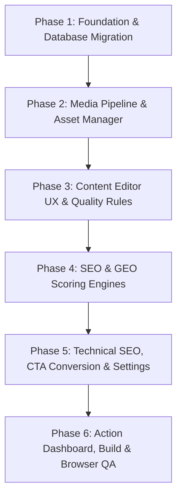

# CMS_IMPLEMENTATION_PLAN.md — Kế Hoạch Triển Khai Nâng Cấp Toàn Diện CMS LocalMate

**Mục tiêu**: Refactor + nâng cấp CMS quản trị nội dung của LocalMate thành hệ thống thực dụng cho SEO, GEO/AI Search, Media R2, Conversion Lead và Technical SEO.

---

## LỘ TRÌNH TRIỂN KHAI 6 GIAI ĐOẠN (6 PHASES)

---

### 🔹 PHASE 1 — FOUNDATION & DATABASE MIGRATION
1. **Migration SQL `0004_cms_advanced_upgrade.sql`**:
   - `cms_media`: Thêm `width, height, format, hash, size_original, size_optimized, focal_x, focal_y`.
   - `cms_posts`: Thêm `geo_main_question, geo_direct_answer, geo_entities, geo_sources, geo_faq_json, cta_id, schema_type, og_image_url`.
   - Bảng mới `cms_ctas`: `id, name, headline, description, button_label, destination_url, placement, is_active, impressions, clicks, created_at, updated_at`.
   - `cms_redirects`: Thêm `hits, last_hit_at`.
2. **Types Cập nhật (`src/cms/types.ts`)**:
   - Đồng bộ hóa toàn bộ kiểu dữ liệu TypeScript giữa Frontend và Backend.
3. **Chạy Migration an toàn trên Cloudflare D1 local / remote**.

---

### 🔹 PHASE 2 — MEDIA PIPELINE & ASSET MANAGER
1. **Client-side & API Image Optimization**:
   - Client nén tự động sang WebP (giảm 60-80% dung lượng mà giữ nguyên độ nét), tự trích xuất kích thước `width`, `height`.
   - API kiểm tra hash SHA-256 chống upload tệp trùng lặp.
   - Upload lưu vào R2 bucket `localmate-assets-prod`.
2. **Media Library UX Refactor (`src/admin/pages/MediaLibraryPage.tsx`)**:
   - Empty state gọn đẹp, hỗ trợ Drag & Drop, thanh tiến trình upload rõ ràng.
   - Bộ lọc thực tế: Tất cả, Chưa dùng (Unused), Đang sử dụng (Used), Thiếu ALT (Missing ALT), Quá khổ (Oversized > 500KB).
   - Side Drawer xem chi tiết asset: Preview, Tỷ lệ khung hình, Kích thước WxH, % Dung lượng tiết kiệm, Nút Copy URL / Markdown / HTML.
   - Danh sách bài viết đang sử dụng ảnh này. Cảnh báo an toàn khi xóa nếu ảnh đang được dùng.
3. **Component `<OptimizedImage />` (`src/components/ui/OptimizedImage.tsx`)**:
   - Tự động sinh `src`, `width`, `height`, `loading="lazy"`, `decoding="async"`, trừ khi có cờ `priority` (cho Hero/LCP).

---

### 🔹 PHASE 3 — CONTENT EDITOR UX & PREVIEW
1. **Tái cấu trúc Sidebar Editor (`src/admin/editor/PostEditorPage.tsx`)**:
   - Phân chia Tab/Collapsible khoa học:
     - Tab **Nội Dung (Content)**: Tiêu đề, Slug, Tóm tắt, Trình soạn thảo Tiptap, Ảnh đại diện, Chuyên mục, Thẻ tag, Tác giả, Trạng thái.
     - Tab **SEO**: Tiêu đề SEO, Mô tả SEO, Từ khóa chính, Canonical, Robots Index/Follow, SERP Preview (Desktop & Mobile).
     - Tab **GEO / AI Search**: Câu hỏi chính, Câu trả lời trực tiếp (Answer-First), Thực thể chính, Nguồn dẫn chứng, FAQs.
     - Tab **Social**: OpenGraph Title, OpenGraph Description, OpenGraph Image preview Facebook.
     - Tab **Schema**: Loại dữ liệu có cấu trúc (Article, BlogPosting, FAQPage, HowTo, Service).
     - Tab **Chuyển Đổi CTA**: Chọn CTA hiển thị và vị trí đặt (Giữa bài, Cuối bài, v.v.).
2. **Tích hợp Media Picker Modal trong Tiptap**:
   - Chèn ảnh trực tiếp từ Thư viện R2 vào bài viết với đầy đủ ALT và Caption.
3. **Safe Draft Preview (`src/pages/PostPreviewPage.tsx`)**:
   - Hiển thị bản nháp chân thực 100% như bài đã xuất bản, bao gồm cả Mục lục (TOC), Tác giả, CTA, và thẻ Meta Preview.

---

### 🔹 PHASE 4 — SEO & GEO SCORING ENGINES
1. **SEO Engine Thuần Logic (`src/cms/services/seoEngine.ts`)**:
   - Tính điểm 0-100 deterministic dựa trên 10 quy tắc: Độ dài Title, Độ dài Description, Mật độ từ khóa tự nhiên, Cấu trúc H1/H2/H3, Ảnh đại diện có ALT, Liên kết nội bộ (Internal links), Liên kết ngoài, Độ dài nội dung (> 300 từ).
   - Phân nhóm: Critical (Đỏ), Warning (Vàng), Good (Xanh).
2. **GEO Engine (`src/cms/services/geoEngine.ts`)**:
   - Đánh giá khả năng trích xuất của LLM/AI Search: Answer-First, Direct Answer, Entity Presence, Cấu trúc câu hỏi rõ ràng, Dữ liệu thực tế có nguồn.
3. **Màn hình Kiểm Toán Toàn Diện SEO/GEO (`/admin/audit`)**:
   - Bảng tổng hợp mọi bài viết cùng danh sách vấn đề cần khắc phục, cho phép click để sửa ngay.

---

### 🔹 PHASE 5 — TECHNICAL SEO, CTA CONVERSION & SETTINGS
1. **Sitemap Động Toàn Diện (`functions/sitemap.xml.ts`)**:
   - Đọc tự động tất cả bài viết published từ D1 database kèm các landing page dịch vụ, giải pháp, báo giá, kèm `lastmod` chuẩn xác.
2. **Redirect Manager Nâng Cấp (`functions/api/routes/adminSettings.ts` & `src/admin/pages/RedirectsPage.tsx`)**:
   - Thuật toán kiểm tra vòng lặp chuyển hướng (Loop Detection) và chuỗi chuyển hướng (Chain Detection: A -> B -> C).
   - Theo dõi số lượt truy cập (Hits) và Thời gian hit cuối.
3. **Hệ Thống CTA Chuyển Đổi (`src/admin/pages/CtasPage.tsx`)**:
   - Quản lý danh sách CTA tái sử dụng, gán CTA mặc định toàn site hoặc riêng từng chuyên mục.
   - Endpoint ghi nhận impression/click thực tế (`/api/public/cta/track`).
4. **Cài Đặt Hệ Thống Chuẩn Hóa (`src/admin/pages/SettingsPage.tsx`)**:
   - Quản lý metadata thương hiệu toàn site: Site Name, Default Meta Title/Description, Logo, Default OG Image, Hotline, Social links, Tác giả mặc định.
   - Tích hợp công cụ Xuất/Nhập Sao lưu JSON ngay trong Settings.

---

### 🔹 PHASE 6 — ACTION DASHBOARD, ACCESSIBILITY & BROWSER QA
1. **Action-Oriented Dashboard (`src/admin/pages/DashboardPage.tsx`)**:
   - Hiển thị thẻ việc cần làm thực tế: "X bài thiếu Meta Description", "Y ảnh thiếu ALT", "Z bài cần tối ưu GEO", "N media dung lượng lớn". Click vào tự động chuyển trang với filter tương ứng.
2. **Chuẩn Hóa Sidebar Navigation (`src/admin/AdminLayout.tsx`)**:
   - Nhóm 5 mục: TỔNG QUAN, NỘI DUNG, MEDIA, SEO & CHUYỂN HƯỚNG, HỆ THỐNG.
3. **Kiểm Tra Khả Năng Truy Cập (Accessibility & Keyboard)**:
   - Hỗ trợ phím Tab, Enter, Esc, nhãn ARIA đầy đủ.
4. **Kiểm Thử Trình Duyệt (Browser QA với Playwright / agent-browser)**:
   - Xác thực màn hình Desktop 14" (1366x768, 1440x900, 1920x1080) không co giật, không vỡ layout, không tràn ngang.
   - Kiểm thử toàn diện luồng: Tạo bài -> Tải ảnh R2 -> Điền SEO/GEO -> Chọn CTA -> Xem trước Preview -> Xuất bản -> Kiểm tra Sitemap & Redirects.

---

Bắt đầu thực thi ngay theo đúng thứ tự các Phase.
