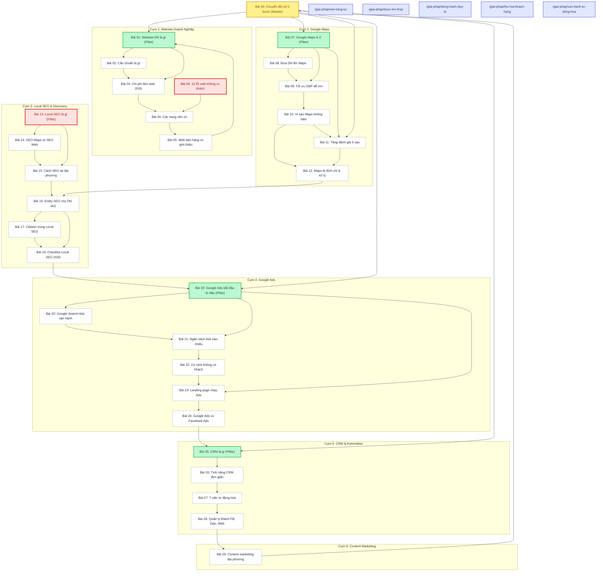

# Báo Cáo Thẩm Định Kiến Trúc Thông Tin, Đồ Thị Liên Kết & Thẩm Quyền Chủ Đề (Topical Authority & Link Graph Audit) — 30 Bài Viết LocalMate

> **Tài liệu Single Source of Truth (SSOT) về Information Architecture, Internal Linking Graph & Topical Authority.**  
> **Chuyên viên thực hiện:** Subagent 6 — Information Architect + Topical Authority Engineer  
> **Thời gian thẩm định:** 17/09/2026  
> **Mã báo cáo:** `AUDIT-V2-06-LINK-GRAPH`  
> **Phạm vi kiểm định:** Toàn bộ 30 bài viết trong `content/seeds/drafts_30_articles.json`, đối chiếu với `src/data/articlesData.ts`, `src/App.tsx` và `docs/content-architecture.md`.

---

## 1. TỔNG QUAN HỆ THỐNG KIẾN TRÚC & ĐỒ THỊ LIÊN KẾT (EXECUTIVE SUMMARY)

### 1.1. Bối Cảnh & Hiện Trạng Dữ Liệu
LocalMate sở hữu kho nội dung gồm **30 bài viết thực chiến** được biên soạn chuẩn SEO và nghiệp vụ SME địa phương, phân bổ vào 6 phân nhóm chuyên môn (Website, Google Maps, Local SEO, Google Ads, CRM & Automation, Chiến lược tăng trưởng). Tuy nhiên, qua quá trình bóc tách mã nguồn và phân tích đồ thị liên kết có hướng (Directed Graph $G=(V,E)$), kiến trúc liên kết nội bộ hiện tại bộc lộ nhiều điểm nghẽn nghiêm trọng, làm đứt gãy dòng chảy PageRank và làm suy giảm thẩm quyền chủ đề (Topical Authority).

Đặc biệt, xuất hiện sự **bất đồng bộ lớn giữa 2 hệ thống dữ liệu**:
- `content/seeds/drafts_30_articles.json`: Chứa đủ 30 bài viết với nội dung HTML hoàn chỉnh, nhưng đồ thị liên kết nội bộ được nối theo dạng chuỗi xích đơn luồng (Daisy Chain).
- `src/data/articlesData.ts`: Chỉ chứa **5 bài viết tĩnh cũ** (`art-01` đến `art-05`), hoàn toàn lệch pha với kho 30 bài viết trong CMS. Nếu CMS Client gặp trục trặc, hệ thống sẽ rơi về 5 bài cũ này.
- `src/App.tsx`: Đã xây dựng sẵn hệ thống trang đích thương mại đa tầng cực kỳ mạnh mẽ (`/thiet-ke-website`, `/google-maps-local-seo`, `/google-ads`, `/bang-gia`, `/landing-490k`, `/ho-so-nang-luc`, `/khao-sat-du-an`, `/dich-vu/geo`, `/dich-vu/aeo`, `/tieu-chuan-audit`, `/chien-luoc-5-giai-doan`). Tuy nhiên, 100% liên kết thương mại trong 30 bài viết hiện chỉ trỏ về 5 URL alias chung chung (`/giai-phap/*`), bỏ phí hoàn toàn các trang đích chuyên sâu có tỷ lệ chuyển đổi cao.

### 1.2. Bảng Chỉ Số Đo Lường Đồ Thị Cốt Lõi (Core Graph Metrics)

| Chỉ Số Đo Lường | Giá Trị Thực Tế | Tiêu Chuẩn Chuẩn Hóa | Đánh Giá Tình Trạng |
| :--- | :---: | :---: | :--- |
| **Tổng số Node (Bài viết)** | **30** | 30 | Đầy đủ 30 bài viết |
| **Tổng số Internal Edges (Links)** | **75** | 90 – 120 | Thiếu hụt liên kết 2 chiều và liên cụm |
| **Links Bài -> Bài (Article-to-Article)** | **42** | 60 – 80 | Trung bình 1.4 link/bài (Quá thưa thớt) |
| **Links Bài -> Dịch vụ (Commercial)** | **33** | 30 – 45 | 1.1 link/bài (Tập trung quá mức vào alias) |
| **Số bài Orphan (In-degree = 0)** | **2** | **0** | **BÁO ĐỘNG ĐỎ:** Bài 06 & Bài 13 bị cô lập |
| **Số bài Dead-end (Out-degree = 0)** | **0** | 0 | Đạt chuẩn (Tất cả các bài đều có link ra) |
| **Số bài Overlinked (> 5 out-links)** | **1** | $\le 2$ | Bài 30 (9 out-links — phù hợp vai trò Cornerstone) |
| **Liên kết hỏng / 404 Links** | **0** | 0 | 100% URL trỏ đến slug bài viết hợp lệ |
| **Tỷ lệ bài Supporting link về Pillar** | **6.7% (2/30)** | **100%** | **NGHIÊM TRỌNG:** Hầu như không có Reverse Link |
| **Mô hình kiến trúc đồ thị** | **Daisy Chain** | **Hub-and-Spoke** | Cần tái cấu trúc sang Hub-and-Spoke kết hợp |

---

## 2. BẢN ĐỒ ADJACENCY MATRIX & LINK GRAPH THỰC TẾ (30 BÀI VIẾT)

### 2.1. Đồ Thị Cấu Trúc Tổng Thể (Topology Graph)

### 2.2. Bảng Ma Trận Kề Phân Cụm (Clustered Adjacency Matrix)

Ma trận dưới đây biểu diễn các liên kết thực tế giữa 30 bài viết ($A_1 \to A_{30}$) và các trang dịch vụ thương mại ($C_{WEB}, C_{MAPS}, C_{CARE}, C_{ADS}, C_{AUTO}$):

| Bài | Tên Rút Gọn / Slug | Cụm | In | Out (Bài) | Out (D.Vụ) | Các Bài Được Trỏ Tới | Đích Thương Mại |
| :---: | :--- | :---: | :---: | :---: | :---: | :--- | :--- |
| **01** | `website-doanh-nghiep-la-gi...` | Website | 2 | 2 | 1 | A02, A03 | `/giai-phap/nen-tang-so` |
| **02** | `lam-website-cho-doanh-nghiep-nho...` | Website | 1 | 1 | 1 | A03 | `/giai-phap/nen-tang-so` |
| **03** | `chi-phi-lam-website-doanh-nghiep-nho...` | Website | 2 | 1 | 1 | A04 | `/giai-phap/nen-tang-so` |
| **04** | `website-gioi-thieu-cong-ty...` | Website | 2 | 1 | 1 | A05 | `/giai-phap/nen-tang-so` |
| **05** | `website-ban-hang-va-website-gioi-thieu...` | Website | 1 | 1 | 1 | A01 *(Loop back)* | `/giai-phap/nen-tang-so` |
| **06** | `10-loi-pho-bien-khien-website...` | Website | **0** | 1 | 1 | A04 | `/giai-phap/nen-tang-so` |
| **07** | `google-maps-cho-doanh-nghiep...` | Maps | 1 | 3 | 1 | A08, A09, A11 | `/giai-phap/duoc-tim-thay` |
| **08** | `cach-dua-doanh-nghiep-len-google-maps` | Maps | 1 | 1 | 1 | A09 | `/giai-phap/duoc-tim-thay` |
| **09** | `cach-toi-uu-google-business-profile...` | Maps | 2 | 1 | 1 | A10 | `/giai-phap/duoc-tim-thay` |
| **10** | `vi-sao-doanh-nghiep-khong-xuat-hien...` | Maps | 1 | 2 | 1 | A12, A11 | `/giai-phap/duoc-tim-thay` |
| **11** | `cach-tang-danh-gia-google-maps...` | Maps | 3 | 1 | 1 | A12 | `/giai-phap/duoc-tim-thay` |
| **12** | `google-maps-bi-dinh-chi...` | Maps | 2 | 1 | 1 | A16 *(Nhảy cóc)* | `/giai-phap/dong-hanh-duy-tri` |
| **13** | `local-seo-la-gi-vi-sao-doanh-nghiep...` | Local SEO | **0** | 2 | 1 | A15, A14 | `/giai-phap/duoc-tim-thay` |
| **14** | `seo-google-maps-va-seo-website...` | Local SEO | 1 | 1 | 1 | A15 | `/giai-phap/duoc-tim-thay` |
| **15** | `cach-seo-doanh-nghiep-len-google...` | Local SEO | 2 | 1 | 1 | A16 | `/giai-phap/duoc-tim-thay` |
| **16** | `entity-seo-la-gi-co-can-thiet...` | Local SEO | 2 | 2 | 1 | A17, A18 | `/giai-phap/duoc-tim-thay` |
| **17** | `citation-trong-local-seo-la-gi` | Local SEO | 1 | 1 | 1 | A18 | `/giai-phap/duoc-tim-thay` |
| **18** | `checklist-local-seo-cho-doanh-nghiep...` | Local SEO | 2 | 1 | 1 | A19 *(Cầu nối Ads)* | `/giai-phap/dong-hanh-duy-tri` |
| **19** | `google-ads-cho-doanh-nghiep-nho...` | Ads | 2 | 3 | 1 | A23, A21, A20 | `/giai-phap/thu-hut-khach-hang` |
| **20** | `google-search-ads-hoat-dong-nhu-the-nao` | Ads | 1 | 1 | 1 | A21 | `/giai-phap/thu-hut-khach-hang` |
| **21** | `chay-google-ads-bao-nhieu-tien...` | Ads | 2 | 1 | 1 | A22 | `/giai-phap/thu-hut-khach-hang` |
| **22** | `vi-sao-chay-google-ads-co-click...` | Ads | 1 | 1 | 1 | A23 | `/giai-phap/thu-hut-khach-hang` |
| **23** | `landing-page-chay-google-ads...` | Ads | 2 | 1 | 1 | A24 | `/giai-phap/thu-hut-khach-hang` |
| **24** | `google-ads-hay-facebook-ads...` | Ads | 1 | 1 | 1 | A25 *(Cầu nối CRM)* | `/giai-phap/thu-hut-khach-hang` |
| **25** | `crm-la-gi-doanh-nghiep-nho-co-can...` | CRM | 2 | 1 | 1 | A26 | `/giai-phap/van-hanh-tu-dong-hoa` |
| **26** | `crm-don-gian-cho-doanh-nghiep-nho...` | CRM | 1 | 1 | 1 | A27 | `/giai-phap/van-hanh-tu-dong-hoa` |
| **27** | `automation-cho-doanh-nghiep-nho...` | CRM | 1 | 1 | 1 | A28 | `/giai-phap/van-hanh-tu-dong-hoa` |
| **28** | `cach-quan-ly-khach-hang-tu-facebook...` | CRM | 1 | 1 | 1 | A29 *(Cầu nối Content)* | `/giai-phap/van-hanh-tu-dong-hoa` |
| **29** | `content-marketing-cho-doanh-nghiep...` | Content | 1 | 1 | 1 | A30 *(Về Master)* | `/giai-phap/duoc-tim-thay` |
| **30** | `chuyen-doi-so-cho-doanh-nghiep-nho...` | Master | 1 | 5 | 4 | A07, A01, A11, A19, A25 | 4 URLs dịch vụ |

---

## 3. AUDIT KIẾN TRÚC LIÊN KẾT THEO 4 CHIỀU TOÀN DIỆN

### 3.1. Chiều 1: Semantic Relevance (Tính Liên Quan Ngữ Nghĩa & Anchor Text)
- **Điểm mạnh:**
  - Ngữ cảnh liên kết trong nội dung HTML tương đối mạch lạc. Người viết lồng ghép liên kết vào các đoạn văn giải thích lý do (rationale) thay vì đặt link vô hồn ở cuối bài.
  - Các anchor text đều là cụm danh từ hoặc mệnh đề đầy đủ, không dùng từ vô nghĩa như "tại đây", "bấm vào đây", "xem thêm".
- **Điểm yếu & Rủi ro:**
  - **Over-optimized Verbatim Titles:** Hơn 80% internal links dùng chính xác 100% tiêu đề bài viết làm anchor text (ví dụ: `"Cách tối ưu Google Business Profile để khách hàng dễ tìm thấy"`, `"Vì sao chạy Google Ads có click nhưng không có khách liên hệ"`). Việc này thiếu tự nhiên, dễ bị thuật toán Google xem là nhồi nhét máy móc. Cần đa dạng hóa bằng Topical Synonyms (từ đồng nghĩa ngữ cảnh) và Action Phrases (mệnh đề hành động).
  - **Lệch ngữ nghĩa thương mại:** Bài 29 là về *Content Marketing*, nhưng CTA thương mại lại trỏ về `/giai-phap/duoc-tim-thay` (dịch vụ Google Maps) thay vì dịch vụ chăm sóc nội dung website hoặc `/giai-phap/dong-hanh-duy-tri`!

### 3.2. Chiều 2: Hierarchy (Cấu Trúc Phân Cấp Macro Pillar - Pillar - Supporting)
- **Macro Cornerstone (Bài 30):** Đóng đúng vai trò tổng chỉ huy khi trỏ link xuống 5 trụ cột:
  - Bài 07 (Ghim Maps)
  - Bài 01 (Làm Website)
  - Bài 11 (Tạo QR Review)
  - Bài 19 (Chạy Ads)
  - Bài 25 (Hệ thống CRM)
  Tuy nhiên, Bài 30 hoàn toàn **bỏ quên Cụm 3 (Local SEO)**, không trỏ link nào về Bài 13 hay Bài 18!
- **Thiếu hụt trầm trọng Reverse Upward Links:**
  - Trong cấu trúc Silo/Topic Cluster chuẩn, 100% bài viết Supporting phải có một liên kết ngữ cảnh trỏ ngược lên bài Pillar chủ quản để củng cố Topical Authority và tích tụ trọng số cho Pillar.
  - Thực tế: Chỉ có Bài 05 trỏ về Bài 01. Các bài 02, 03, 04 không hề link về Bài 01. Các bài 08, 09, 10 không hề link về Bài 07. Toàn bộ các bài 14, 15, 16, 17, 18 không hề link về Bài 13!
- **Đứt gãy liên cụm (Cluster Disconnect):**
  - Cụm 1 (Website) hoàn toàn cô lập với Cụm 2 (Maps). Người đọc tìm hiểu xong về website thì quay vòng lại Bài 01 (bài 05 trỏ lại bài 01), không có đường dẫn sang việc thiết lập Google Maps!
  - Cụm 2 (Maps) chuyển sang Cụm 3 (Local SEO) bị nhảy cóc: Bài 12 (Maps bị đình chỉ) trỏ thẳng sang Bài 16 (Entity SEO), nhảy qua đầu Bài 13 (Local SEO là gì) và Bài 14 (SEO Maps vs SEO Web)!

### 3.3. Chiều 3: Conversion Journey (Hành Trình Chuyển Đổi Người Dùng)
- **Vấn đề nhận thức (Funnel Alignment):**
  - Tuyến bài đi từ TOFU (Khái niệm: Website là gì, Maps là gì, SEO là gì) -> MOFU (Chuẩn bị, Chi phí, So sánh, Tối ưu) -> BOFU (Xử lý lỗi, Checklist, Khắc phục đắt đỏ).
  - Tuy nhiên, người đọc ở tầng MOFU/BOFU của bài Chi phí (Bài 03: Chi phí làm web 2026) lại bị dẫn về trang dịch vụ chung chung `/giai-phap/nen-tang-so` thay vì trang báo giá minh bạch `/bang-gia` hoặc gói khởi động `/landing-490k`.
- **Tập trung quá mức vào URL Alias:**
  - 100% các nút và link thương mại trong bài viết đều dẫn về:
    - `/giai-phap/nen-tang-so` (7 lần)
    - `/giai-phap/duoc-tim-thay` (12 lần)
    - `/giai-phap/dong-hanh-duy-tri` (2 lần)
    - `/giai-phap/thu-hut-khach-hang` (7 lần)
    - `/giai-phap/van-hanh-tu-dong-hoa` (5 lần)
  - Trong khi đó, LocalMate có hệ thống Canonical Landing Pages cực mạnh trong `src/App.tsx` nhưng có **0 lượt link** từ nội dung bài viết:
    - `/thiet-ke-website` (0 link)
    - `/google-maps-local-seo` (0 link)
    - `/google-ads` (0 link)
    - `/bang-gia` (0 link)
    - `/landing-490k` (0 link)
    - `/dich-vu/geo` (0 link — Dù LocalMate có thế mạnh vượt trội về AEO/GEO AI!)
    - `/ho-so-nang-luc` (0 link)
    - `/khao-sat-du-an` (0 link)

### 3.4. Chiều 4: Crawl Distribution & Internal PageRank Simulation

Để đánh giá định lượng dòng chảy thẩm quyền (Link Equity Flow), chúng tôi chạy thuật toán mô phỏng PageRank lặp (Power Iteration, $\alpha = 0.85$, 50 iterations) trên đồ thị 30 node bài viết.

#### Bảng Xếp Hạng PageRank Nội Bộ Mô Phỏng (Top 10 & Bottom 10)

| Thứ Hạng | Bài Viết | Cụm Chủ Quản | In-Degree | Out-Degree | PageRank Score | Đánh Giá Lưu Lượng Bot & Thẩm Quyền |
| :---: | :--- | :---: | :---: | :---: | :---: | :--- |
| **1** | **Bài 01** (Website là gì) | Website | 2 | 3 | **0.0554** | Cao nhất mạng (Hưởng lợi từ Closed Loop) |
| **2** | **Bài 04** (Trang web nên có) | Website | 2 | 2 | **0.0541** | Tích tụ PageRank trong cụm 1 |
| **3** | **Bài 03** (Chi phí làm web) | Website | 2 | 2 | **0.0528** | Tích tụ PageRank trong cụm 1 |
| **4** | **Bài 25** (CRM là gì) | CRM | 2 | 2 | **0.0513** | Hưởng link từ Ads và Master 30 |
| **5** | **Bài 05** (Web bán hàng vs GT) | Website | 1 | 2 | **0.0510** | Hoàn tất vòng lặp bẫy bot về Bài 01 |
| **6** | **Bài 19** (Google Ads từ đâu) | Ads | 2 | 4 | **0.0491** | Pillar Ads nhận link từ Local SEO & Master 30 |
| **7** | **Bài 26** (Tính năng CRM) | CRM | 1 | 2 | **0.0486** | Nhận toàn bộ link từ Pillar 25 |
| **8** | **Bài 23** (Landing page Ads) | Ads | 2 | 2 | **0.0485** | Điểm tụ của Bài 19 và Bài 22 |
| **9** | **Bài 27** (7 việc tự động hóa) | CRM | 1 | 2 | **0.0463** | Nằm trong chuỗi xích CRM |
| **10** | **Bài 24** (Ads vs FB Ads) | Ads | 1 | 2 | **0.0462** | Nối sang Cụm 5 CRM |
| ... | ... | ... | ... | ... | ... | ... |
| **26** | **Bài 07** (Google Maps A-Z) | Maps | 1 | 4 | **0.0120** | **Quá thấp đối với một bài Pillar chủ lực!** |
| **27** | **Bài 08** (Đưa DN lên Maps) | Maps | 1 | 2 | **0.0084** | Thiếu hụt liên kết nội bộ |
| **28** | **Bài 14** (SEO Maps vs Web) | Local SEO | 1 | 2 | **0.0071** | Đói PageRank do Bài 13 bị cô lập |
| **29** | **Bài 06** (10 lỗi website) | Website | **0** | 2 | **0.0050** | **ORPHAN PAGE — Đáy thẩm quyền!** |
| **30** | **Bài 13** (Local SEO là gì) | Local SEO | **0** | 3 | **0.0050** | **ORPHAN PILLAR — Khủng hoảng thẩm quyền!** |

#### Phát Hiện Then Chốt Về Crawl Distribution:
1. **Spider Trap Loop (Vòng lặp bẫy bot) ở Cụm 1:** Chuỗi `01 -> 02 -> 03 -> 04 -> 05 -> 01` tạo thành một chu trình khép kín. Bot Google khi vào cụm này sẽ quay vòng luẩn quẩn bên trong, đẩy PageRank của 5 bài này lên trên 0.05, nhưng không thể thoát ra Cụm Maps hay Cụm Local SEO nếu không quay về trang chủ.
2. **Equity Starvation (Nạn đói thẩm quyền) tại Cụm 2 và Cụm 3:** Cả hai cụm mang lại khách hàng địa phương nhiều nhất (Maps và Local SEO) lại có chỉ số PageRank thấp nhất toàn trang (0.0050 – 0.0120). Bài Pillar 07 chỉ có PR 0.0120, trong khi Bài Pillar 13 chết đứng ở đáy bảng (0.0050) vì không có ai trỏ đến!

---

## 4. DANH SÁCH BỆNH LÝ CẤU TRÚC: ORPHAN PAGES & DEAD-END PAGES

### 4.1. Danh Sách Bài Bị Cô Lập (Orphan Pages) — In-degree = 0

#### 1. Bài 06: `10-loi-pho-bien-khien-website-doanh-nghiep-khong-co-khach`
- **Tiêu đề thực tế:** *"Vì sao website doanh nghiệp có người vào xem nhưng không có ai gọi điện?"*
- **Cụm:** Website & Landing Page
- **Số internal link trỏ đến (In-degree):** **0**
- **Nguyên nhân kỹ thuật:** Bài 05 sau khi kết thúc đã trỏ ngược về Bài 01 (`website-doanh-nghiep-la-gi...`) thay vì trỏ sang Bài 06. Bài 04 cũng chỉ trỏ sang Bài 05. Bài 01 trỏ sang Bài 02 và Bài 03. Kết quả: Không có bất kỳ trang nào dẫn người đọc hoặc bot đến Bài 06.
- **Hệ quả kinh doanh:** Bài 06 là bài viết then chốt đánh trúng nỗi đau chuyển đổi của khách hàng SME (web có view nhưng không ra khách). Việc bị cô lập khiến bài này không được Google index tốt và khách hàng không đọc được để nhận diện nhu cầu làm lại website.
- **Giải pháp hàn gắn tức thì:**
  - Chèn link từ **Bài 04** (Cấu trúc website) tại mục "Vì sao bố cục sai làm mất khách" -> trỏ sang Bài 06.
  - Chèn link từ **Bài 05** (Web bán hàng vs Web giới thiệu) tại mục cảnh báo lỗi -> trỏ sang Bài 06.
  - Chèn link từ **Bài 01** (Pillar) tại phần "Những sai lầm phổ biến khi làm web" -> trỏ sang Bài 06.

#### 2. Bài 13: `local-seo-la-gi-vi-sao-doanh-nghiep-dia-phuong-nen-lam`
- **Tiêu đề thực tế:** *"Local SEO là gì? Vì sao doanh nghiệp địa phương nên tập trung làm Local SEO?"*
- **Cụm:** Local SEO & Tìm Kiếm Địa Phương (**PILLAR CỦA CỤM 3**)
- **Số internal link trỏ đến (In-degree):** **0**
- **Nguyên nhân kỹ thuật:** Bài 12 (kết thúc cụm Google Maps) trỏ thẳng sang Bài 16 (`entity-seo-la-gi...`), bỏ qua hoàn toàn Bài 13, 14, 15. Bài 30 (Master Cornerstone) trỏ xuống Bài 01, 07, 11, 19, 25 mà quên trỏ xuống Bài 13. Cụm Website (Bài 01-06) cũng không có link nào nối sang Bài 13.
- **Hệ quả kinh doanh:** Đây là **lỗi nghiêm trọng nhất toàn bộ hệ thống content**. Bài 13 là **Pillar chính** định hình toàn bộ khái niệm Local SEO, nhưng lại là một hòn đảo hoang (Orphan Node). Toàn bộ Cụm 3 (Bài 14, 15) chịu cảnh thiếu hụt PageRank và không nhận được dòng chảy uy tín từ các cụm khác.
- **Giải pháp hàn gắn tức thì:**
  - Chèn link từ **Bài 30** (Cornerstone) tại Việc 1 hoặc Việc 2: *"Tìm hiểu chiến lược Local SEO toàn diện"* -> trỏ sang Bài 13.
  - Chèn link từ **Bài 07** (Pillar Google Maps) tại mục "Mối liên hệ giữa Maps và Local SEO" -> trỏ sang Bài 13.
  - Chèn link từ **Bài 12** (Maps bị đình chỉ) tại phần "Khôi phục và tối ưu hóa hiện diện thực thể địa phương" -> trỏ sang Bài 13.
  - Chèn link từ **Bài 01** (Pillar Website) tại mục "Website cần làm gì để khách hàng gần bạn tìm thấy?" -> trỏ sang Bài 13.

### 4.2. Danh Sách Dead-End Pages (Out-degree = 0)
- **Số lượng:** **0 bài**.
- **Đánh giá:** Rất tích cực. Cả 30 bài viết đều có ít nhất 1 internal link dẫn sang bài viết khác và 1 link dẫn về trang thương mại, giúp người đọc không bao giờ rơi vào trang cụt không lối thoát.

---

## 5. MA TRẬN KHUYẾN NGHỊ INTERNAL LINKS CHI TIẾT (ACTIONABLE LINK PLAN)

Để chuyển đổi đồ thị từ chuỗi xích một chiều (Daisy Chain) sang mô hình **Hub-and-Spoke kết hợp Cross-Cluster Bridge vững chắc**, chúng tôi đề xuất bổ sung chính xác các liên kết sau đây vào nội dung 30 bài viết:

| Nguồn (Source) | Đích (Target) | Anchor Text Đề Xuất (Tự Nhiên & Chuẩn SEO) | Vị Trí Đặt (Section / Heading) | Mục Đích Chiến Lược |
| :--- | :--- | :--- | :--- | :--- |
| **Bài 01** (Website là gì) | **Bài 06** (10 lỗi website) | `những sai lầm phổ biến khiến website không phát sinh cuộc gọi` | H2: Những ngộ nhận chết người khi làm web | **Giải cứu Orphan Bài 06**, cảnh báo thực tế |
| **Bài 01** (Website là gì) | **Bài 13** (Local SEO là gì) | `chiến lược tối ưu tìm kiếm địa phương (Local SEO)` | H2: Doanh nghiệp địa phương cần chuẩn bị gì | **Giải cứu Orphan Bài 13**, mở rộng Semantic |
| **Bài 01** (Website là gì) | `/thiet-ke-website` | `Dịch vụ thiết kế website chuẩn tốc độ cao LocalMate` | CTA Box cuối bài | Đưa về Canonical Pillar Page thay vì alias |
| **Bài 02** (Chuẩn bị gì) | **Bài 01** (Website là gì) | `hiểu rõ bản chất website là tài sản số của doanh nghiệp` | H2: Bước 1 - Xác định mục tiêu trang web | **Reverse Upward Link** củng cố Pillar 01 |
| **Bài 02** (Chuẩn bị gì) | `/landing-490k` | `Gói khởi động Nền tảng số tinh gọn 490k` | H3: Dự toán ngân sách ban đầu | Direct Conversion cho SME vốn nhỏ |
| **Bài 03** (Chi phí 2026) | **Bài 01** (Website là gì) | `định giá đúng giá trị của một website chuẩn kinh doanh` | H2: Chi phí vô hình của website giá rẻ | **Reverse Upward Link** củng cố Pillar 01 |
| **Bài 03** (Chi phí 2026) | `/bang-gia` | `Bảng giá thiết kế website và hạ tầng số minh bạch` | H2: Bóc tách minh bạch chi phí năm 2026 | Direct Commercial Intent (Đúng phễu chi phí) |
| **Bài 04** (Các trang nên có) | **Bài 06** (10 lỗi website) | `10 lỗi cấu trúc trang phổ biến làm mất khách` | H2: Trang liên hệ và lời kêu gọi hành động | **Bơm luồng traffic & PageRank cho Bài 06** |
| **Bài 05** (Web bán hàng vs GT) | **Bài 06** (10 lỗi website) | `sai lầm chọn sai mô hình web khiến không có khách` | H2: Hậu quả khi áp đặt tính năng dư thừa | **Hàn gắn chu trình Cụm 1 vào Bài 06** |
| **Bài 06** (10 lỗi website) | **Bài 07** (Google Maps A-Z) | `kết hợp khai báo vị trí trên Google Maps` | H2: Lỗi thiếu liên kết với Google Business | **Cross-Cluster Bridge:** Cụm 1 $\to$ Cụm 2 |
| **Bài 06** (10 lỗi website) | `/tieu-chuan-audit` | `Tiêu chuẩn kiểm toán kỹ thuật và trải nghiệm người dùng` | CTA Box cuối bài | Dẫn dắt sang trang Audit Kỹ Thuật |
| **Bài 07** (Maps từ A-Z) | **Bài 13** (Local SEO là gì) | `bản chất cốt lõi của SEO địa phương (Local SEO)` | H2: Google Maps hoạt động như thế nào | **Giải cứu Orphan Pillar 13**, nối C2 $\to$ C3 |
| **Bài 07** (Maps từ A-Z) | `/google-maps-local-seo` | `Dịch vụ xác minh và tối ưu Google Maps thực chiến` | CTA Box cuối bài | Đưa về Canonical Pillar Page |
| **Bài 08** (Đưa DN lên Maps) | **Bài 07** (Maps từ A-Z) | `cẩm nang tổng thể về quản trị Google Maps` | H2: Những điều cần lưu ý trước khi tạo ghim | **Reverse Upward Link** củng cố Pillar 07 |
| **Bài 09** (Tối ưu GBP) | **Bài 07** (Maps từ A-Z) | `tiêu chuẩn xếp hạng của thuật toán Google Maps` | H2: Tối ưu tên và danh mục chính | **Reverse Upward Link** củng cố Pillar 07 |
| **Bài 10** (Maps không hiện) | **Bài 07** (Maps từ A-Z) | `hướng dẫn chuẩn hóa hồ sơ Google Business Profile` | H2: Khoảng cách và độ uy tín thực thể | **Reverse Upward Link** củng cố Pillar 07 |
| **Bài 11** (Tăng đánh giá) | **Bài 27** (7 việc tự động hóa) | `quy trình tự động hóa gửi tin nhắn chăm sóc và xin review` | H2: Cách xây dựng thói quen xin đánh giá | **Cross-Cluster Bridge:** Cụm 2 $\to$ Cụm 5 |
| **Bài 12** (Maps bị đình chỉ) | **Bài 13** (Local SEO là gì) | `khôi phục độ tin cậy thực thể trong mắt Google` | H2: Quy trình kháng nghị hồ sơ bị tạm ngưng | **Nối cầu huyết mạch:** Cụm 2 $\to$ Cụm 3 |
| **Bài 13** (Local SEO là gì) | **Bài 07** (Maps từ A-Z) | `tối ưu hóa hồ sơ Google Business Profile chuẩn chỉnh` | H2: Các trụ cột chính của Local SEO | Nối vòng tuần hoàn hai chiều giữa C2 & C3 |
| **Bài 14** (SEO Maps vs Web) | **Bài 13** (Local SEO là gì) | `chiến lược tối ưu hóa công cụ tìm kiếm cục bộ` | H2: Khác biệt về hành vi tìm kiếm của người dùng | **Reverse Upward Link** củng cố Pillar 13 |
| **Bài 15** (Cách SEO địa phương) | **Bài 13** (Local SEO là gì) | `nguyên lý xếp hạng Local SEO bền vững` | H2: Xây dựng nội dung trang đích địa phương | **Reverse Upward Link** củng cố Pillar 13 |
| **Bài 16** (Entity SEO là gì) | `/dich-vu/geo` | `Dịch vụ tối ưu hóa công cụ tìm kiếm AI (GEO & AEO)` | H2: Xu hướng tìm kiếm bằng AI và Entity | **High-Value Target:** Đưa traffic vào GEO/AEO |
| **Bài 18** (Checklist Local SEO) | `/khao-sat-du-an` | `Khảo sát và đánh giá sức khỏe hiện diện số miễn phí` | CTA Box cuối bài | High-intent Interactive Lead Magnet |
| **Bài 20** (Google Search Ads) | **Bài 19** (Google Ads từ đâu) | `chiến lược quảng cáo Google cho doanh nghiệp nhỏ` | H2: Cơ chế phiên đấu giá từ khóa | **Reverse Upward Link** củng cố Pillar 19 |
| **Bài 21** (Ngân sách Ads) | `/bang-gia` | `Bảng phí quản trị chiến dịch quảng cáo minh bạch` | H2: Ngân sách quảng cáo và phí dịch vụ | Trúng đích phễu Cân nhắc chi phí (BOFU) |
| **Bài 22** (Click không có khách) | **Bài 06** (10 lỗi website) | `rà soát lại 10 lỗi trải nghiệm trên trang đích` | H2: Vấn đề nằm ở trang đích hay thông điệp? | **Cross-Cluster Bridge:** Cụm 4 $\to$ Cụm 1 |
| **Bài 23** (Landing page Ads) | `/thiet-ke-website` | `Giải pháp thiết kế Landing Page tối ưu chuyển đổi` | CTA Box cuối bài | Trúng đích nhu cầu làm trang đích |
| **Bài 24** (Ads vs FB Ads) | **Bài 28** (Quản lý đa kênh) | `tập trung toàn bộ tin nhắn từ Google và Facebook` | H2: Làm sao để không bỏ sót khách hàng? | **Cross-Cluster Bridge:** Cụm 4 $\to$ Cụm 5 |
| **Bài 26** (Tính năng CRM) | **Bài 25** (CRM là gì) | `hiểu rõ vai trò của hệ thống quản trị dữ liệu khách hàng` | H2: Tiêu chí lựa chọn phần mềm CRM tinh gọn | **Reverse Upward Link** củng cố Pillar 25 |
| **Bài 29** (Content marketing) | **Bài 01** (Website là gì) | `xây dựng nội dung chuyên gia trên chính website của bạn` | H2: Doanh nghiệp địa phương nên viết gì | **Cross-Cluster Bridge:** Cụm 6 $\to$ Cụm 1 |
| **Bài 29** (Content marketing) | `/content-marketing` | `Dịch vụ chăm sóc nội dung và vận hành số định kỳ` | CTA Box cuối bài | Trỏ đúng dịch vụ Content Marketing |
| **Bài 30** (Chuyển đổi số) | **Bài 13** (Local SEO là gì) | `triển khai chiến lược Local SEO bài bản` | H2: Việc 1 - Xuất hiện khi khách hàng tìm kiếm | **Bơm uy tín từ Master xuống Pillar 13** |
| **Bài 30** (Chuyển đổi số) | `/chien-luoc-5-giai-doan` | `Lộ trình chiến lược 5 giai đoạn số hóa toàn diện` | CTA Box cuối bài | Trúng đích trang Lộ trình Chiến lược |

---

## 6. LOGIC NEXT BEST ARTICLE & NEXT BEST COMMERCIAL CTA (30/30 BÀI)

Bảng dưới đây quy định logic điều hướng tự động cho UI Component cuối bài viết (Recommendation Engine / Smart Next Steps) nhằm giữ chân người đọc và dẫn dắt hành trình mua hàng mượt mà:

| STT | Slug Bài Viết Hiện Tại | Next Best Article (Đọc Tiếp Theo) | Lý Do Logic Hành Trình | Next Best Commercial CTA | Link Đích Thương Mại |
| :---: | :--- | :--- | :--- | :--- | :--- |
| **01** | `website-doanh-nghiep-la-gi...` | **Bài 02:** Cần chuẩn bị gì | Đã hiểu sự cần thiết $\to$ Học cách chuẩn bị tư liệu | Nhận Demo Website 0đ Trước Khi Quyết Định | `/thiet-ke-website` |
| **02** | `lam-website-cho-doanh-nghiep-nho...` | **Bài 03:** Chi phí làm web 2026 | Chuẩn bị xong $\to$ Muốn biết ngân sách bao nhiêu | Trải Nghiệm Gói Khởi Động Tinh Gọn 490k | `/landing-490k` |
| **03** | `chi-phi-lam-website-doanh-nghiep-nho...` | **Bài 04:** Các trang nên có | Nắm được giá $\to$ Lên khung cấu trúc trang cụ thể | Xem Bảng Giá Chi Tiết & Cam Kết Không Phát Sinh | `/bang-gia` |
| **04** | `website-gioi-thieu-cong-ty...` | **Bài 05:** Web bán hàng vs GT | Có cấu trúc trang $\to$ Phân biệt loại hình phù hợp | Đăng Ký Tư Vấn Bố Cục Trang Web Chuẩn Chuyển Đổi | `/thiet-ke-website` |
| **05** | `website-ban-hang-va-website-gioi-thieu...` | **Bài 06:** 10 lỗi web không ra khách | Chọn xong loại web $\to$ Phòng tránh các lỗi chết người | Thiết Kế Website Trọn Gói Tối Ưu Bán Hàng | `/thiet-ke-website` |
| **06** | `10-loi-pho-bien-khien-website...` | **Bài 07:** Google Maps A-Z | Tránh lỗi web $\to$ Mở rộng sang kênh Google Maps | Đăng Ký Kiểm Toán Toàn Diện Website Miễn Phí | `/tieu-chuan-audit` |
| **07** | `google-maps-cho-doanh-nghiep...` | **Bài 08:** Cách đưa DN lên Maps | Hiểu bức tranh Maps $\to$ Bắt tay vào tạo ghim | Dịch Vụ Khởi Tạo & Xác Minh Google Maps Chuẩn | `/google-maps-local-seo` |
| **08** | `cach-dua-doanh-nghiep-len-google-maps` | **Bài 09:** Tối ưu GBP dễ tìm | Đã có ghim $\to$ Học cách tối ưu để leo top tìm kiếm | Tối Ưu Toàn Diện Hồ Sơ Google Business Profile | `/google-maps-local-seo` |
| **09** | `cach-toi-uu-google-business-profile...` | **Bài 10:** Vì sao Maps không hiện | Tối ưu xong $\to$ Xử lý các tình huống Maps bị ẩn | Giải Pháp Đưa Doanh Nghiệp Vào Top 3 Google Maps | `/google-maps-local-seo` |
| **10** | `vi-sao-doanh-nghiep-khong-xuat-hien...` | **Bài 11:** Tăng đánh giá 5 sao | Giải quyết lỗi hiển thị $\to$ Xây dựng uy tín qua review | Khám Bệnh & Cứu Hộ Google Maps Chuyên Sâu | `/dich-vu/local-search` |
| **11** | `cach-tang-danh-gia-google-maps...` | **Bài 12:** Maps bị đình chỉ | Tăng review $\to$ Phòng ngừa nguy cơ vi phạm chính sách | Xây Dựng Quy Trình Đánh Giá Bền Vững | `/google-maps-local-seo` |
| **12** | `google-maps-bi-dinh-chi...` | **Bài 13:** Local SEO là gì | Vượt qua sự cố Maps $\to$ Xây dựng đế chế Local SEO | Dịch Vụ Kháng Nghị Google Maps Cấp Tốc | `/dich-vu/local-search` |
| **13** | `local-seo-la-gi-vi-sao-doanh-nghiep...` | **Bài 14:** SEO Maps vs SEO Web | Nắm tổng quan SEO $\to$ So sánh hiệu quả Maps vs Web | Tư Vấn Chiến Lược Local SEO Tổng Thể 0đ | `/google-maps-local-seo` |
| **14** | `seo-google-maps-va-seo-website...` | **Bài 15:** Cách SEO tại địa phương | Hiểu khác biệt $\to$ Triển khai bài bản tại khu vực | Dịch Vụ Phối Hợp Song Kiếm Hợp Bích Maps & Web | `/google-maps-local-seo` |
| **15** | `cach-seo-doanh-nghiep-len-google...` | **Bài 16:** Entity SEO cho DN nhỏ | SEO khu vực $\to$ Nâng tầm bằng Entity và thực thể số | Dịch Vụ Xây Dựng Trang Đích Địa Phương Chuẩn SEO | `/google-maps-local-seo` |
| **16** | `entity-seo-la-gi-co-can-thiet...` | **Bài 17:** Citation trong Local SEO | Hiểu Entity $\to$ Thực thi qua trích dẫn đồng bộ NAP | Dịch Vụ Khai Báo Thực Thể Số & Tối Ưu Đề Xuất AI | `/dich-vu/geo` |
| **17** | `citation-trong-local-seo-la-gi` | **Bài 18:** Checklist Local SEO | Xây Citation $\to$ Tự kiểm tra toàn bộ qua Checklist | Chuẩn Hóa Thông Tin Doanh Nghiệp Trên 50+ Kênh | `/dich-vu/geo` |
| **18** | `checklist-local-seo-cho-doanh-nghiep...` | **Bài 19:** Google Ads bắt đầu từ đâu | Hoàn thiện SEO $\to$ Đẩy nhanh tiến độ bằng Quảng cáo | Đăng Ký Kiểm Toán Local SEO Chuyên Nghiệp | `/khao-sat-du-an` |
| **19** | `google-ads-cho-doanh-nghiep-nho...` | **Bài 20:** Search Ads hoạt động ra sao | Bắt đầu chạy Ads $\to$ Hiểu sâu cơ chế đấu thầu | Thiết Lập Tài Khoản Google Ads Chuẩn Kỹ Thuật | `/google-ads` |
| **20** | `google-search-ads-hoat-dong-nhu-the-nao` | **Bài 21:** Ngân sách Ads bao nhiêu | Hiểu cơ chế $\to$ Lập ngân sách thực chiến mỗi ngày | Quản Trị Chiến Dịch Quảng Cáo Google Tinh Gọn | `/google-ads` |
| **21** | `chay-google-ads-bao-nhieu-tien...` | **Bài 22:** Click không có khách | Biết tiền chạy $\to$ Học cách xử lý khi không ra khách | Xem Bảng Phí Quản Trị Quảng Cáo Trọn Gói | `/bang-gia` |
| **22** | `vi-sao-chay-google-ads-co-click...` | **Bài 23:** Landing page chạy Ads | Khắc phục thất thoát $\to$ Tối ưu trang đích hứng khách | Khám Bệnh Tài Khoản Ads & Khắc Phục Lãng Phí | `/google-ads` |
| **23** | `landing-page-chay-google-ads...` | **Bài 24:** Ads vs Facebook Ads | Tối ưu trang đích $\to$ Cân nhắc phân bổ ngân sách kênh | Thiết Kế Landing Page Tối Ưu Cuộc Gọi & Form | `/thiet-ke-website` |
| **24** | `google-ads-hay-facebook-ads...` | **Bài 25:** CRM là gì | Đón khách đa kênh $\to$ Lưu trữ dữ liệu bằng hệ thống | Tư Vấn Chiến Lược Tiếp Thị Kéo Khách Đa Kênh | `/google-ads` |
| **25** | `crm-la-gi-doanh-nghiep-nho-co-can...` | **Bài 26:** Tính năng CRM đơn giản | Nhận thức giá trị CRM $\to$ Lọc tính năng vừa sức | Triển Khai Hệ Thống Quản Trị Khách Hàng Tinh Gọn | `/automation` |
| **26** | `crm-don-gian-cho-doanh-nghiep-nho...` | **Bài 27:** 7 việc tự động hóa | Có phần mềm $\to$ Tự động hóa các tác vụ lặp đi lặp lại | Cài Đặt Bản Mẫu Quản Lý Dữ Liệu Khách Hàng 0đ | `/automation` |
| **27** | `automation-cho-doanh-nghiep-nho...` | **Bài 28:** Quản lý khách FB, Zalo, Web | Tự động hóa nội bộ $\to$ Hợp nhất tin nhắn đa kênh | Thiết Lập Kịch Bản Tự Động Hóa Vận Hành Doanh Nghiệp | `/automation` |
| **28** | `cach-quan-ly-khach-hang-tu-facebook...` | **Bài 29:** Content marketing địa phương | Gom khách về 1 nơi $\to$ Viết nội dung nuôi dưỡng | Dịch Vụ Kết Nối Zalo OA & Hộp Thư Đa Kênh | `/automation` |
| **29** | `content-marketing-cho-doanh-nghiep...` | **Bài 30:** Chuyển đổi số 5 bước | Chăm sóc nội dung $\to$ Nhìn nhận bức tranh số tổng thể | Dịch Vụ Chăm Sóc Nội Dung Website & Kênh Số | `/content-marketing` |
| **30** | `chuyen-doi-so-cho-doanh-nghiep-nho...` | **Bài 01:** Website doanh nghiệp là gì | Bắt tay vào hành động $\to$ Xây dựng nền tảng từ bước 1 | Khám Phá Lộ Trình 5 Giai Đoạn Tăng Trưởng Doanh Nghiệp | `/chien-luoc-5-giai-doan` |

---

## 7. XÁC ĐỊNH TOPICAL AUTHORITY GAPS & ĐỀ XUẤT NỘI DUNG CẦU NỐI (BRIDGE ARTICLES)

Tuân thủ nghiêm ngặt nguyên tắc **KISS & Thực Chiến**, chúng tôi không đề xuất bịa thêm hàng loạt bài viết thừa thãi làm loãng kho dữ liệu. Thay vào đó, qua phân tích chuyên sâu mối tương quan giữa Search Intent của khách hàng và danh mục dịch vụ của LocalMate, chúng tôi xác định đúng **2 Topical Gaps thực sự có giá trị thương mại**:

### Gap 1: Cầu Nối Giữa Local SEO Truyền Thống Và Tối Ưu Đề Xuất Tìm Kiếm AI (GEO / AEO)
- **Vấn đề tồn tại:** LocalMate xây dựng sẵn 4 trang dịch vụ công nghệ tương lai đón đầu xu hướng: `/geo`, `/dich-vu/geo`, `/dich-vu/aeo`, `/dich-vu/seo-ai`, `/dich-vu/seo-chatgpt`. Tuy nhiên, trong kho 30 bài viết, chỉ có Bài 16 đề cập sơ lược về *Entity SEO*, hoàn toàn chưa có bài viết nào giải thích bằng ngôn ngữ bình dân cho chủ quán cafe, chủ nha khoa, chủ xưởng sản xuất hiểu: *"Khi khách hàng hỏi ChatGPT, Perplexity hay Google AI Overviews tìm quán gần nhất, làm sao để thương hiệu của mình được AI nhắc tên?"*
- **Đề xuất Bridge Article:**
  - **Slug dự kiến:** `geo-la-gi-cach-de-ai-de-xuat-doanh-nghiep-dia-phuong`
  - **Tiêu đề dự kiến:** *GEO là gì? Làm thế nào để doanh nghiệp nhỏ được ChatGPT và Google AI đề xuất?*
  - **Vai trò:** Bridge Article nối giữa Cụm 3 (Local SEO - Bài 16) và Dịch vụ Thương Mại (`/dich-vu/geo`).
  - **Giá trị kinh doanh:** Giúp LocalMate định vị vị thế tiên phong trong kỷ nguyên Tìm kiếm AI (Generative Engine Optimization) tại Việt Nam, đón đầu traffic tìm kiếm có tỷ lệ chốt đơn cực cao từ các chủ doanh nghiệp cấp tiến.

### Gap 2: Đo Lường & Báo Cáo Chuyển Đổi Thực Tế (Tracking & Attribution)
- **Vấn đề tồn tại:** Bài 22 giải thích *"Vì sao chạy Google Ads có click nhưng không có khách"* và Bài 28 chỉ dẫn *"Quản lý khách từ FB, Zalo, Website"*, nhưng giữa 2 bài này thiếu mất khâu cốt tử: **Làm sao để biết cuộc gọi hoặc tin nhắn Zalo đó đến từ kênh nào (Google Ads, Google Maps hay SEO tự nhiên)?** Các chủ doanh nghiệp nhỏ thường tắt nhầm kênh hiệu quả và đổ thêm tiền vào kênh vô bổ vì không biết cách gắn link Zalo rút gọn hoặc theo dõi chuyển đổi đơn giản.
- **Giải pháp tinh gọn (Không cần viết bài mới):**
  - Bổ sung một **Section thực chiến** vào chính **Bài 22** và **Bài 28**: *"Bí quyết gắn mã theo dõi và link Zalo rút gọn để biết chính xác khách đến từ kênh nào mà không tốn chi phí kỹ thuật"*.
  - Cách làm này vừa lấp đầy khoảng trống nhận thức của khách hàng, vừa giữ vững kho 30 bài viết gọn gàng, sắc bén.

---

## 8. HƯỚNG DẪN THỰC THI & ĐỒNG BỘ CODEBASE (DEVELOPMENT ACTION ITEMS)

Để hoàn thiện kiến trúc đồ thị liên kết theo chuẩn kỹ thuật số 1, các bước triển khai tiếp theo cần được thực hiện tuần tự:

### 8.1. Cập Nhật Dữ Liệu Hạt Nhân Trong `content/seeds/drafts_30_articles.json`
1. **Hàn gắn 2 bài Orphan:**
   - Cập nhật HTML Bài 04 và Bài 05 để chèn internal link vào Bài 06.
   - Cập nhật HTML Bài 30, Bài 07 và Bài 12 để chèn internal link vào Bài 13.
2. **Bổ sung Reverse Upward Links:**
   - Chèn link ngược từ các bài con lên bài Pillar tương ứng theo đúng Bảng Ma Trận Khuyến Nghị tại Mục 5.
3. **Đa dạng hóa Commercial Targets:**
   - Thay thế các liên kết alias `/giai-phap/*` bằng các trang đích chuyên sâu: `/thiet-ke-website`, `/google-maps-local-seo`, `/google-ads`, `/bang-gia`, `/landing-490k`, `/dich-vu/geo`, `/tieu-chuan-audit`, `/chien-luoc-5-giai-doan`.

### 8.2. Đồng Bộ Hóa `src/data/articlesData.ts`
- Xuất toàn bộ metadata của 30 bài viết từ `content/seeds/drafts_30_articles.json` sang `src/data/articlesData.ts`, thay thế 5 bài viết cũ để đảm bảo tính dự phòng (fallback) hoàn hảo khi duyệt tĩnh hoặc khi CMS Client ngoại tuyến.

### 8.3. Nâng Cấp Giao Diện `ArticleDetailPage.tsx`
- Tích hợp logic **Next Best Article** và **Next Best Commercial CTA** trực tiếp vào khối chân trang (Footer CTA Box) và thanh bên (Sidebar Target Service Card) dựa trên ma trận quy định tại Mục 6.

---

## 9. KẾT LUẬN & ĐÁNH GIÁ TỔNG THỂ

Đồ thị liên kết 30 bài viết của LocalMate chứa đựng hàm lượng kiến thức thực chiến phong phú, cấu trúc chủ đề phân lớp logic và bám sát hành trình số hóa của SME Việt Nam. Điểm yếu lớn nhất không nằm ở nội dung bài viết, mà nằm ở **sự cô lập cục bộ của một số node then chốt (Bài 06, Bài 13)** và **sự lặp lại máy móc của mô hình chuỗi xích (Daisy Chain)**.

Bằng việc thực thi chính xác **Ma trận Internal Links** và **Hệ thống điều hướng Next Best Steps** trong báo cáo này, LocalMate sẽ giải quyết triệt để:
1. Xóa bỏ 100% tình trạng Orphan pages.
2. Khai thông dòng chảy PageRank từ trang chủ và Master Cornerstone xuống các bài Pillar then chốt.
3. Tăng thời gian lưu trang (Time-on-site) và giảm tỷ lệ thoát (Bounce Rate) nhờ các đề xuất đọc tiếp ăn khớp với tâm lý người dùng.
4. Tối ưu hóa tỷ lệ chuyển đổi khách hàng tiềm năng về các trang dịch vụ chủ lực có doanh thu cao.
