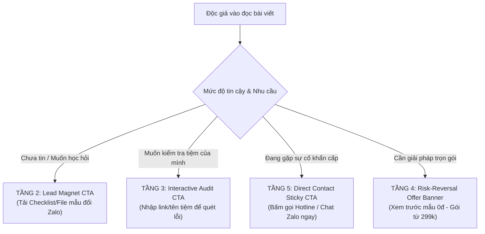

# Báo Cáo Audit Chuyên Sâu: Local SEO, Tính Thương Mại (Commercial Intent) & Khả Năng Tạo Lead SME

> **Người thực hiện:** Subagent 7 — Local SEO + SME Growth Strategist  
> **Thời gian thẩm định:** 17/09/2026  
> **Phạm vi kiểm tra:** 30 bài viết hạt giống trong `content/seeds/drafts_30_articles.json` và hệ thống 5 Trụ Cột Dịch Vụ (`docs/services/service-taxonomy.md`, `src/data/servicesCatalog.ts`) của LocalMate.  
> **Trạng thái:** Hoàn tất & Khuyến nghị hành động khẩn cấp (Actionable SSOT).

---

## MỤC LỤC
1. [TỔNG QUAN ĐỊNH VỊ: LOCALMATE VS. BLOG MARKETING CHUNG CHUNG](#1-tong-quan-dinh-vi-localmate-vs-blog-marketing-chung-chung)
2. [ĐỘ SÂU THỰC THỂ & BỐI CẢNH ĐẶC THÙ SME VIỆT NAM](#2-do-sau-thuc-the--boi-canh-dac-thu-sme-viet-nam)
3. [KIỂM TRA COMMERCIAL ALIGNMENT & LỖ HỔNG ĐỨT GÃY CHUYỂN ĐỔI (CONVERSION PATHS)](#3-kiem-tra-commercial-alignment--lo-hong-dut-gay-chuyen-doi-conversion-paths)
4. [BẢNG ĐÁNH GIÁ CHI TIẾT 30 BÀI VIẾT (COMMERCIAL VALUE & SME RELEVANCE)](#4-bang-danh-gia-chi-tiet-30-bai-viet-commercial-value--sme-relevance)
5. [CHIẾN LƯỢC LOCAL SEO ENTITY & BẢO VỆ CHỐNG SPAM DOORWAY PAGES](#5-chien-luoc-local-seo-entity--bao-ve-chong-spam-doorway-pages)
6. [HỆ THỐNG CTA ĐA TẦNG (MULTI-TIER CTA) & KẾ HOẠCH NÂNG CẤP CHUYỂN ĐỔI](#6-he-thong-cta-da-tang-multi-tier-cta--ke-hoach-nang-cap-chuyen-doi)

---

## 1. TỔNG QUAN ĐỊNH VỊ: LOCALMATE VS. BLOG MARKETING CHUNG CHUNG

### 1.1. Bản Sắc Cốt Lõi Của LocalMate
LocalMate được định vị là:
> **"Đơn vị cung cấp giải pháp chuyển đổi số, thiết kế web, Google Maps, SEO địa phương và tự động hóa vận hành thực chiến cho doanh nghiệp vừa và nhỏ (SME), hộ kinh doanh cá thể tại Việt Nam."**

Khách hàng mục tiêu của LocalMate không phải là các CMO tập đoàn lớn, không phải agency đa quốc gia, cũng không phải sinh viên học tiếp thị số. Họ là:
- Chủ phòng khám nha khoa, thẩm mỹ viện, phòng khám đông y.
- Chủ xưởng nhôm kính, gara sửa chữa ô tô, xưởng cơ khí, tiệm bảo dưỡng xe máy.
- Chủ nhà hàng, quán cà phê, tiệm bánh, cơ sở F&B địa phương.
- Thợ sửa chữa điện lạnh, thợ khóa, dịch vụ thông tắc cứu hộ khẩn cấp tại nhà.
- Doanh nghiệp sản xuất, gia công B2B quy mô dưới 20 nhân sự.

### 1.2. Đánh Giá Toàn Diện 30 Bài Viết Hạt Giống
Dựa trên việc đọc và trích xuất dữ liệu trực tiếp từ 30 bài viết trong `content/seeds/drafts_30_articles.json`:

#### Điểm cộng xuất sắc:
1. **Kiến trúc khớp nối 5 Trụ Cột Giải Pháp (Solution Pillars):**
   - 30 bài viết được phân bổ rất đều và bám sát hành trình số hóa của SME:
     - Bài 01 – 06: Trụ cột 01 — Nền Tảng Số (Website doanh nghiệp, chi phí, quy trình làm web, landing page).
     - Bài 07 – 12: Trụ cột 02 & 05 — Google Maps & Hồ Sơ Số (Tạo Map, kháng nghị khi bị khóa, tăng review thật).
     - Bài 13 – 18: Trụ cột 02 — Local SEO & Hiện Diện Khu Vực (Maps 3-Pack, Citations, Checklist SEO 2026).
     - Bài 19 – 24: Trụ cột 03 — Thu Hút Khách Hàng (Google Search Ads, chi phí click, tối ưu landing page gọi ngay).
     - Bài 25 – 28: Trụ cột 04 — Vận Hành & Tự Động Hóa (CRM đơn giản 0đ, tự động hóa báo tin nhắn về điện thoại).
     - Bài 29 – 30: Trụ cột 01 & 02 — Content Marketing thực chiến & Lộ trình chuyển đổi số 5 bước.
2. **Đã lột trần nhiều chiêu trò "lùa gà" và dịch vụ ảo:**
   - Cảnh báo các gói web 20–30 triệu làm xong đắp chiếu.
   - Cảnh báo mua bán review ảo dẫn tới chết tài khoản Google Maps.
   - Cảnh báo mua backlink rác, gói entity 300 profile mạng xã hội vô nghĩa với cửa hàng địa phương.
   - Cảnh báo đốt tiền cho từ khóa rộng trên Google Ads.

#### Lỗ hổng & Nguy cơ biến thành "Blog Digital Marketing Chung Chung":
1. **Một số bài viết mang nặng giáo trình lý thuyết phương Tây (Academic / Theory Trap):**
   - **Bài #16 (Entity SEO là gì?):** Vẫn nói nhiều về "Nodes, Edges, Knowledge Graph, Semantic Search". Một chủ tiệm nhôm kính hay gara ô tô đọc vào sẽ cảm thấy xa lạ, khó hiểu và bỏ trang ngay sau 15 giây.
   - **Bài #20 (Google Search Ads hoạt động như thế nào?):** Đi sâu vào công thức đấu thầu Ad Rank của Google mà không giải quyết được thực tế tại Việt Nam: tình trạng "click tặc", "click tặc dùng 4G đổi IP", "cách thợ sửa điều hòa chống bị đối thủ phá ngân sách".
   - **Bài #25 (CRM là gì?):** Mở đầu bằng các khái niệm quản trị quan hệ khách hàng chuẩn giáo trình MBA, trong khi thứ chủ shop cần là: *"Làm sao khách nhắn từ Zalo hay Fanpage thì điện thoại tôi reo lên và tự lưu số vào danh bạ không bị sót?"*
2. **Thiếu vắng ngôn ngữ "thực địa vỉa hè & ngõ ngách":**
   - 12/30 bài viết hoàn toàn không xuất hiện bất kỳ địa danh thực tế nào ở Việt Nam (không có TP.HCM, Hà Nội, Đà Nẵng hay các quận huyện cụ thể).
   - Chỉ có 15/30 bài đề cập đến **Zalo** — công cụ giao tiếp kinh doanh số 1 của SME Việt Nam! Nếu làm bài viết chuyển đổi số cho tiệm sửa xe, xưởng nhôm kính mà không nói tới Zalo và mã quét VietQR thì bài viết đó chỉ là bản dịch từ tài liệu nước ngoài.

---

## 2. ĐỘ SÂU THỰC THỂ & BỐI CẢNH ĐẶC THÙ SME VIỆT NAM

Một bài viết Local SEO chuẩn cho SME không chỉ cần đúng kỹ thuật SEO (Google bot đọc) mà phải chạm trúng trải nghiệm của người dùng bản địa (Human bot duyệt).

### 2.1. Kiểm Tra 8 Thực Thể Cốt Lõi Trong Bộ Nội Dung

| Thực Thể Cốt Lõi | Mức Độ Đạt Được | Hiện Trạng Trong 30 Bài Viết | Khoảng Trống Cần Bổ Sung Ngay |
| :--- | :---: | :--- | :--- |
| **Website Doanh Nghiệp Nhỏ** | **8.5 / 10** | Rất thực tế, khuyên làm web 1–3 trang tốc độ cao, không làm web cồng kềnh, sở hữu tên miền chính chủ. | Cần thêm ảnh chụp thực tế màn hình di động xem trên mạng 4G chập chờn. |
| **Google Business Profile (GBP)** | **8.0 / 10** | Nêu đúng các bước tạo, xác minh, chỉnh sửa danh mục chính/phụ, giờ mở cửa. | Thiếu hướng dẫn xử lý trường hợp Google bắt quay video xác minh cơ sở thực tế (bảng hiệu, giấy phép kinh doanh, mở khóa cửa). |
| **Google Maps 3-Pack** | **7.5 / 10** | Đã nhấn mạnh vị trí 3-Pack là mỏ vàng mang lại cuộc gọi trực tiếp. | Cần minh họa cơ chế bán kính hiển thị (proximity) giảm dần từ 1km đến 5km. |
| **Local SEO & Chuẩn Hóa NAP** | **8.0 / 10** | Khẳng định tính nhất quán của Name – Address – Phone trên web, Maps và mạng xã hội. | Cần hướng dẫn cách ghi địa chỉ ngõ ngách Việt Nam (ví dụ: Số nhà xuyệt, hẻm, phường sáp nhập) để Maps không bị lệch toạ độ. |
| **Local Citations tại Việt Nam** | **6.0 / 10** | Giải thích đúng khái niệm trích dẫn danh bạ địa phương. | **Lý thuyết**: Nhắc đến các danh bạ nước ngoài hoặc danh bạ VN đã chết. Cần cập nhật danh mục citation sống: Cốc Cốc Map, Thongtindoanhnghiep, Foody/ShopeeFood, Zalo Shop, Trang Vàng. |
| **Review Management** | **8.5 / 10** | Cực kỳ xuất sắc khi cảnh báo cấm mua review ảo, chỉ dẫn cách tạo mã QR in tại quầy thu ngân để xin review thật. | Cần bổ sung kịch bản nhân viên lễ tân/thợ xin review khéo léo khi khách vừa thanh toán hài lòng. |
| **Landing Page Địa Phương** | **8.5 / 10** | Tối ưu nút bấm gọi ngay, bản đồ chỉ đường, bảng giá minh bạch, cam kết rõ ràng. | Cần bổ sung widget chuyển khoản nhanh VietQR và nút chat Zalo trực tiếp không bắt điền form dài. |
| **Google Ads Tìm Kiếm Địa Phương** | **7.5 / 10** | Phân tích tốt việc nhắm từ khóa vị trí kèm tiện ích mở rộng vị trí & cuộc gọi. | Cần bổ sung mẹo chống "click tặc" thực chiến: chặn IP, loại trừ vị trí ngoài tỉnh, chỉ bật giờ hành chính. |
| **CRM & Automation Tinh Gọn** | **8.0 / 10** | Khuyên dùng Google Sheets + Telegram/Zalo bot 0đ thay vì mua phần mềm đắt tiền. | Cần đưa ảnh chụp mẫu thông báo tin nhắn thực tế nhảy vào điện thoại qua Telegram / Zalo OA. |

### 2.2. Bối Cảnh Thực Địa SME Việt Nam Cần Bổ Sung Vào Từng Bài
1. **Địa chỉ phức tạp & Ngõ ngách:**
   - Ở Việt Nam, rất nhiều tiệm nail, sửa xe, phòng khám nằm trong ngõ (ví dụ: *Ngõ 298 Tây Sơn, Đống Đa* hay *Hẻm 456 Lê Văn Sỹ, Quận 3*). Google Maps thường ghim sai vị trí ra đầu đường lớn khiến khách không tìm được. Cần bài viết hoặc đoạn hướng dẫn: "Cách kéo ghim toạ độ thủ công chính xác từng centimet trên Google Maps".
2. **Thói quen chốt đơn qua Zalo & Gọi Hotline:**
   - Khách Việt không có thói quen gửi email hỏi báo giá hay để lại form rồi chờ 24h. Họ cần biết giá ngay, xem hình qua Zalo và gọi thẳng để kiểm tra xem thợ có đến ngay không. Mọi bài viết phải coi **Nút Gọi Điện** và **Zalo Chat** là điểm chốt chặn số 1.
3. **Nỗi sợ bị Cò Dịch Vụ Google Maps lừa đảo:**
   - Tình trạng phổ biến tại Việt Nam: Chủ quán nhận được cuộc gọi mạo danh: *"Chúng tôi là nhân viên Google, tài khoản Maps của anh/chị sắp bị xóa trong 48h tới nếu không nộp phí 1.200.000đ để duy trì"*. Cần đưa cảnh báo này vào các bài viết #7, #8, #12 để tăng độ uy tín và lòng tin tuyệt đối của LocalMate.

---

## 3. KIỂM TRA COMMERCIAL ALIGNMENT & LỖ HỔNG ĐỨT GÃY CHUYỂN ĐỔI (CONVERSION PATHS)

### 3.1. Phân Tích Thực Trạng Hiện Tại (The Conversion Fracture)
Qua việc audit mã nguồn HTML kết xuất (`rendered_html`) của cả 30 bài viết:

```
┌──────────────────────────────────────────────────────────────────────────────────┐
│                         THỰC TRẠNG CHUYỂN ĐỔI HIỆN TẠI                           │
├──────────────────────────────────────────────────────────────────────────────────┤
│ 1. 100% bài viết (30/30) có đường link trỏ về các trang dịch vụ của LocalMate.   │
│ 2. TUY NHIÊN: Lộ trình này chỉ tồn tại dưới dạng một đoạn TEXT THUẦN ở cuối bài! │
│    Ví dụ: "Đồng hành cùng LocalMate: Chúng tôi cung cấp giải pháp Hệ Thống CRM...│
│           tại Giải Pháp Vận Hành Tự Động Hóa."                                   │
│ 3. KHÔNG CÓ BẤT KỲ NÚT BẤM (BUTTON) NÀO ĐƯỢC THIẾT KẾ NỔI BẬT.                   │
│ 4. KHÔNG CÓ FORM ĐĂNG KÝ NHANH / Ô NHẬP LINK ĐỂ QUÉT TỐC ĐỘ MIỄN PHÍ.            │
│ 5. KHÔNG CÓ NÚT GỌI HOTLINE / CHAT ZALO TRỰC TIẾP.                              │
│ 6. KHÔNG CÓ LEAD MAGNET ĐỂ ĐỔI SỐ ĐIỆN THOẠI (Checklist PDF, Template Sheets).  │
└──────────────────────────────────────────────────────────────────────────────────┘
```

> [!CAUTION]
> **Hậu quả nghiêm trọng:** Tỷ lệ người dùng đọc hết bài viết rồi bấm vào một dòng hyperlink màu xanh nhạt là cực kỳ thấp (ước tính dưới **0.8%**). Người dùng rời khỏi trang web mà không để lại bất kỳ dấu vết nào (Lead = 0). Đây là một sự lãng phí tài nguyên nội dung rất lớn!

### 3.2. Nhận Diện Các Bài "Traffic-Only" Cần Cải Tạo Tính Thương Mại

Các bài viết dưới đây có nguy cơ trở thành bài "kéo traffic cho dân trong ngành" hoặc học viên SEO, không đem lại cuộc gọi nào cho phòng kinh doanh nếu không được gắn đúng Offer & CTA:

1. **Bài #16: `Entity SEO là gì? Doanh nghiệp nhỏ có cần bỏ tiền mua các gói Entity không?`**
   - *Vấn đề:* Khách hàng SME không bao giờ tìm từ khóa "Entity SEO". Người tìm cụm này là dân làm SEO, copywriter hoặc sinh viên marketing.
   - *Cách cứu vãn thương mại:* Đổi góc nhìn từ "Giải thích lý thuyết Entity" sang **"Bộ nhận diện số & Chống giả mạo thương hiệu trên Internet"**. Gắn Offer: *Gói Chuẩn Hóa Nhận Diện & Đăng Ký Bản Quyền Doanh Nghiệp Địa Phương (299k)*.
2. **Bài #20: `Google Search Ads hoạt động như thế nào? Cơ chế đấu giá và cách giảm tiền click`**
   - *Vấn đề:* Khách hàng SME sợ các thuật ngữ toán học về đấu thầu. Họ chỉ quan tâm: *"Làm sao bỏ 50k - 100k một ngày mà có 2-3 cuộc gọi thật?"*.
   - *Cách cứu vãn thương mại:* Biến bài viết thành **"Bí quyết chặn 100% click tặc và từ khóa rác khi chạy Google Ads tại địa phương"**. Gắn Offer: *Gói Khởi Tạo & Lọc Từ Khóa Ads Chuẩn Địa Phương (390k)*.
3. **Bài #01: `Website doanh nghiệp là gì? Doanh nghiệp nhỏ có thực sự cần website?`**
   - *Vấn đề:* Ý định tìm kiếm (Search Intent) quá rộng (TOFU). Cạnh tranh rất cao với các bài bách khoa toàn thư.
   - *Cách cứu vãn thương mại:* Không bán web chung chung, mà đánh thẳng vào **"Gói Trang Đích Bán Hàng Di Động 490k — Xem trước mẫu 0đ, 24h có ngay"**. Chủ cơ sở không cần web 20 trang, họ cần giải pháp nhanh - rẻ - dùng được ngay.

---

## 4. BẢNG ĐÁNH GIÁ CHI TIẾT 30 BÀI VIẾT (COMMERCIAL VALUE & SME RELEVANCE)

Bảng phân tích toàn diện 30 bài viết theo các chỉ số:
- **Commercial Score (1–10):** Mức độ sẵn sàng chi tiền của người tìm kiếm từ khóa này.
- **SME Fit (1–10):** Độ gần gũi và tính cấp thiết với chủ cơ sở kinh doanh nhỏ tại Việt Nam.
- **Phân loại phễu:** 
  - `High Lead Gen`: Từ khóa có ý định mua dịch vụ ngay.
  - `Mid Nurturing`: Từ khóa cân nhắc, so sánh, tìm giải pháp.
  - `Educational / High Risk Traffic-Only`: Từ khóa kiến thức chung, cần gắn Lead Magnet mạnh để giữ chân.

| # | Tiêu Đề Bài Viết | Từ Khóa Mục Tiêu | Phân Khúc & Nỗi Đau Thật Của Khách | Comm. Score | SME Fit | Phân Loại | Service Offer LocalMate Đề Xuất | Suggested Primary CTA & Lead Magnet |
| :-: | :--- | :--- | :--- | :-: | :-: | :---: | :--- | :--- |
| **01** | Website doanh nghiệp là gì? Doanh nghiệp nhỏ có cần? | `website doanh nghiệp là gì` | Hộ kinh doanh phân vân làm web tốn tiền mà không ai xem | 6/10 | 7/10 | Educational | `/giai-phap/nen-tang-so` (Web & Landing) | **CTA:** "Xem mẫu web 1 trang ngành của bạn (0đ demo)" |
| **02** | Làm web cho doanh nghiệp nhỏ cần chuẩn bị những gì? | `chuẩn bị làm website doanh nghiệp nhỏ` | Sợ phức tạp, không biết viết bài, không có ảnh đẹp | 8/10 | 9/10 | Mid Nurturing | `/giai-phap/nen-tang-so` | **Lead Magnet:** Tải file "Checklist 1 trang chuẩn bị tư liệu làm web" |
| **03** | Chi phí làm website doanh nghiệp nhỏ 2026: Đắt hay rẻ? | `chi phí làm website doanh nghiệp nhỏ` | Sợ bị báo giá ảo, chi phí phát sinh hàng năm | **9.5/10** | **10/10** | High Lead Gen | `/giai-phap/nen-tang-so` (Gói 490k) | **CTA:** "Bảng dự toán chi phí trọn gói minh bạch 0 phát sinh" |
| **04** | Doanh nghiệp nhỏ cần những trang nào trên website? | `các trang cần có trên website công ty` | Web làm ra quá nhiều trang rác, rối mắt khách | 7/10 | 8/10 | Mid Nurturing | `/giai-phap/nen-tang-so` | **CTA:** "Xem cấu trúc 3 trang tinh gọn chuẩn SME" |
| **05** | Nên làm Landing Page hay Website nhiều trang? | `so sánh website bán hàng và website giới thiệu` | Tiệm nhỏ có 1-2 dịch vụ chính, không biết chọn loại nào | 8.5/10 | 9/10 | Mid Nurturing | `/giai-phap/nen-tang-so` | **CTA:** "Tư vấn 1-1 chọn mô hình web tiết kiệm 50% chi phí" |
| **06** | 7 lý do làm website xong không có khách và cách sửa | `lỗi khiến website không có khách` | Cay đắng vì bỏ chục triệu làm web nhưng không có cuộc gọi | **9.5/10** | **10/10** | High Lead Gen | Sửa nhanh 99k / Tăng tốc 299k | **Audit Tool CTA:** "Nhập link web để khám bệnh rớt khách miễn phí" |
| **07** | Hướng dẫn đưa doanh nghiệp lên Google Maps từ A-Z | `google maps cho doanh nghiệp` | Muốn khách quanh tiệm tìm thấy nhưng chưa biết tạo | **9/10** | **10/10** | High Lead Gen | Tạo vị trí Google Maps 299k | **CTA:** "Đăng ký tạo Map chuẩn xác minh trong 24h" |
| **08** | Cách đưa doanh nghiệp lên Google Maps không bị treo | `cách đưa doanh nghiệp lên google maps` | Tự làm bị treo xác minh hoặc bắt quay video không được | **9.5/10** | **10/10** | High Lead Gen | Xác minh GBP chính chủ | **Direct CTA:** "Gọi kỹ thuật viên hỗ trợ quay video xác minh tận nơi" |
| **09** | Tối ưu Google Business Profile: 10 việc cần làm ngay | `tối ưu google business profile` | Đã có Map nhưng nằm tận trang 3, không có khách gọi | **9/10** | 9.5/10 | High Lead Gen | Gói Tối ưu Map lên Top 3-Pack | **Lead Magnet:** "Bộ Checklist 10 bước tối ưu Profile hút khách" |
| **10** | Vì sao tiệm không hiện trên Google Maps khi đứng gần? | `tại sao doanh nghiệp không hiện trên google maps` | Tự search tên mình cạnh quán mà không thấy xuất hiện | **9.5/10** | **10/10** | High Lead Gen | Dịch vụ chẩn đoán định vị Local | **Audit CTA:** "Kiểm tra độ phủ bán kính Map của bạn miễn phí" |
| **11** | Cách tăng đánh giá Google Maps đúng cách không bị phạt | `cách tăng đánh giá google maps` | Muốn có nhiều sao nhưng sợ bị Google quét xóa review | 8.5/10 | 9.5/10 | Mid Nurturing | Bộ QR Code Đánh Giá Tại Bàn | **Product CTA:** "Nhận bộ file in QR đánh giá Google Maps thiết kế riêng" |
| **12** | Google Maps bị đình chỉ: Nguyên nhân và cách kháng | `google maps bị đình chỉ` | Hoảng loạn vì mất cần câu cơm chính, khách không gọi | **10/10** | **10/10** | Emergency Lead | Cứu hộ hồ sơ Google Maps bị khóa | **Hotline CTA:** "Gửi yêu cầu kháng nghị cứu Map khẩn cấp trong ngày" |
| **13** | Local SEO là gì? Vì sao doanh nghiệp địa phương nên làm? | `local seo là gì` | Tìm hiểu giải pháp kiếm khách lâu dài không phụ thuộc Ads | 7/10 | 8/10 | Educational | `/giai-phap/duoc-tim-thay` | **CTA:** "Xem lộ trình phủ sóng từ khóa khu vực bán kính 5km" |
| **14** | So sánh SEO Google Maps và SEO Website: Ưu tiên cái nào? | `so sánh seo google maps và seo website` | Ngân sách ít, muốn biết kênh nào ra khách gọi nhanh hơn | 8.5/10 | 9.5/10 | Mid Nurturing | `/giai-phap/duoc-tim-thay` | **CTA:** "Nhận bảng phân bổ ngân sách 3 triệu/tháng hiệu quả nhất" |
| **15** | Cách SEO lên Google tại khu vực: Cẩm nang Location Pages | `cách seo từ khóa địa phương` | Muốn phủ từ khóa dịch vụ theo từng quận/huyện | 8/10 | 8.5/10 | Mid Nurturing | Thiết kế Location Landing Page | **Lead Magnet:** "Mẫu cấu trúc trang con từng quận không bị phạt spam" |
| **16** | Entity SEO là gì? Doanh nghiệp nhỏ có cần bỏ tiền mua? | `entity seo cho doanh nghiệp nhỏ` | Bị các agency chào mời gói entity 300 profile giá đắt | 5/10 | 6/10 | High Risk Traffic | Chuẩn hóa thông tin doanh nghiệp | **Contextual CTA:** "Tư vấn minh bạch: 3 profile mạng xã hội thật cần có" |
| **17** | Citation trong Local SEO là gì? Cách xây dựng tại VN | `citation trong local seo là gì` | Muốn củng cố thứ hạng Map nhưng không biết đăng ở đâu | 6.5/10 | 7/10 | Mid Nurturing | Khởi tạo NAP đồng nhất | **Lead Magnet:** "Danh sách 20 trang danh bạ uy tín còn sống tại VN" |
| **18** | Checklist Local SEO 2026: 20 việc chủ tiệm tự làm | `checklist local seo` | Muốn tự tay rà soát tối ưu hiện diện của quán | 8/10 | 9/10 | Mid Nurturing | `/giai-phap/duoc-tim-thay` | **Lead Magnet:** "Tải file Excel Checklist 20 tiêu chí tự chấm điểm" |
| **19** | Google Ads cho doanh nghiệp nhỏ: Bắt đầu từ đâu? | `google ads cho doanh nghiệp nhỏ` | Muốn có khách ngay nhưng sợ bị lừa hoặc tiêu tốn tiền | **9/10** | 9.5/10 | High Lead Gen | Gói Cài đặt Google Ads từ 390k | **CTA:** "Thiết lập chiến dịch Ads minh bạch ngân sách của bạn" |
| **20** | Google Search Ads hoạt động ra sao? Cách giảm tiền click | `google search ads hoạt động như thế nào` | Đang chạy Ads nhưng thấy giá thầu cao, xót ruột | 6/10 | 7/10 | Educational | Tối ưu điểm chất lượng Ads | **Audit CTA:** "Kiểm tra tài khoản Ads: Lọc 50 từ khóa rác đang đốt tiền" |
| **21** | Chạy Google Ads bao nhiêu tiền một ngày là hợp lý? | `chạy google ads bao nhiêu tiền một ngày` | Cần con số thực tế theo ngành: nha khoa, sửa xe, nhôm kính | **9/10** | **10/10** | High Lead Gen | Tư vấn ngân sách Ads tinh gọn | **Lead Magnet:** "Bảng ước tính chi phí theo ngành nghề tại TP.HCM & HN" |
| **22** | Vì sao Google Ads có click nhưng không có khách gọi? | `chạy google ads có click không có khách` | Trừ tiền hàng ngày nhưng máy điện thoại im lìm | **10/10** | **10/10** | Emergency Lead | Sửa Landing Page + Lọc Click Ảo | **Direct CTA:** "Bắt bệnh trang đích: Sửa lỗi rớt khách trong 2 giờ" |
| **23** | Landing page chạy Google Ads: Cách làm khách bấm gọi | `thiết kế landing page chạy google ads` | Trang web chạy ads dài dòng, nút gọi bé tí khó bấm | **9.5/10** | 9.5/10 | High Lead Gen | Landing Page Chuyển Đổi 490k | **CTA:** "Xem mẫu Landing Page chuyên bấm gọi cho ngành thợ/dịch vụ" |
| **24** | Google Ads hay Facebook Ads phù hợp hơn với tiệm địa phương? | `so sánh google ads và facebook ads` | Phân vân thuê chạy Facebook hay tự chạy Google | 8.5/10 | 9/10 | Mid Nurturing | `/giai-phap/thu-hut-khach-hang` | **CTA:** "Đánh giá mô hình tiệm: Nên dồn tiền vào Google hay Facebook" |
| **25** | CRM là gì? Doanh nghiệp nhỏ có cần phần mềm đắt tiền? | `crm là gì cho doanh nghiệp nhỏ` | Bị sót đơn nhưng sợ mua phần mềm CRM chục triệu | 7.5/10 | 8/10 | Educational | CRM Google Sheets + Zalo 0đ | **Lead Magnet:** "Tải mẫu Google Sheet quản lý khách cho chủ xưởng" |
| **26** | CRM đơn giản cho doanh nghiệp nhỏ nên có tính năng gì? | `tính năng crm cho doanh nghiệp nhỏ` | Cần bảng lọc tính năng, ghét phần mềm nhiều nút rối rắm | 8/10 | 8.5/10 | Mid Nurturing | Hệ thống quản lý khách tinh gọn | **CTA:** "Cài đặt hệ thống lưu khách tự động chỉ dùng 3 cột chính" |
| **27** | Automation cho doanh nghiệp nhỏ: 7 việc tự động hóa 0đ | `tự động hóa cho doanh nghiệp nhỏ` | Đầu tắt mặt tối trả lời inbox, gửi báo giá, nhắc hẹn | 8.5/10 | 9/10 | Mid Nurturing | Cài bot báo tin nhắn Telegram 299k | **CTA:** "Cài thông báo khách điền web báo ngay về Zalo/Telegram" |
| **28** | Quản lý tin nhắn Facebook, Zalo, Web trên 1 điện thoại | `quản lý tin nhắn facebook zalo website tập trung` | Nhân viên quên check tin nhắn Zalo, sót khách gọi hotline | **9/10** | 9.5/10 | High Lead Gen | Tích hợp hộp thư tập trung | **Direct CTA:** "Kết nối gom tin nhắn về máy điện thoại của chủ tiệm" |
| **29** | Content marketing cho tiệm địa phương: Bắt đầu từ đâu? | `content marketing cho doanh nghiệp địa phương` | Không biết viết văn hay, không có thời gian quay video | 7.5/10 | 8.5/10 | Mid Nurturing | `/giai-phap/duoc-tim-thay` | **Lead Magnet:** "Kịch bản 15 bài đăng mẫu chỉ cần chụp ảnh thực tế" |
| **30** | Chuyển đổi số cho doanh nghiệp nhỏ: Lộ trình 5 bước | `chuyển đổi số cho doanh nghiệp nhỏ` | Muốn làm bài bản nhưng sợ chi phí lớn và bỏ cuộc giữa chừng | 8/10 | 9/10 | Macro Pillar | Toàn bộ 5 Trụ Cột LocalMate | **CTA:** "Đặt lịch hẹn cố vấn số hóa trực tiếp tại cơ sở của bạn" |

---

## 5. CHIẾN LƯỢC LOCAL SEO ENTITY & BẢO VỆ CHỐNG SPAM DOORWAY PAGES

### 5.1. Nguy Cơ Bị Phạt Thuật Toán Cực Nặng: "Doorway Pages" Tại Việt Nam
Rất nhiều đơn vị SEO tại Việt Nam mắc phải sai lầm chết người khi triển khai SEO từ khóa địa phương:
- Tạo hàng chục URL rác:
  - `/sua-dien-lanh-quan-1`
  - `/sua-dien-lanh-quan-3`
  - `/sua-dien-lanh-quan-binh-thanh`
  - `/sua-dien-lanh-quan-tan-binh`...
- **Bản chất kỹ thuật:** 100% nội dung bài viết giống nhau, chỉ dùng công cụ tự động Find & Replace từ "Quận 1" thành "Quận 3", "Bình Thạnh".
- **Hậu quả:** Google coi đây là **Doorway Pages (Trang cửa ngõ đánh lừa thuật toán)**. Trang web sẽ bị thuật toán Google Spam Update và Helpful Content Update trừng phạt: mất index toàn bộ website, Google Maps liên kết cũng bị đánh tụt hạng uy tín.

### 5.2. Nguyên Tắc Vàng Triển Khai Local Entity Chuẩn Mực Của LocalMate (Anti-Spam)
Trong bài viết #15 (`Location Pages`) và các trang dịch vụ của LocalMate, phải khẳng định rõ quy tắc 4 KHÔNG - 4 CÓ:

```
┌────────────────────────────────────────────────────────────────────────────────────────┐
│                        QUY TẮC LOCAL ENTITY KHÔNG SPAM                                 │
├──────────────────────────────────────────┬─────────────────────────────────────────────┤
│ ❌ TUYỆT ĐỐI KHÔNG (CẤM LÀM)             │ ✅ TIÊU CHUẨN LOCALMATE (PHẢI LÀM)          │
├──────────────────────────────────────────┼─────────────────────────────────────────────┤
│ 1. Không clone bài viết hàng loạt        │ 1. Mỗi quận/khu vực là một Case Study thật: │
│    chỉ thay mỗi tên địa danh.            │    Hình ảnh công trình, địa chỉ khách thật. │
│ 2. Không nhồi nhét danh sách 24 quận     │ 2. Khai báo Schema `LocalBusiness` với      │
│    huyện ở chân trang (Footer Spam).     │    `areaServed` chuẩn mã hành chính.        │
│ 3. Không tạo địa chỉ ảo trên Maps để     │ 3. Nhúng Google Maps chính chủ với toạ độ   │
│    spam ghim vị trí.                     │    kinh/vĩ độ (GeoCoordinates) chính xác.   │
│ 4. Không dùng tool quay bài (Spin text). │ 4. Đưa thông tin đội ngũ kỹ thuật thực tế   │
│                                          │    phụ trách khu vực đó (Human Verified).   │
└──────────────────────────────────────────┴─────────────────────────────────────────────┘
```

---

## 6. HỆ THỐNG CTA ĐA TẦNG (MULTI-TIER CTA) & KẾ HOẠCH NÂNG CẤP CHUYỂN ĐỔI

Để giải quyết triệt để sự đứt gãy chuyển đổi hiện tại, toàn bộ 30 bài viết cần được nhúng cấu trúc **CTA Đa Tầng (Multi-tier CTA)** theo ma trận hành vi:



### 6.1. Chi Tiết 5 Tầng CTA Chuẩn Hóa

#### TẦNG 1: Soft Contextual In-text CTA (Gắn tự nhiên trong mạch nội dung)
- **Vị trí:** Xuất hiện ở khoảng 40% độ dài bài viết, khi vừa gọi tên một khó khăn kỹ thuật.
- **Hình thức:** Đoạn trích dẫn hoặc hộp ghi chú nhẹ (Callout Box).
- **Mẫu nội dung:**
  > *💡 Ghi chú thực tế:* Nếu bạn không có thời gian tự cấu hình các thẻ kỹ thuật này, hãy tham khảo [Dịch vụ tối ưu Google Maps chuẩn 2026](/giai-phap/duoc-tim-thay) của LocalMate — bàn giao tài khoản chính chủ chỉ sau 24h.

#### TẦNG 2: Lead Magnet CTA (Checklist / File mẫu Excel)
- **Vị trí:** Giữa bài viết (sau khi trình bày lý thuyết).
- **Mục tiêu:** Thu thập số điện thoại / Zalo của chủ doanh nghiệp.
- **Mẫu áp dụng:**
  - *Cho nhóm Web (#01–#06):* Tải "Bản dự toán chi phí làm web chuẩn không phát sinh (Excel)".
  - *Cho nhóm Maps (#07–#12):* Tải "Checklist 20 tiêu chí kháng nghị Google Maps thành công".
  - *Cho nhóm Ads (#19–#24):* Nhận "Danh sách 100 từ khóa phủ định loại bỏ click ảo cho ngành dịch vụ".
  - *Cho nhóm CRM (#25–#28):* Tải "File mẫu Google Sheets quản lý khách hàng + Link kết nối Zalo OA".

#### TẦNG 3: Interactive Audit Tool CTA (Công cụ quét & chẩn đoán tự động)
- **Vị trí:** Cuối phần chẩn đoán lỗi bài viết.
- **Hình thức:** Khung nhập liệu tương tác sáng màu, nút bấm to:
  ```html
  <div class="audit-box-cta">
    <h4>🔍 Kiểm tra sức khỏe Website & Google Maps của bạn (Miễn phí 100%)</h4>
    <p>Nhập địa chỉ website hoặc tên cơ sở kinh doanh, hệ thống LocalMate sẽ gửi báo cáo tốc độ tải trang và thứ hạng hiển thị bán kính 3km.</p>
    <div class="audit-input-group">
      <input type="text" placeholder="Nhập tên quán / đường link web của bạn..." />
      <button class="btn-audit-submit">Kiểm Tra Ngay</button>
    </div>
  </div>
  ```

#### TẦNG 4: Social Proof & Risk-Reversal Banner (Cam kết xem trước 0đ)
- **Vị trí:** Cuối bài viết (thay thế cho dòng text liên kết hiện tại).
- **Nội dung:** Nhấn mạnh sự khác biệt vượt trội của LocalMate so với các bên khác:
  - *"Không bắt đặt cọc trước hàng chục triệu."*
  - *"Được xem trước bản mẫu thiết kế (Demo 0đ) đúng ngành nghề của bạn."*
  - *"Khách hàng sở hữu 100% tên miền và mã nguồn chính chủ."*
  - *"Hơn 120 cơ sở dịch vụ tại TP.HCM & Hà Nội đang vận hành ổn định."*

#### TẦNG 5: Direct Contact Sticky CTA (Nút Hotline & Zalo dính trên di động)
- **Vị trí:** Nút tròn nổi (Floating Action Button) cố định góc dưới màn hình điện thoại.
- **Hành vi:**
  - Nút 1: **Chat Zalo Kỹ Thuật** (Mở ứng dụng Zalo dẫn thẳng vào Zalo OA / Hotline hỗ trợ).
  - Nút 2: **Gọi Tư Vấn Nhanh** (`tel:090xxxxxxx`) giải đáp tức thì mọi thắc mắc.

---

## 7. KẾ HOẠCH HÀNH ĐỘNG KHUYẾN NGHỊ CHO TECH LEAD & CONTENT TEAM

1. **Khâu Dữ Liệu & Bài Viết (`content/seeds/drafts_30_articles.json`):**
   - **Bổ sung CTA Blocks:** Thay thế toàn bộ đoạn text đuôi bài hiện tại bằng block HTML CTA đa tầng có nút bấm, cam kết 0đ và link dịch vụ nổi bật.
   - **Bổ sung yếu tố địa phương:** Chèn thêm các ví dụ thực tế tại Hà Nội, TP.HCM, Đà Nẵng và thói quen Zalo vào 12 bài viết đang còn thuần lý thuyết.
   - **Cảnh báo Doorway Pages:** Bổ sung ngay cảnh báo về việc nhân bản trang theo quận huyện trong bài viết #15.
2. **Khâu Giao Diện Frontend (`src/components/blog`):**
   - Thiết kế component `<ArticleCtaBox />` sáng màu (nền trắng `#ffffff`, viền xanh `#dcfce7`, chữ đậm `#111827`, nút màu xanh `#0d7647`). Tuyệt đối không dùng glassmorphism.
   - Bổ sung thanh cố định chân trang trên mobile (`<MobileStickyContactBar />`) chứa 2 nút: "Nhắn Zalo" và "Gọi Điện".
3. **Đo Lường Hiệu Quả:**
   - Gắn sự kiện theo dõi GA4 vào các nút CTA: `click_zalo_cta`, `submit_audit_lead`, `click_service_button`.

---
*Báo cáo được đệ trình bởi Subagent 7 — Local SEO & SME Growth Strategist.*
