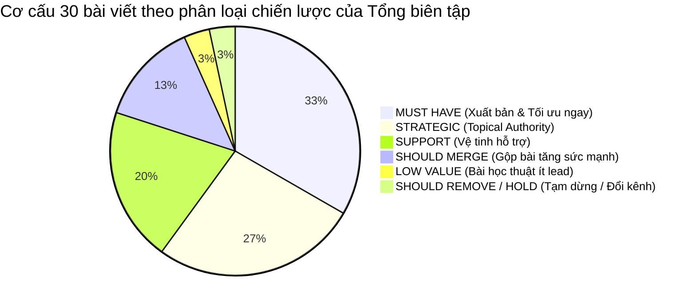
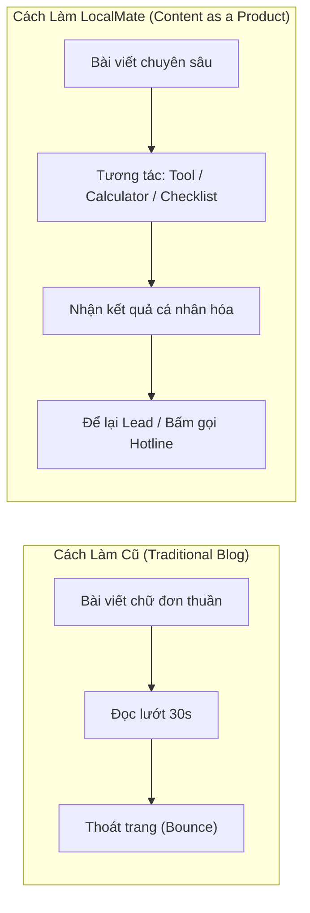
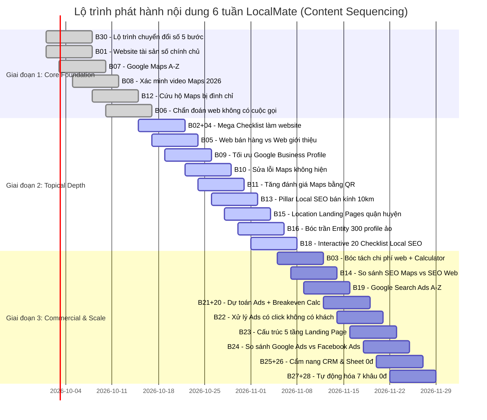

# 🧭 BÁO CÁO TỔNG BIÊN TẬP & SEO PRODUCT MANAGER (PORTFOLIO VALUATION & SEQUENCING STRATEGY)

> **Tài liệu:** Đánh giá danh mục 30 bài viết như một tài sản kinh doanh (Content Economics & Portfolio Valuation)  
> **Chức danh:** Subagent 10 — Editor-in-Chief + SEO Product Manager  
> **Hệ thống:** LocalMate CMS & Digital Marketing Hub  
> **Thời gian thực hiện:** Tháng 09/2026  
> **Trạng thái:** ✅ **PHÊ DUYỆT ĐỊNH HƯỚNG CHIẾN LƯỢC — PHÂN BỔ TÀI NGUYÊN GIAI ĐOẠN 2026**

---

## PHẦN 1: NGUYÊN TẮC QUẢN TRỊ DANH MỤC & PHƯƠNG TRÌNH KINH TẾ NỘI DUNG (CONTENT ECONOMICS)

### 1.1. Thoát khỏi bẫy tâm lý chi phí chìm (Sunk-Cost Fallacy)
Trong quản trị sản phẩm nội dung, sai lầm phổ biến nhất của các đơn vị là: *"Vì chúng ta đã bỏ công viết nháp 30 bài, nên phải cố xuất bản cả 30 bài lên web cùng lúc"*. Tư duy này dẫn đến:
1. **Pha loãng thẩm quyền chuyên đề (Topical Dilution):** Xuất bản các bài viết mỏng (thin content) dưới 500 từ khiến thuật toán Google đánh giá thấp toàn bộ website.
2. **Ăn thịt từ khóa (Keyword Cannibalization):** Nhiều bài nhắm vào các truy vấn tương đồng (ví dụ: bài 01 vs bài 04 vs bài 05; bài 25 vs bài 26) khiến Google phân vân không biết xếp hạng URL nào, dẫn tới việc cả 2 URL đều bị đẩy ra khỏi trang 1.
3. **Lãng phí ngân sách thu thập dữ liệu (Crawl Budget Waste):** Bot tìm kiếm mất thời gian quét qua các URL giá trị thấp thay vì dồn tài nguyên index và cập nhật các trang trụ cột sinh lời.
4. **Nợ kỹ thuật và chi phí bảo trì (Maintenance Debt):** Càng nhiều URL rác, chi phí kiểm tra link hỏng, cập nhật chính sách và làm mới nội dung hàng năm càng tăng vọt.

**Tuyên ngôn của Tổng biên tập:** Một bài viết không được đo lường bằng việc nó đã viết xong hay chưa, mà được định giá bằng **lợi nhuận ròng (Net Business Value)** mà nó mang lại cho LocalMate trong 12 - 24 tháng tới.

---

### 1.2. Phương trình định giá tài sản nội dung (Content Valuation Equation)

$$\mathbf{Net\ Business\ Value} = (\mathbf{SEO\ Potential} + \mathbf{Lead\ Potential} + \mathbf{Brand\ Differentiation}) - (\mathbf{Content\ Polish\ Effort} + \mathbf{Maintenance\ Cost})$$

Trong đó:
- **SEO Potential (Tiềm năng SEO):** Khối lượng tìm kiếm thực tế (Search Volume), độ khó từ khóa (Keyword Difficulty) và khả năng lọt Top 3 bền vững trong thị trường Việt Nam.
- **Lead Potential (Tiềm năng tạo khách hàng):** Khả năng thôi thúc độc giả bấm nút gọi điện thoại, gửi tin nhắn Zalo hoặc để lại thông tin nhận tư vấn giải pháp.
- **Brand Differentiation (Sức mạnh định vị thương hiệu):** Mức độ thể hiện góc nhìn độc quyền của LocalMate (chính chủ tài khoản, bóc trần chiêu trò agency giá rẻ, thực tế, minh bạch).
- **Content Polish Effort (Công sức tinh chỉnh):** Thời gian cần thiết của đội ngũ kỹ thuật/biên tập để biến bài viết từ mức trung bình thành tài sản xuất sắc (bổ sung infographic, bảng tính, schema markup).
- **Maintenance Cost (Chi phí duy trì):** Tần suất nội dung bị lỗi thời do Google đổi thuật toán hoặc biến động thị trường, đòi hỏi phải audit lại định kỳ.

---

### 1.3. Hệ thống 6 phân loại chiến lược (The 6-Tier Portfolio Taxonomy)

Toàn bộ 30 bài viết trong kho hạt giống (`content/seeds/drafts_30_articles.json`) được phân bổ dứt khoát vào 6 nhóm chiến lược:

1. **MUST HAVE (Thiết yếu sống còn — 10 bài):** Chất lượng chuyên sâu, giải quyết điểm đau khẩn cấp, có tỷ lệ chuyển đổi lead cao nhất hoặc là nền tảng tối thượng của hệ thống. Phải được đánh bóng hoàn hảo và xuất bản đầu tiên.
2. **STRATEGIC (Định vị chiến lược — 8 bài):** Đóng vai trò xây dựng pháo đài chuyên môn (Topical Authority), thể hiện POV sắc bén, phá vỡ định kiến sai lệch và tạo rào cản phòng vệ thương hiệu trước đối thủ.
3. **SUPPORT (Bổ trợ vệ tinh — 6 bài):** Các bài hướng dẫn chi tiết (How-to, Implementation), đóng vai trò vệ tinh liên kết chặt chẽ và truyền sức mạnh (link juice) về bài trụ cột.
4. **SHOULD MERGE (Nên sáp nhập — 4 bài):** Các bài bị phân mảnh nội dung, dung lượng ngắn (< 550 từ), dẫm chân intent với bài lớn. Cần gộp thẳng vào bài trụ cột để tạo thành "Mega-Article" có chiều sâu trên 1.100 từ.
5. **LOW VALUE (Giá trị thấp — 1 bài):** Từ khóa mang tính học thuật dành cho dân làm SEO, không phản ánh hành vi tìm kiếm của chủ hộ kinh doanh/thợ địa phương, tiềm năng tạo lead = 0.
6. **SHOULD REMOVE / HOLD (Tạm dừng / Hủy — 1 bài):** Danh mục mồ côi (Orphan category), làm loãng kiến trúc 5 Trụ cột giải pháp của LocalMate, nên giữ lại làm tư liệu truyền thông mạng xã hội thay vì đưa lên web.

---

## PHẦN 2: BẢNG KIỂM TOÁN VÀ ĐỊNH GIÁ TOÀN BỘ 30 BÀI VIẾT (PORTFOLIO VALUATION MATRIX)

| ID | Tiêu đề bài viết | Slug | Category | Phân loại (Verdict) | Vai trò chiến lược | Tiềm năng Lead | Công sức hoàn thiện | Kế hoạch hành động chi tiết |
| :---: | :--- | :--- | :--- | :---: | :--- | :---: | :---: | :--- |
| **01** | Website doanh nghiệp là gì? Doanh nghiệp nhỏ có thực sự cần website? | `website-doanh-nghiep-la-gi-doanh-nghiep-nho-co-can-website` | `website` | **MUST HAVE** | Nền tảng nhận thức (Pillar) | Trung bình | Thấp | Xuất bản Phase 1. Định vị tài sản số chính chủ vs mạng xã hội đi thuê. Đã có 1.171 từ chất lượng cao. |
| **02** | Làm website cho doanh nghiệp nhỏ cần chuẩn bị những gì? | `lam-website-cho-doanh-nghiep-nho-can-chuan-bi-nhung-gi` | `website` | **SUPPORT** | Hướng dẫn chuẩn bị đầu vào | Cao | Vừa | Gộp nội dung Bài 04 vào bài này để tạo thành Mega Checklist hoàn chỉnh. Tích hợp PDF Checklist tải về. |
| **03** | Chi phí làm website doanh nghiệp nhỏ năm 2026 gồm những gì? | `chi-phi-lam-website-doanh-nghiep-nho-2026` | `website` | **MUST HAVE** | Định giá & Minh bạch hóa | **Rất cao** | Vừa | Top 5 bài cốt lõi. Chuyển đổi thành **Interactive Website Cost Calculator** gắn trực tiếp vào bài. |
| **04** | Website giới thiệu công ty nên có những trang nào để chốt khách hiệu quả? | `website-gioi-thieu-cong-ty-nen-co-nhung-trang-nao` | `website` | **SHOULD MERGE** | Cấu trúc trang cơ bản | Thấp | Vừa | **Gộp vào Bài 02**. Tránh phân mảnh bài 559 từ; đưa 4 trang cơ bản thành 1 đề mục trong checklist chuẩn bị. |
| **05** | Website bán hàng và website giới thiệu khác nhau thế nào? | `website-ban-hang-va-website-gioi-thieu-khac-nhau-nhu-the-nao` | `website` | **STRATEGIC** | Cây quyết định Yes/No | Trung bình | Thấp | Bài viết tiết kiệm tiền cho khách: 90% tiệm dịch vụ chỉ cần web giới thiệu gọi điện, không cần giỏ hàng online. |
| **06** | Vì sao website doanh nghiệp có người vào xem nhưng không có ai gọi điện? | `10-loi-pho-bien-khien-website-doanh-nghiep-khong-co-khach` | `website` | **MUST HAVE** | Chẩn đoán điểm nghẽn | **Rất cao** | Thấp | Top 5 bài cốt lõi. Bắt trọn tệp khách thất vọng với agency cũ. Tích hợp form đăng ký Free Web Audit. |
| **07** | Google Maps cho doanh nghiệp: Hướng dẫn từ A đến Z cho hộ kinh doanh | `google-maps-cho-doanh-nghiep-huong-dan-tu-a-den-z` | `google-maps` | **MUST HAVE** | Mặt tiền số cốt lõi (Pillar) | **Rất cao** | Thấp | Top 5 bài cốt lõi. Trụ cột của Pillar "Được tìm thấy". Cẩm nang toàn diện xác lập chủ quyền vị trí kinh doanh. |
| **08** | Cách đưa doanh nghiệp lên Google Maps: Xác minh video thực địa 2026 | `cach-dua-doanh-nghiep-len-google-maps` | `google-maps` | **MUST HAVE** | Hướng dẫn kỹ thuật nóng | **Rất cao** | Thấp | Giải quyết điểm nghẽn lớn nhất năm 2026: Google bắt quay video 90s không cắt ghép. Cung cấp kịch bản mẫu. |
| **09** | Cách tối ưu Google Business Profile để khách hàng quanh đây dễ tìm thấy | `cach-toi-uu-google-business-profile-de-khach-de-tim-thay` | `google-maps` | **SUPPORT** | Tối ưu hóa thứ hạng | Cao | Thấp | Vệ tinh hỗ trợ Bài 07. Tập trung vào bán kính 3-5km, danh mục ngành nghề và menu bảng giá. |
| **10** | Vì sao doanh nghiệp không xuất hiện trên Google Maps? Cách khắc phục nhanh | `vi-sao-doanh-nghiep-khong-xuat-hien-tren-google-maps` | `google-maps` | **SUPPORT** | Xử lý sự cố kỹ thuật | Cao | Thấp | Phân biệt hồ sơ bị ẩn do vi phạm thuật toán vs nằm ngoài bán kính tìm kiếm. Lọc hồ sơ trùng lặp. |
| **11** | Cách tăng đánh giá Google Maps đúng cách và bền vững cho hộ kinh doanh | `cach-tang-danh-gia-google-maps-dung-cach` | `google-maps` | **STRATEGIC** | Tăng trưởng uy tín | Cao | Vừa | Định vị đạo đức: cấm mua review ảo. Hướng dẫn quy trình in mã QR để bàn và kịch bản 3 câu xin đánh giá thật. |
| **12** | Google Maps bị đình chỉ: Nguyên nhân cốt lõi và quy trình kháng nghị khôi phục | `google-maps-bi-dinh-chi-nguyen-nhan-va-cach-xu-ly` | `google-maps` | **MUST HAVE** | Cứu hộ khẩn cấp (SOS) | **Rất cao** | Vừa | Top 5 bài cốt lõi. Chuyển đổi thành **Emergency Service Landing Page**. Khách hàng sẵn sàng trả phí cứu Maps. |
| **13** | Local SEO là gì? Vì sao doanh nghiệp địa phương nên tập trung làm Local SEO? | `local-seo-la-gi-vi-sao-doanh-nghiep-dia-phuong-nen-lam` | `local-seo` | **STRATEGIC** | Định hướng chiến lược (Pillar) | Trung bình | Vừa | Trụ cột Local SEO. Phân biệt SEO đốt tiền toàn quốc vs SEO tập trung bán kính 10km quanh tiệm. |
| **14** | SEO Google Maps và SEO Website khác nhau thế nào? Nên ưu tiên làm cái nào? | `seo-google-maps-va-seo-website-khac-nhau-nhu-the-nao` | `local-seo` | **SUPPORT** | So sánh & Phân bổ vốn | Trung bình | Thấp | Phân tích ngành nghề nào cần Maps trước (sửa chữa, cứu hộ), ngành nào cần Web trước (nội thất, dịch vụ cao cấp). |
| **15** | Cách SEO doanh nghiệp lên Google tại khu vực địa phương: Cẩm nang Location Pages | `cach-seo-doanh-nghiep-len-google-tai-khu-vuc-dia-phuong` | `local-seo` | **SUPPORT** | Kỹ thuật mở rộng địa bàn | Cao | Vừa | Cẩm nang xây dựng Landing Page quận/huyện chất lượng, cấm dùng tool nhân bản trang tự động gây phạt SpamBrain. |
| **16** | Entity SEO là gì? Doanh nghiệp nhỏ có cần bỏ tiền mua các gói Entity không? | `entity-seo-la-gi-co-can-thiet-cho-doanh-nghiep-nho` | `local-seo` | **STRATEGIC** | Bóc trần chiêu trò | Cao | Thấp | Vô hiệu hóa gói Entity 300 profile ảo giá 3-5 triệu của agency lừa đảo. Chuẩn hóa Schema và NAP thật tại VN. |
| **17** | Citation trong Local SEO là gì và cách xây dựng chuẩn xác tại Việt Nam | `citation-trong-local-seo-la-gi` | `local-seo` | **LOW VALUE** | Bổ trợ kỹ thuật thuần túy | Rất thấp | Thấp | Keyword mang tính học thuật SEO, chủ tiệm không search. Giữ lại làm tài liệu tham khảo hoặc gộp vào Bài 16. |
| **18** | Checklist Local SEO 2026: 20 việc chủ tiệm tự làm để lên top tìm kiếm | `checklist-local-seo-cho-doanh-nghiep-dia-phuong` | `local-seo` | **MUST HAVE** | Công cụ thực thi (Lead Magnet) | **Rất cao** | Vừa | Top 10 Topical Authority. Chuyển thành **Interactive Audit Checklist** tích chọn trực quan trên web. |
| **19** | Google Ads cho doanh nghiệp nhỏ: Bắt đầu từ đâu để không bị đốt tiền oan? | `google-ads-cho-doanh-nghiep-nho-bat-dau-tu-dau` | `google-ads` | **STRATEGIC** | Khởi động quảng cáo (Pillar) | Cao | Thấp | Trụ cột Google Ads. Định hướng chỉ chạy Search Ads phục vụ nhu cầu chủ động, cấm chạy banner dàn trải. |
| **20** | Google Search Ads hoạt động như thế nào? Cơ chế đấu giá và cách giảm tiền click | `google-search-ads-hoat-dong-nhu-the-nao` | `google-ads` | **SHOULD MERGE** | Cơ chế đấu thầu | Thấp | Thấp | **Gộp vào Bài 21**. Đưa công thức Ad Rank & Quality Score vào bài ngân sách để chứng minh cách tiết kiệm tiền click. |
| **21** | Chạy Google Ads bao nhiêu tiền một ngày là hợp lý cho doanh nghiệp nhỏ? | `chay-google-ads-bao-nhieu-tien-mot-ngay-la-hop-ly` | `google-ads` | **MUST HAVE** | Dự toán ngân sách thực tế | **Rất cao** | Vừa | Tích hợp nội dung Bài 20. Chuyển đổi thành **Google Ads Breakeven Calculator** (Tính điểm hòa vốn quảng cáo). |
| **22** | Vì sao chạy Google Ads có click nhưng không có khách? Cách xử lý dứt điểm | `vi-sao-chay-google-ads-co-click-nhung-khong-co-khach` | `google-ads` | **MUST HAVE** | Cứu nguy ngân sách | **Rất cao** | Thấp | Đánh đúng nỗi đau bị trừ tiền nhưng không có cuộc gọi. Xử lý từ khóa phủ định, trang đích và kỹ năng nghe máy. |
| **23** | Landing page chạy Google Ads nên thiết kế thế nào để khách bấm gọi ngay? | `landing-page-chay-google-ads-nen-thiet-ke-nhu-the-nao` | `google-ads` | **SUPPORT** | Tối ưu chuyển đổi Ads | Cao | Thấp | Cấu trúc 5 tầng nội dung giúp tối ưu Quality Score và tăng tỷ lệ bấm gọi hotline. Kết nối dịch vụ Web & Ads. |
| **24** | Google Ads hay Facebook Ads phù hợp hơn với doanh nghiệp địa phương? | `google-ads-hay-facebook-ads-phu-hop-hon-voi-doanh-nghiep-dia-phuong` | `google-ads` | **STRATEGIC** | So sánh phễu tiếp cận | Cao | Thấp | Phân định rạch ròi: Nhu cầu chủ động (Google) vs Nhu cầu thụ động (Meta). Ma trận 10 ngành nghề lựa chọn kênh. |
| **25** | CRM là gì? Doanh nghiệp nhỏ có thực sự cần mua phần mềm CRM đắt tiền? | `crm-la-gi-doanh-nghiep-nho-co-can-crm-khong` | `crm-automation` | **STRATEGIC** | Giải ảo công nghệ (Pillar) | Trung bình | Vừa | Gộp Bài 26 vào bài này. Bình dân hóa CRM: bắt đầu từ Google Sheet 0đ để không mất số khách cũ. |
| **26** | CRM đơn giản cho doanh nghiệp nhỏ nên có những tính năng nào? | `crm-don-gian-cho-doanh-nghiep-nho-nen-co-nhung-tinh-nang-nao` | `crm-automation` | **SHOULD MERGE** | Bảng lọc tính năng | Thấp | Thấp | **Gộp vào Bài 25**. Đưa 4 tính năng cốt lõi vào thân bài Bài 25 để tạo cẩm nang hoàn chỉnh > 1.000 từ. |
| **27** | Automation cho doanh nghiệp nhỏ: 7 việc thủ công nên tự động hóa ngay | `automation-cho-doanh-nghiep-nho-7-viec-nen-tu-dong-hoa` | `crm-automation` | **STRATEGIC** | Tự động hóa vận hành 0đ | Cao | Vừa | Gộp Bài 28 vào việc số 1 của bài này. Tự động hóa thông báo tin nhắn đa kênh về Telegram/Zalo 0đ. |
| **28** | Cách quản lý khách hàng từ Facebook, Zalo và Website tập trung trên một điện thoại | `cach-quan-ly-khach-hang-tu-facebook-zalo-website-tren-mot-he-thong` | `crm-automation` | **SHOULD MERGE** | Đồng bộ tin nhắn đa kênh | Trung bình | Thấp | **Gộp vào Bài 27**. Nội dung này chính là trường hợp sử dụng (Use Case) cụ thể của bài Automation 7 việc. |
| **29** | Content marketing cho doanh nghiệp địa phương: Bắt đầu từ đâu? | `content-marketing-cho-doanh-nghiep-dia-phuong-bat-dau-tu-dau` | `content` | **SHOULD REMOVE / HOLD** | Tiếp thị nội dung tiệm nhỏ | Thấp | Thấp | **Tạm dừng publish trên blog web**. Category `content` là orphan category. Chuyển thành chuỗi post trên Fanpage. |
| **30** | Chuyển đổi số cho doanh nghiệp nhỏ: Lộ trình 5 bước thực tế từ 0 đến có khách | `chuyen-doi-so-cho-doanh-nghiep-nho-5-viec-don-gian` | `kinh-doanh-dia-phuong` | **MUST HAVE** | Lộ trình tổng thể (Macro Pillar) | **Rất cao** | Thấp | Top 1 toàn hệ thống. Kim chỉ nam dẫn đường cho toàn bộ sản phẩm LocalMate. Kết nối 5 Trụ cột & Bánh đà tăng trưởng. |

---

### 2.1. Thống kê cơ cấu danh mục sau phân loại

- **Tổng số URL công khai mục tiêu sau khi gộp:** **24 URLs chất lượng cao** (thay vì 30 URLs phân mảnh).
- **Số bài viết loại bỏ hoặc chuyển kênh:** 1 bài (Bài 29).
- **Số bài hợp nhất (Consolidated):** 4 bài (Bài 04 -> B02; Bài 20 -> B21; Bài 26 -> B25; Bài 28 -> B27).

---

## PHẦN 3: TOP TÀI SẢN CHIẾN LƯỢC CỦA HỆ THỐNG (THE CROWN JEWELS)

### 3.1. Top 5 bài viết quan trọng nhất hệ thống (Tạo doanh thu & Định vị cốt lõi)

Đây là 5 "cỗ máy chuyển đổi" (Conversion Engines) phải được bảo vệ, tối ưu kỹ thuật cao nhất và ghim nổi bật trên toàn bộ trải nghiệm người dùng:

1. **Top 1 — Bài 30 (`chuyen-doi-so-cho-doanh-nghiep-nho-5-viec-don-gian`) | Macro North Star**
   - *Lý do sống còn:* Đây không phải là bài viết thông thường mà là **Hiến chương thực hành của LocalMate**. Nó đập tan ảo tưởng về các thuật ngữ chuyển đổi số đắt đỏ (AI, Big Data, ERP) và đặt ra lộ trình 5 bước bình dân gắn chặt với 5 Solution Pillars của công ty.
   - *Nhiệm vụ kinh doanh:* Điều hướng người đọc tới tất cả các dịch vụ: từ Maps, Website đến Quảng cáo và Chăm sóc định kỳ.
2. **Top 2 — Bài 07 (`google-maps-cho-doanh-nghiep-huong-dan-tu-a-den-z`) | The Ultimate Local Asset**
   - *Lý do sống còn:* Google Maps là nhu cầu số 1 của mọi hộ kinh doanh địa phương (quán ăn, gara, nha khoa, tiệm tóc). Bài viết này là thỏi nam châm hút organic traffic lớn nhất từ tệp khách hàng mục tiêu.
   - *Nhiệm vụ kinh doanh:* Chuyển đổi thành hợp đồng khởi tạo/tối ưu Maps chính chủ và gói chăm sóc review định kỳ.
3. **Top 3 — Bài 03 (`chi-phi-lam-website-doanh-nghiep-nho-2026`) | High-Intent Commercial Gate**
   - *Lý do sống còn:* Người tìm kiếm từ khóa "chi phí làm website doanh nghiệp nhỏ" là người đã cầm sẵn tiền trong tay và chuẩn bị giải ngân. Bài viết bóc tách minh bạch chi phí hạ tầng bắt buộc vs chi phí dịch vụ, đập tan chiêu trò "web 500k" lừa đảo.
   - *Nhiệm vụ kinh doanh:* Dẫn trực tiếp vào Bảng giá niêm yết của LocalMate, tăng tỷ lệ chốt deal mà không cần kỳ kèo giảm giá.
4. **Top 4 — Bài 06 (`10-loi-pho-bien-khien-website-doanh-nghiep-khong-co-khach`) | Problem-Solving Hook**
   - *Lý do sống còn:* Tệp khách hàng đã từng bỏ tiền làm web nhưng thất vọng vì "không có ai gọi điện" là tệp khách hàng có nỗi đau lớn nhất và sẵn sàng trả tiền để sửa sai.
   - *Nhiệm vụ kinh doanh:* Bán gói Dịch vụ Cải tạo Website (Website Redesign) và Tối ưu Chuyển đổi (CRO).
5. **Top 5 — Bài 12 (`google-maps-bi-dinh-chi-nguyen-nhan-va-cach-xu-ly`) | Emergency SOS Funnel**
   - *Lý do sống còn:* Khi Maps bị tạm ngưng, chủ cơ sở bị cắt đứt nguồn sống hàng ngày. Đây là tâm lý khẩn cấp cao độ (High Urgency). Họ không có thời gian so sánh giá, chỉ cần đơn vị cứu được vị trí kinh doanh ngay lập tức.
   - *Nhiệm vụ kinh doanh:* Dịch vụ Kháng nghị Google Maps chuyên sâu với biên lợi nhuận cao.

---

### 3.2. Top 10 bài xây dựng Topical Authority vững chắc nhất

Topical Authority là rào cản phòng thủ giúp LocalMate thống trị bảng xếp hạng Google mà không cần phải mua hàng nghìn backlink bẩn. 10 bài viết sau cấu thành "Pháo đài chuyên gia địa phương":

1. **Bài 30:** Lộ trình chuyển đổi số 5 bước bình dân từ 0 đến có khách.
2. **Bài 01:** Website doanh nghiệp là gì: Phân biệt tài sản số chính chủ vs trang đi thuê mướn.
3. **Bài 07:** Cẩm nang chủ quyền Google Maps cho cửa hàng địa phương từ A-Z.
4. **Bài 08:** Kỹ thuật quay video thực địa 90 giây xác minh Maps thành công năm 2026.
5. **Bài 11:** Chiến lược tăng đánh giá Maps thật bằng mã QR để bàn và văn hóa dịch vụ.
6. **Bài 13:** Định nghĩa chuẩn mực về Local SEO trong bán kính 10km cho tiệm địa phương.
7. **Bài 16:** Bóc trần sự thật về các gói Entity 300 profile mạng xã hội ảo giá rẻ.
8. **Bài 18:** Bảng kiểm toán 20 tiêu chuẩn Local SEO chủ tiệm tự làm không cần biết code.
9. **Bài 19:** Khởi động Google Search Ads an toàn: Đấu thầu từ khóa nhu cầu chủ động.
10. **Bài 27:** Tự động hóa 7 khâu vận hành lặp đi lặp lại bằng công cụ 0đ (kèm quản lý tin nhắn tập trung).

---

## PHẦN 4: KẾ HOẠCH CHUYỂN ĐỔI HÌNH THỨC NỘI DUNG (FORMAT TRANSFORMATION BLUEPRINT)

Một blog đơn thuần chỉ dừng lại ở việc đọc. Một **Sản phẩm Nội dung (Content as a Product)** giữ chân người dùng và tạo ra chuyển đổi vượt trội nhờ các công cụ tương tác:

### 4.1. Danh mục 5 chuyển đổi định dạng mang tính đột phá

#### 1. Interactive Tool: Bộ Tính Dự Toán Chi Phí Website (Từ Bài 03)
- **Tên công cụ:** `LocalMate Website Cost Estimator`
- **Cơ chế hoạt động:** Cho phép chủ tiệm chọn:
  - Ngành nghề (F&B / Dịch vụ kỹ thuật / Phòng khám / Xưởng sản xuất).
  - Quy mô (1 trang đích / 4 trang cơ bản / Danh mục sản phẩm).
  - Tính năng cần có (Nút gọi một chạm, form đặt hẹn, bảng giá động, chứng chỉ SSL).
- **Giá trị đầu ra:** Xuất ra bảng dự toán chi tiết từng khoản: Phí mua tên miền nộp nhà nước, Phí lưu trữ Cloudflare 0đ, Phí thiết kế LocalMate (Cố định, không phát sinh).

#### 2. Interactive Tool: Bảng Tính Ngân Sách & Điểm Hòa Vốn Google Ads (Từ Bài 21 + Bài 20)
- **Tên công cụ:** `Local Business Ads Breakeven Calculator`
- **Cơ chế hoạt động:**
  - Input: Giá trị trung bình 1 đơn hàng (Ví dụ: Thay lốp ô tô 2.000.000đ, Lãi ròng 600.000đ).
  - Tỷ lệ chốt đơn khi khách gọi điện (Ví dụ: 30%).
  - Chi phí ước tính mỗi click tại khu vực (Ví dụ: 8.000đ/click).
- **Giá trị đầu ra:** Máy tính tự động tính toán: Ngân sách chạy thử nghiệm tối thiểu mỗi ngày (ví dụ: 80.000đ/ngày) và số cuộc gọi cần thiết để hòa vốn. Xóa tan nỗi sợ bị đốt tiền vô lý.

#### 3. Downloadable Asset & Live App: Bảng Kiểm Toán 20 Tiêu Chuẩn Local SEO (Từ Bài 18)
- **Tên tài sản:** `Bảng Tự Soát Sức Khỏe Local SEO 2026`
- **Định dạng:** 
  - Phiên bản trực tiếp: 20 checkbox tương tác ngay trên bài viết kèm thanh tiến độ hoàn thành (Progress bar: 0% -> 100%).
  - Phiên bản tải về: File Notion Template & PDF in màu để dán tại quầy thu ngân tiệm.

#### 4. Dedicated Emergency Service Page: Cứu Hộ Google Maps Đình Chỉ (Từ Bài 12)
- **Định dạng:** Trang đích giải cứu khẩn cấp chuyên biệt (`/dich-vu/khang-nghi-google-maps`).
- **Thành phần cốt lõi:**
  - Bộ câu hỏi chẩn đoán lý do bị khóa (Đổi tên, đổi địa chỉ, bị đối thủ chơi xấu, thiếu giấy phép).
  - Đồng hồ đếm ngược thời gian vàng kháng nghị (7 ngày đầu tiên).
  - Form tiếp nhận thông tin khẩn cấp: Nhập link Maps bị khóa + Ảnh giấy tờ -> Kỹ thuật viên LocalMate phản hồi trong 60 phút.

#### 5. Onboarding Checklist Template: Bộ Hồ Sơ Chuẩn Bị Làm Web Cho Tiệm Nhỏ (Từ Bài 02 + Bài 04)
- **Định dạng:** Google Docs & Google Drive Folder Template mẫu.
- **Thành phần:** 
  - Hướng dẫn góc chụp ảnh mặt tiền, thợ làm việc bằng camera điện thoại.
  - Khung điền thông tin 4 trang cốt lõi (Trang chủ, Dịch vụ, Bảng giá, Liên hệ).
  - File cam kết mẫu chống agency chiếm dụng tên miền.

---

## PHẦN 5: LỘ TRÌNH PHÁT HÀNH THEO GIAI ĐOẠN (PUBLICATION SEQUENCING ROADMAP)

Để đảm bảo hiệu quả thu thập dữ liệu của Google và tối ưu hóa nguồn lực biên tập, việc phát hành sẽ tuân thủ lộ trình 3 giai đoạn (6 tuần) nghiêm ngặt:

---

### 5.1. Giai đoạn 1: Thiết lập nền tảng & Giải quyết sự cố nóng (Tuần 1 & Tuần 2)
- **Mục tiêu chiến lược:** Tạo "mỏ neo" nhận thức thương hiệu, index ngay các trụ cột quan trọng nhất và đón các lượt tìm kiếm giải quyết sự cố sống còn.
- **Tần suất xuất bản:** 3 bài/tuần (Tổng 6 bài).
- **Danh sách phát hành:**
  1. **Bài 30:** Chuyển đổi số cho doanh nghiệp nhỏ: Lộ trình 5 bước thực tế từ 0 đến có khách (Master Pillar).
  2. **Bài 01:** Website doanh nghiệp là gì? Doanh nghiệp nhỏ có thực sự cần website? (Pillar Website).
  3. **Bài 07:** Google Maps cho doanh nghiệp: Hướng dẫn từ A đến Z cho hộ kinh doanh (Pillar Maps).
  4. **Bài 08:** Cách đưa doanh nghiệp lên Google Maps: Hướng dẫn xác minh video thực địa 2026 (Urgent How-to).
  5. **Bài 12:** Google Maps bị đình chỉ: Nguyên nhân cốt lõi và quy trình kháng nghị khôi phục (SOS Landing Funnel).
  6. **Bài 06:** Vì sao website doanh nghiệp có người vào xem nhưng không có ai gọi điện? (CRO Problem Solver).

### 5.2. Giai đoạn 2: Đào sâu chuyên môn & Xây dựng pháo đài tìm kiếm (Tuần 3 & Tuần 4)
- **Mục tiêu chiến lược:** Phủ sóng toàn bộ cụm từ khóa How-to, củng cố internal links về các bài Pillar Giai đoạn 1, bóc trần chiêu trò agency để củng cố niềm tin.
- **Tần suất xuất bản:** 4-5 bài/tuần (Tổng 9 bài hợp nhất).
- **Danh sách phát hành:**
  1. **Bài 02 (Đã sáp nhập Bài 04):** Làm website cho doanh nghiệp nhỏ cần chuẩn bị những gì? (Mega Checklist & Cấu trúc trang).
  2. **Bài 05:** Website bán hàng và website giới thiệu khác nhau thế nào? Nên chọn loại nào? (Cây quyết định kinh tế).
  3. **Bài 09:** Cách tối ưu Google Business Profile để khách hàng quanh đây dễ tìm thấy.
  4. **Bài 10:** Vì sao doanh nghiệp không xuất hiện trên Google Maps? Cách khắc phục nhanh.
  5. **Bài 11:** Cách tăng đánh giá Google Maps đúng cách và bền vững cho hộ kinh doanh (Kèm bộ QR mẫu).
  6. **Bài 13:** Local SEO là gì? Vì sao doanh nghiệp địa phương nên tập trung làm Local SEO? (Pillar SEO).
  7. **Bài 15:** Cách SEO doanh nghiệp lên Google tại khu vực địa phương (Cẩm nang Location Pages).
  8. **Bài 16:** Entity SEO là gì? Doanh nghiệp nhỏ có cần bỏ tiền mua các gói Entity không? (Myth Busting).
  9. **Bài 18:** Checklist Local SEO 2026: 20 việc chủ tiệm tự làm để lên top tìm kiếm (Interactive Checklist).

### 5.3. Giai đoạn 3: Phễu thương mại, Dự toán ngân sách & Tự động hóa (Tuần 5 & Tuần 6)
- **Mục tiêu chiến lược:** Chuyển đổi trực tiếp traffic thành khách hàng trả tiền thông qua các bài bóc tách chi phí, so sánh kênh và bàn giao công cụ tính toán tương tác.
- **Tần suất xuất bản:** 4-5 bài/tuần (Tổng 9 bài hợp nhất).
- **Danh sách phát hành:**
  1. **Bài 03:** Chi phí làm website doanh nghiệp nhỏ năm 2026 gồm những gì? (Gắn kèm Tool tính chi phí web).
  2. **Bài 14:** SEO Google Maps và SEO Website khác nhau thế nào? Nên ưu tiên làm cái nào?
  3. **Bài 19:** Google Ads cho doanh nghiệp nhỏ: Bắt đầu từ đâu để không bị đốt tiền oan? (Pillar Ads).
  4. **Bài 21 (Đã sáp nhập Bài 20):** Chạy Google Ads bao nhiêu tiền một ngày là hợp lý? (Gắn kèm Tool tính điểm hòa vốn).
  5. **Bài 22:** Vì sao chạy Google Ads có click nhưng không có khách? Cách xử lý dứt điểm.
  6. **Bài 23:** Landing page chạy Google Ads nên thiết kế thế nào để khách bấm gọi ngay?
  7. **Bài 24:** Google Ads hay Facebook Ads phù hợp hơn với doanh nghiệp địa phương?
  8. **Bài 25 (Đã sáp nhập Bài 26):** CRM là gì? Cẩm nang quản lý khách hàng bằng Google Sheet 0đ cho tiệm nhỏ.
  9. **Bài 27 (Đã sáp nhập Bài 28):** Automation cho doanh nghiệp nhỏ: 7 việc thủ công nên tự động hóa ngay chi phí 0đ (Gồm quản lý tin nhắn tập trung).

---

## PHẦN 6: PHÂN TÍCH TRADE-OFFS VÀ CHI PHÍ CƠ HỘI (OPPORTUNITY COST ANALYSIS)

### 6.1. Ma trận đánh đổi (Trade-off Matrix)

| Phương án lựa chọn | Điểm được (Pros) | Điểm mất / Rủi ro (Cons) | Nhận định của Tổng biên tập |
| :--- | :--- | :--- | :--- |
| **Lựa chọn A: Xuất bản ồ ạt cả 30 bài cùng lúc** | - Hoàn thành chỉ tiêu số lượng nhanh chóng. - Không cần viết code gộp bài. | - **Rủi ro dính thuật toán Helpful Content** do có nhiều bài mỏng 400-500 từ. - Cannibalization giữa các bài trùng intent. - Khách hàng nhận diện nội dung xào xáo, thiếu chiều sâu. | ❌ **Bác bỏ hoàn toàn**. Đây là tư duy làm số lượng, hủy hoại uy tín thương hiệu của LocalMate. |
| **Lựa chọn B: Tinh giản thành 24 bài sâu sắc + 5 công cụ tương tác (Được chọn)** | - **100% bài viết đạt chuẩn chuyên gia** (> 800 - 1.200 từ sau khi gộp). - Tránh hoàn toàn lỗi ăn thịt từ khóa. - Tăng thời gian lưu trang (Dwell Time) nhờ các interactive tools. - Giảm 20% công sức bảo trì kỹ thuật hàng năm. | - Đòi hỏi công sức kỹ thuật Frontend để dựng 2 bộ Calculator và Interactive Checklist. - Tiến độ xuất bản kéo dài qua 6 tuần có kế hoạch. | ✅ **Phê duyệt thực thi**. Tối ưu hóa tối đa giá trị kinh doanh ròng (Net Business Value). |

---

### 6.2. Chi phí cơ hội của việc trì hoãn xuất bản
- Mỗi tuần chậm trễ trong việc xuất bản **Top 5 bài cốt lõi** đồng nghĩa với việc LocalMate bỏ lỡ:
  - Hàng trăm lượt tìm kiếm địa phương của các chủ cơ sở đang bị khóa Maps hoặc đang tìm kiếm đơn vị thiết kế web uy tín.
  - Mất cơ hội tích lũy "Domain Age" và "URL History" cho các từ khóa cạnh tranh trước khi đối thủ tỉnh ngộ.
- **Giải pháp:** Bắt đầu kích hoạt Phase 1 ngay trong tuần đầu tiên mà không chờ đợi toàn bộ 24 bài được đánh bóng xong.

---

## PHẦN 7: KẾT LUẬN & CHỈ THỊ THỰC THI CHO TOÀN ĐỘI NGŨ

1. **Đối với Đội ngũ Kỹ thuật (Engineering Team):**
   - Triển khai chức năng hợp nhất 4 cặp bài viết trong database seed (`scripts/batches/` và `drafts_30_articles.json`):
     - Gộp Bài 04 vào Bài 02.
     - Gộp Bài 20 vào Bài 21.
     - Gộp Bài 26 vào Bài 25.
     - Gộp Bài 28 vào Bài 27.
   - Thiết lập chuyển hướng 301 tự động nếu các slug cũ đã từng được index thử nghiệm.
   - Ưu tiên dựng 2 Interactive Components: `WebsiteCostCalculator` (cho Bài 03) và `AdsBudgetCalculator` (cho Bài 21).

2. **Đối với Đội ngũ Biên tập (Editorial Team):**
   - Tiến hành hiệu đính 6 bài viết thuộc **Phase 1** theo đúng chuẩn thương hiệu LocalMate (100% Light mode, giọng văn điềm tĩnh, trung thực, ví dụ xưởng/tiệm thật).
   - Kiểm tra kỹ các số hotline `0834.422.439`, mã số thuế `4001337934` và các liên kết trỏ về 5 Solution Pillars: `/giai-phap/{slug}`.
   - Chuyển toàn bộ tài liệu Bài 29 sang kho dữ liệu bài đăng mạng xã hội (Social Media Content Calendar).

3. **Chỉ số thành công cốt lõi (OKRs đến Hết Q4/2026):**
   - **O1:** 100% (24/24) bài viết mục tiêu được Google index đầy đủ, 0 URL bị dính lỗi thin content hay duplicate content.
   - **O2:** Tối thiểu 5 bài lọt vào Top 3 tìm kiếm Google cho các từ khóa chủ lực (`xác minh video google maps`, `chi phí làm website doanh nghiệp nhỏ`, `kháng nghị google maps`).
   - **O3:** Đạt tỷ lệ chuyển đổi (Lead Conversion Rate) tối thiểu **3.5%** trên tổng số traffic đọc bài viết thông qua các nút gọi hotline và công cụ tính toán tương tác.

---
*Báo cáo được lập bởi Subagent 10 (Editor-in-Chief + SEO Product Manager) — Lưu trữ chính thức tại `docs/audit-v2/10-editor-in-chief.md`.*
