# Kiến Trúc Nội Dung & Bản Đồ Liên Kết Nội Bộ (Content Architecture & Internal Linking Graph) — LocalMate

> **Tài liệu SSOT (Single Source of Truth) về Information Architecture & Internal Linking cho 30 Bài Viết CMS.**  
> **Trạng thái:** Hoàn thiện & Khóa duyệt kiến trúc.  
> **Phạm vi:** 30 bài viết trong `docs/drafts_30_inventory.json` kết nối với hệ thống Giải pháp Thương mại (`/giai-phap/*`).

---

## 1. Bản Đồ Tổng Thể Kiến Trúc Cụm Nội Dung (Macro Content Clusters)

Toàn bộ 30 bài viết thực tế được tổ chức thành **5 Content Clusters chuyên sâu** và **1 Hub Lộ Trình Tăng Trưởng Toàn Cảnh (Cornerstone Roadmap)**. Mỗi cụm phản ánh một giai đoạn sống còn trong hành trình số hóa của doanh nghiệp địa phương:

```mermaid
graph TD
    CP30["BÀI 30 (MASTER CORNERSTONE)<br>Chuyển đổi số 5 việc đơn giản"]
    
    subgraph C1["Cụm 1: Website & Landing Page"]
        P1["Pillar: Bài 01<br>Website DN là gì & Cần không"]
        S2["Bài 02: Cần chuẩn bị gì"]
        S3["Bài 03: Chi phí làm web 2026"]
        S4["Bài 04: Các trang cần có"]
        S5["Bài 05: Web bán hàng vs giới thiệu"]
        S6["Bài 06: 10 lỗi web không ra khách"]
    end

    subgraph C2["Cụm 2: Google Maps & Local Presence"]
        P7["Pillar: Bài 07<br>Google Maps DN từ A-Z"]
        S8["Bài 08: Cách đưa DN lên Maps"]
        S9["Bài 09: Tối ưu GBP để dễ tìm"]
        S10["Bài 10: Vì sao Maps không hiện"]
        S11["Bài 11: Tăng đánh giá 5 sao bền vững"]
        S12["Bài 12: Maps bị đình chỉ & xử lý"]
    end

    subgraph C3["Cụm 3: Local SEO & Discovery"]
        P13["Pillar: Bài 13<br>Local SEO là gì & Vì sao cần"]
        SUB14["Sub-Pillar: Bài 14<br>SEO Maps vs SEO Website"]
        S15["Bài 15: Cách SEO tại khu vực"]
        S16["Bài 16: Entity SEO cho DN nhỏ"]
        S17["Bài 17: Citation & đồng bộ NAP"]
        SUB18["Sub-Pillar: Bài 18<br>Checklist Local SEO 2026"]
    end

    subgraph C4["Cụm 4: Google Ads & Paid Acquisition"]
        P19["Pillar: Bài 19<br>Google Ads DN nhỏ bắt đầu từ đâu"]
        SUB24["Sub-Pillar: Bài 24<br>Google Ads vs Facebook Ads"]
        S20["Bài 20: Google Search Ads vận hành thế nào"]
        S21["Bài 21: Ngân sách bao nhiêu 1 ngày"]
        S22["Bài 22: Có click nhưng không có khách"]
        S23["Bài 23: Thiết kế Landing Page chạy Ads"]
    end

    subgraph C5["Cụm 5: CRM & Automation"]
        P25["Pillar: Bài 25<br>CRM là gì & DN nhỏ có cần không"]
        SUB27["Sub-Pillar: Bài 27<br>7 việc nên tự động hóa ngay"]
        S26["Bài 26: 5 tính năng CRM đơn giản"]
        S28["Bài 28: Quản lý khách FB, Zalo, Web"]
    end

    subgraph C6["Cụm Vệ Tinh Hỗ Trợ: Content"]
        S29["Bài 29: Content marketing địa phương"]
    end

    %% Kết nối từ Cornerstone xuống các trụ cột
    CP30 -->|Việc 2: Web chuẩn| P1
    CP30 -->|Việc 1: Ghim Maps| P7
    CP30 -->|Việc 4: Quản lý data| P25
    CP30 -->|Việc 3: QR Review| S11
    CP30 -->|Việc 5: Kết nối Zalo OA| S28

    %% Kết nối giữa các cụm theo hành trình
    P1 -.->|SEO & Hiện diện| P13
    P1 -.->|Kéo khách nhanh| P19
    P7 -.->|Tối ưu xếp hạng| P13
    P19 -.->|Trang đích chuyển đổi| S23
    S23 -.->|Hứng khách & lưu trữ| P25
    S29 -.->|Nguyên liệu nội dung| P1
    S29 -.->|Bài đăng updates| S9
```



---

## 2. Phân Cụm Chi Tiết & Phân Vai (Pillar vs Supporting Roles)

### Cụm 1: Website & Landing Page Chuyển Đổi (Digital Storefront)
*Mục tiêu thương mại:* Dẫn về Dịch vụ **Xây Nền Tảng Số** (`/giai-phap/nen-tang-so`) & Gói giải pháp tinh gọn (`/landing-490k`).

| ID | Tiêu Đề Bài Viết | Slug | Vai Trò | Tầng Phễu | Commercial Target |
| :-: | :--- | :--- | :--- | :-: | :--- |
| **01** | Website doanh nghiệp là gì? Doanh nghiệp nhỏ có thực sự cần website? | `website-doanh-nghiep-la-gi-doanh-nghiep-nho-co-can-website` | **Pillar Article** | TOFU | `/giai-phap/nen-tang-so` |
| **02** | Làm website cho doanh nghiệp nhỏ cần chuẩn bị những gì? | `lam-website-cho-doanh-nghiep-nho-can-chuan-bi-nhung-gi` | Supporting | MOFU | `/landing-490k` |
| **03** | Chi phí làm website doanh nghiệp nhỏ năm 2026 gồm những gì? | `chi-phi-lam-website-doanh-nghiep-nho-2026` | Supporting | MOFU / BOFU | `/bang-gia` |
| **04** | Website giới thiệu công ty nên có những trang nào? | `website-gioi-thieu-cong-ty-nen-co-nhung-trang-nao` | Supporting | MOFU | `/giai-phap/nen-tang-so` |
| **05** | Website bán hàng và website giới thiệu khác nhau như thế nào? | `website-ban-hang-va-website-gioi-thieu-khac-nhau-nhu-the-nao` | Supporting | MOFU | `/giai-phap/nen-tang-so` |
| **06** | 10 lỗi phổ biến khiến website doanh nghiệp không có khách hàng | `10-loi-pho-bien-khien-website-doanh-nghiep-khong-co-khach` | Supporting (Audit) | MOFU / BOFU | `/giai-phap/nen-tang-so` |

---

### Cụm 2: Google Maps & Hiện Diện Địa Phương (Local Presence)
*Mục tiêu thương mại:* Dẫn về Dịch vụ **Được Tìm Thấy Trên Google & AI** (`/giai-phap/duoc-tim-thay`).

| ID | Tiêu Đề Bài Viết | Slug | Vai Trò | Tầng Phễu | Commercial Target |
| :-: | :--- | :--- | :--- | :-: | :--- |
| **07** | Google Maps cho doanh nghiệp: Hướng dẫn từ A đến Z | `google-maps-cho-doanh-nghiep-huong-dan-tu-a-den-z` | **Pillar Article** | TOFU / MOFU | `/giai-phap/duoc-tim-thay` |
| **08** | Cách đưa doanh nghiệp lên Google Maps nhanh chóng và chuẩn xác | `cach-dua-doanh-nghiep-len-google-maps` | Supporting (Setup) | TOFU / MOFU | `/giai-phap/duoc-tim-thay` |
| **09** | Cách tối ưu Google Business Profile để khách hàng dễ tìm thấy | `cach-toi-uu-google-business-profile-de-khach-de-tim-thay` | Supporting (Opt) | MOFU | `/giai-phap/duoc-tim-thay` |
| **10** | Vì sao doanh nghiệp không xuất hiện trên Google Maps? | `vi-sao-doanh-nghiep-khong-xuat-hien-tren-google-maps` | Supporting (Fix) | MOFU | `/giai-phap/duoc-tim-thay` |
| **11** | Cách tăng đánh giá Google Maps đúng cách và bền vững | `cach-tang-danh-gia-google-maps-dung-cach` | Supporting (Trust) | MOFU / BOFU | `/giai-phap/duoc-tim-thay` |
| **12** | Google Maps bị đình chỉ: Nguyên nhân và cách xử lý khôi phục | `google-maps-bi-dinh-chi-nguyen-nhan-va-cach-xu-ly` | Supporting (Rescue) | BOFU / Urgent | `/giai-phap/duoc-tim-thay` |

---

### Cụm 3: Local SEO & Tìm Kiếm Địa Phương (Discovery & Organic Rankings)
*Mục tiêu thương mại:* Dẫn về Dịch vụ **Được Tìm Thấy** (`/giai-phap/duoc-tim-thay`) và các trang chuyên sâu (`/dich-vu/geo`, `/dich-vu/aeo`).

| ID | Tiêu Đề Bài Viết | Slug | Vai Trò | Tầng Phễu | Commercial Target |
| :-: | :--- | :--- | :--- | :-: | :--- |
| **13** | Local SEO là gì? Vì sao doanh nghiệp địa phương nên làm Local SEO? | `local-seo-la-gi-vi-sao-doanh-nghiep-dia-phuong-nen-lam` | **Pillar Article** | TOFU | `/giai-phap/duoc-tim-thay` |
| **14** | SEO Google Maps và SEO website khác nhau như thế nào? | `seo-google-maps-va-seo-website-khac-nhau-nhu-the-nao` | **Sub-Pillar (Bridge)** | MOFU | `/giai-phap/duoc-tim-thay` |
| **15** | Cách SEO doanh nghiệp lên Google tại khu vực địa phương | `cach-seo-doanh-nghiep-len-google-tai-khu-vuc-dia-phuong` | Supporting (On-page) | MOFU | `/giai-phap/duoc-tim-thay` |
| **16** | Entity SEO là gì và có cần thiết cho doanh nghiệp nhỏ? | `entity-seo-la-gi-co-can-thiet-cho-doanh-nghiep-nho` | Supporting (Authority)| MOFU | `/dich-vu/geo` |
| **17** | Citation trong Local SEO là gì và cách xây dựng chuẩn xác | `citation-trong-local-seo-la-gi` | Supporting (Off-page) | MOFU | `/giai-phap/duoc-tim-thay` |
| **18** | Checklist Local SEO 2026 cho doanh nghiệp địa phương | `checklist-local-seo-cho-doanh-nghiep-dia-phuong` | **Sub-Pillar (Audit)** | BOFU | `/giai-phap/duoc-tim-thay` |

---

### Cụm 4: Google Ads & Tiếp Cận Khách Hàng Trả Phí (Paid Acquisition)
*Mục tiêu thương mại:* Dẫn về Dịch vụ **Thu Hút Khách Hàng** (`/giai-phap/thu-hut-khach-hang`).

| ID | Tiêu Đề Bài Viết | Slug | Vai Trò | Tầng Phễu | Commercial Target |
| :-: | :--- | :--- | :--- | :-: | :--- |
| **19** | Google Ads cho doanh nghiệp nhỏ: Bắt đầu từ đâu? | `google-ads-cho-doanh-nghiep-nho-bat-dau-tu-dau` | **Pillar Article** | TOFU | `/giai-phap/thu-hut-khach-hang` |
| **20** | Google Search Ads hoạt động như thế nào? | `google-search-ads-hoat-dong-nhu-the-nao` | Supporting (Core Tech) | MOFU | `/giai-phap/thu-hut-khach-hang` |
| **21** | Chạy Google Ads bao nhiêu tiền một ngày là hợp lý? | `chay-google-ads-bao-nhieu-tien-mot-ngay-la-hop-ly` | Supporting (Budget) | MOFU / BOFU | `/bang-gia` |
| **22** | Vì sao chạy Google Ads có click nhưng không có khách liên hệ? | `vi-sao-chay-google-ads-co-click-nhung-khong-co-khach` | Supporting (Troubleshoot)| BOFU | `/giai-phap/thu-hut-khach-hang` |
| **23** | Landing page chạy Google Ads nên thiết kế như thế nào để ra khách? | `landing-page-chay-google-ads-nen-thiet-ke-nhu-the-nao` | Supporting (Conversion)| MOFU / BOFU | `/giai-phap/nen-tang-so` |
| **24** | Google Ads hay Facebook Ads phù hợp hơn với doanh nghiệp địa phương? | `google-ads-hay-facebook-ads-phu-hop-hon-voi-doanh-nghiep-dia-phuong` | **Sub-Pillar (Comparison)** | MOFU | `/giai-phap/thu-hut-khach-hang` |

---

### Cụm 5: CRM, Tự Động Hóa & Quản Trị Khách Hàng (Retention & Operations)
*Mục tiêu thương mại:* Dẫn về Dịch vụ **Vận Hành Tự Động Hóa** (`/giai-phap/van-hanh-tu-dong-hoa`) và **Chăm Sóc & Đồng Hành** (`/giai-phap/dong-hanh-duy-tri`).

| ID | Tiêu Đề Bài Viết | Slug | Vai Trò | Tầng Phễu | Commercial Target |
| :-: | :--- | :--- | :--- | :-: | :--- |
| **25** | CRM là gì? Doanh nghiệp nhỏ có thực sự cần hệ thống CRM không? | `crm-la-gi-doanh-nghiep-nho-co-can-crm-khong` | **Pillar Article** | TOFU | `/giai-phap/van-hanh-tu-dong-hoa` |
| **26** | CRM đơn giản cho doanh nghiệp nhỏ nên có những tính năng nào? | `crm-don-gian-cho-doanh-nghiep-nho-nen-co-nhung-tinh-nang-nao` | Supporting (Features) | MOFU | `/giai-phap/van-hanh-tu-dong-hoa` |
| **27** | Automation cho doanh nghiệp nhỏ: 7 việc nên tự động hóa ngay | `automation-cho-doanh-nghiep-nho-7-viec-nen-tu-dong-hoa` | **Sub-Pillar (Automation)** | MOFU / BOFU | `/giai-phap/van-hanh-tu-dong-hoa` |
| **28** | Cách quản lý khách hàng từ Facebook, Zalo và website trên một hệ thống | `cach-quan-ly-khach-hang-tu-facebook-zalo-website-tren-mot-he-thong` | Supporting (Omnichannel)| MOFU / BOFU | `/giai-phap/van-hanh-tu-dong-hoa` |

---

### Cụm 6: Chiến Lược Tăng Trưởng & Lộ Trình Chuyển Đổi Số (Cornerstone & Enablers)
*Mục tiêu thương mại:* Hub kết nối toàn bộ hệ sinh thái dịch vụ LocalMate.

| ID | Tiêu Đề Bài Viết | Slug | Vai Trò | Tầng Phễu | Commercial Target |
| :-: | :--- | :--- | :--- | :-: | :--- |
| **29** | Content marketing cho doanh nghiệp địa phương nên bắt đầu từ đâu? | `content-marketing-cho-doanh-nghiep-dia-phuong-bat-dau-tu-dau` | **Supporting (Enabler)** | TOFU / MOFU | `/giai-phap/dong-hanh-duy-tri` |
| **30** | Chuyển đổi số cho doanh nghiệp nhỏ: Bắt đầu từ 5 việc đơn giản | `chuyen-doi-so-cho-doanh-nghiep-nho-5-viec-don-gian` | **Master Cornerstone** | TOFU / MOFU | `/giai-phap` |

---

## 3. Bản Đồ Liên Kết Nội Bộ Chi Tiết (Complete Internal Linking Graph)

Quy tắc liên kết áp dụng nguyên tắc **3 chiều vững chắc**:
1. **Chiều dọc (Vertical):** Pillar bài lớn liên kết xuống các bài thành phần; mỗi bài thành phần bắt buộc có contextual link dẫn ngược về bài Pillar chủ quản.
2. **Chiều ngang (Horizontal):** Các bài trong cùng cluster dẫn dắt nhau theo trình tự thực thi logic (Chuẩn bị → Triển khai → Tối ưu → Sửa lỗi).
3. **Chiều xuyên cụm (Cross-Cluster):** Kết nối các điểm chạm tự nhiên giữa Website, Maps, Ads, SEO và Automation theo Customer Journey.

### Ma Trận Liên Kết Toàn Diện Cho 30 Bài Viết

| Bài | Tên Bài Viết | Link Lên Pillar (Dọc) | Link Ngang Cùng Cụm (Ngang) | Link Xuyên Cụm (Cross-Cluster) | Link Thương Mại (Commercial Anchor) |
| :-: | :--- | :--- | :--- | :--- | :--- |
| **01** | Website doanh nghiệp là gì | *(Chính là Pillar C1)* | → Bài 02 (Chuẩn bị tư liệu)<br>→ Bài 03 (Dự toán chi phí) | → Bài 30 (Lộ trình 5 bước số hóa)<br>→ Bài 07 (Kết hợp với Google Maps) | [Giải pháp Nền tảng số](/giai-phap/nen-tang-so) |
| **02** | Chuẩn bị gì khi làm web | ↑ Bài 01 (Hiểu bản chất web) | → Bài 03 (Chi phí thực tế)<br>→ Bài 04 (Cấu trúc các trang) | → Bài 17 (Chuẩn bị NAP đồng nhất)<br>→ Bài 29 (Chuẩn bị hình ảnh/content) | [Gói thiết kế website tinh gọn](/landing-490k) |
| **03** | Chi phí làm web 2026 | ↑ Bài 01 (Định giá tài sản số) | → Bài 02 (Chuẩn bị để không phát sinh)<br>→ Bài 06 (Tránh bẫy web rẻ rác) | → Bài 21 (So sánh với chi phí chạy Ads)<br>→ Bài 14 (Đầu tư SEO bền vững) | [Bảng giá minh bạch LocalMate](/bang-gia) |
| **04** | Website nên có những trang nào | ↑ Bài 01 (Cấu trúc chuẩn) | → Bài 05 (Web giới thiệu vs bán hàng)<br>→ Bài 06 (Thiếu trang gây mất khách) | → Bài 08 (Trang liên hệ gắn Google Maps)<br>→ Bài 23 (Tối ưu trang đích chuyển đổi) | [Dịch vụ thiết kế website](/giai-phap/nen-tang-so) |
| **05** | Web bán hàng vs giới thiệu | ↑ Bài 01 (Lựa chọn loại hình) | → Bài 04 (Cấu trúc từng trang)<br>→ Bài 03 (Chênh lệch chi phí) | → Bài 25 (Quản lý đơn & khách dịch vụ)<br>→ Bài 24 (Chọn kênh quảng cáo phù hợp) | [Tư vấn chọn web phù hợp](/giai-phap/nen-tang-so) |
| **06** | 10 lỗi web không có khách | ↑ Bài 01 (Khắc phục nền móng) | → Bài 04 (Bổ sung trang & nút gọi)<br>→ Bài 03 (Lỗi do dùng web giá rẻ) | → Bài 22 (Lỗi khiến Ads không ra khách)<br>→ Bài 15 (Lỗi thiếu thông tin chuẩn SEO) | [Kiểm tra website miễn phí](/giai-phap/nen-tang-so) |
| **07** | Google Maps từ A đến Z | *(Chính là Pillar C2)* | → Bài 08 (Các bước tạo ghim)<br>→ Bài 09 (Tối ưu hiển thị)<br>→ Bài 11 (Chiến lược review) | → Bài 13 (Mối quan hệ với Local SEO)<br>→ Bài 01 (Gắn link website vào Maps)<br>→ Bài 30 (Bước 1 chuyển đổi số) | [Dịch vụ tối ưu Google Maps](/giai-phap/duoc-tim-thay) |
| **08** | Cách đưa DN lên Maps | ↑ Bài 07 (Cẩm nang tổng thể) | → Bài 09 (Tối ưu sau khi ghim)<br>→ Bài 10 (Tránh lỗi không hiển thị) | → Bài 17 (Đặt tên & NAP khớp Citation)<br>→ Bài 04 (Lấy mã nhúng Maps vào Web) | [Hỗ trợ xác minh Maps chuẩn](/giai-phap/duoc-tim-thay) |
| **09** | Tối ưu Google Business Profile | ↑ Bài 07 (Khai thác tối đa) | → Bài 11 (Tối ưu phần đánh giá)<br>→ Bài 10 (Sửa lỗi bị tụt hạng) | → Bài 29 (Cách viết bài cập nhật GBP)<br>→ Bài 15 (Đồng bộ từ khóa On-page) | [Tối ưu hiện diện địa phương](/giai-phap/duoc-tim-thay) |
| **10** | Vì sao Maps không xuất hiện | ↑ Bài 07 (Tiêu chuẩn thuật toán) | → Bài 08 (Kiểm tra lại tọa độ & tên)<br>→ Bài 12 (Phân biệt ẩn vs đình chỉ) | → Bài 17 (Kiểm tra xung đột địa chỉ NAP)<br>→ Bài 13 (Yếu tố khoảng cách & uy tín) | [Khám bệnh hồ sơ Google Maps](/giai-phap/duoc-tim-thay) |
| **11** | Tăng đánh giá Maps bền vững | ↑ Bài 07 (Tăng điểm uy tín Maps) | → Bài 09 (Hiển thị review ra ngoài)<br>→ Bài 10 (Xử lý khi thiếu review) | → Bài 27 (Tự động hóa nhắn xin review)<br>→ Bài 30 (Tạo mã QR review để bàn) | [Giải pháp tăng trưởng Maps](/giai-phap/duoc-tim-thay) |
| **12** | Maps bị đình chỉ & cách xử lý | ↑ Bài 07 (Quy chuẩn tuân thủ) | → Bài 10 (Phân biệt đình chỉ vs bị ẩn)<br>→ Bài 08 (Đối chiếu thông tin giấy tờ) | → Bài 16 (Chứng thực Entity pháp lý)<br>→ Bài 28 (Kênh hỗ trợ khách lúc mất Maps) | [Hỗ trợ kháng nghị Google Maps](/giai-phap/duoc-tim-thay) |
| **13** | Local SEO là gì & vì sao cần | *(Chính là Pillar C3)* | → Bài 14 (Khác biệt SEO Maps vs Web)<br>→ Bài 15 (Cách SEO theo khu vực)<br>→ Bài 18 (Checklist tổng hợp) | → Bài 07 (Nền tảng Google Maps)<br>→ Bài 01 (Nền tảng Website di động)<br>→ Bài 19 (So sánh SEO vs Google Ads) | [Giải pháp SEO Địa Phương](/giai-phap/duoc-tim-thay) |
| **14** | SEO Maps vs SEO Website | ↑ Bài 13 (Bức tranh tổng thể) | → Bài 15 (Tối ưu On-page song hành)<br>→ Bài 18 (Đo lường cả 2 trong checklist) | → Bài 07 (Sức mạnh của Map 3-Pack)<br>→ Bài 04 (Website hỗ trợ SEO Maps thế nào) | [Chiến lược Song Kiếm Hợp Bích](/giai-phap/duoc-tim-thay) |
| **15** | Cách SEO lên Google tại địa phương | ↑ Bài 13 (Thực thi chiến lược) | → Bài 16 (Gắn mã Schema Entity)<br>→ Bài 17 (Xây dựng nguồn trích dẫn) | → Bài 04 (Cấu trúc trang dịch vụ quận)<br>→ Bài 23 (Trang đích SEO kiêm chạy Ads) | [Tối ưu SEO On-page địa phương](/giai-phap/duoc-tim-thay) |
| **16** | Entity SEO là gì cho DN nhỏ | ↑ Bài 13 (Uy tín thực thể số) | → Bài 17 (Đồng nhất NAP toàn mạng)<br>→ Bài 18 (Mục Entity trong checklist) | → Bài 12 (Dùng Entity kháng nghị Maps)<br>→ Bài 02 (Khai báo thông tin pháp lý) | [Dịch vụ tối ưu Entity & GEO](/dich-vu/geo) |
| **17** | Citation trong Local SEO | ↑ Bài 13 (Trụ cột Prominence) | → Bài 16 (Đồng bộ NAP củng cố Entity)<br>→ Bài 15 (Trỏ link Citation về Web) | → Bài 08 (Khớp tên & địa chỉ trên Maps)<br>→ Bài 10 (Tránh trùng lặp địa chỉ cũ) | [Chuẩn hóa hiện diện đa kênh](/giai-phap/duoc-tim-thay) |
| **18** | Checklist Local SEO 2026 | ↑ Bài 13 (Bảng tổng kiểm tra) | → Bài 14 (Kiểm tra cả Maps và Web)<br>→ Bài 15 (Rà soát thẻ Heading & Schema) | → Bài 09 (Kiểm tra hồ sơ Maps 100%)<br>→ Bài 06 (Rà soát 10 lỗi website) | [Đăng ký Audit Local SEO](/giai-phap/duoc-tim-thay) |
| **19** | Google Ads DN nhỏ: Bắt đầu từ đâu | *(Chính là Pillar C4)* | → Bài 20 (Cơ chế hoạt động)<br>→ Bài 21 (Dự toán ngân sách)<br>→ Bài 24 (So sánh với Facebook Ads) | → Bài 13 (So sánh Ads đón đầu vs SEO)<br>→ Bài 01 (Cần web trước khi chạy Ads)<br>→ Bài 23 (Chuẩn bị trang đích) | [Dịch vụ chạy Google Ads](/giai-phap/thu-hut-khach-hang) |
| **20** | Google Search Ads vận hành ra sao | ↑ Bài 19 (Hiểu sâu nguyên lý) | → Bài 21 (Cách đấu giá tối ưu tiền)<br>→ Bài 22 (Tránh click ảo mất tiền) | → Bài 23 (Tối ưu Landing Page tăng Điểm CL)<br>→ Bài 06 (Tránh lỗi trang đích chậm) | [Tối ưu tài khoản Google Ads](/giai-phap/thu-hut-khach-hang) |
| **21** | Ngân sách Ads bao nhiêu 1 ngày | ↑ Bài 19 (Lập kế hoạch vốn) | → Bài 20 (Cách tính Ad Rank và CPC)<br>→ Bài 24 (Phân bổ ngân sách FB vs Google) | → Bài 03 (So sánh phí làm web và phí Ads)<br>→ Bài 22 (Chặn thất thoát ngân sách) | [Báo giá quản trị quảng cáo](/bang-gia) |
| **22** | Vì sao Ads có click không có khách | ↑ Bài 19 (Khắc phục thất thoát) | → Bài 20 (Loại trừ Search Terms rác)<br>→ Bài 23 (Sửa ngay cấu trúc trang đích) | → Bài 06 (Đối chiếu 10 lỗi chết người)<br>→ Bài 28 (Do nhân viên trực chat chậm) | [Audit tài khoản Ads & Trang đích](/giai-phap/thu-hut-khach-hang) |
| **23** | Thiết kế Landing Page chạy Ads | ↑ Bài 19 (Tối ưu tỷ lệ chuyển đổi) | → Bài 22 (Chữa lỗi có click không ra khách)<br>→ Bài 20 (Nâng cao Quality Score) | → Bài 04 (Các thành phần trang chuyển đổi)<br>→ Bài 25 (Đồng bộ form vào hệ thống CRM) | [Thiết kế Landing Page chuyển đổi](/giai-phap/nen-tang-so) |
| **24** | Google Ads hay Facebook Ads | ↑ Bài 19 (Lựa chọn kênh đúng) | → Bài 21 (So sánh chi phí mỗi lead)<br>→ Bài 20 (Hành vi chủ động vs thụ động) | → Bài 28 (Gom tin nhắn cả 2 kênh về 1 nơi)<br>→ Bài 05 (Mô hình kinh doanh nào hợp kênh nào) | [Tư vấn chiến lược đa kênh](/giai-phap/thu-hut-khach-hang) |
| **25** | CRM là gì & DN nhỏ có cần không | *(Chính là Pillar C5)* | → Bài 26 (Các tính năng cần có)<br>→ Bài 27 (Các quy trình tự động hóa)<br>→ Bài 28 (Quản lý đa kênh FB/Zalo/Web) | → Bài 30 (Bước 4 trong chuyển đổi số)<br>→ Bài 22 (Chống rớt khách từ quảng cáo)<br>→ Bài 06 (Không để sót khách điền form) | [Hệ thống CRM & Tự động hóa](/giai-phap/van-hanh-tu-dong-hoa) |
| **26** | Tính năng CRM đơn giản cho DN nhỏ | ↑ Bài 25 (Chọn giải pháp đúng) | → Bài 27 (Khai thác tính năng tự động)<br>→ Bài 28 (Tích hợp luồng chat đa kênh) | → Bài 02 (Lưu trữ danh sách khách từ đầu)<br>→ Bài 11 (Lọc khách quen để xin review) | [Phần mềm quản lý khách hàng](/giai-phap/van-hanh-tu-dong-hoa) |
| **27** | 7 việc nên tự động hóa ngay | ↑ Bài 25 (Đòn bẩy vận hành) | → Bài 26 (Cài đặt trên nền CRM)<br>→ Bài 28 (Tự động chia tin nhắn cho sale) | → Bài 11 (Kịch bản tự động xin review Maps)<br>→ Bài 23 (Tự động gửi thông báo form Ads) | [Giải pháp tự động hóa vận hành](/giai-phap/van-hanh-tu-dong-hoa) |
| **28** | Quản lý khách FB, Zalo, Web tập trung | ↑ Bài 25 (Chống phân mảnh dữ liệu) | → Bài 26 (Kết nối vào danh bạ CRM)<br>→ Bài 27 (Phản hồi tự động ngoài giờ) | → Bài 24 (Đón khách từ cả Google và FB)<br>→ Bài 04 (Cài nút chat Zalo/Web đồng bộ)<br>→ Bài 30 (Bước 5 kết nối Zalo OA) | [Hộp thư hợp nhất Omnichannel](/giai-phap/van-hanh-tu-dong-hoa) |
| **29** | Content marketing cho DN địa phương | *(Bridge / Enabler)* | → Bài 04 (Ý tưởng bài viết cho trang Blog)<br>→ Bài 09 (Ý tưởng bài đăng Google Updates) | → Bài 01 (Nuôi dưỡng uy tín thương hiệu)<br>→ Bài 13 (Tạo bài viết chuẩn SEO địa phương)<br>→ Bài 30 (Duy trì hoạt động số đều đặn) | [Dịch vụ chăm sóc nội dung](/giai-phap/dong-hanh-duy-tri) |
| **30** | Chuyển đổi số 5 việc đơn giản | *(MASTER CORNERSTONE)* | → Kết nối xuống Bài 07 (Việc 1: Maps)<br>→ Kết nối xuống Bài 01 (Việc 2: Web)<br>→ Kết nối xuống Bài 11 (Việc 3: QR) | → Kết nối xuống Bài 25 (Việc 4: Quản lý khách)<br>→ Kết nối xuống Bài 28 (Việc 5: Zalo OA)<br>→ Bài 18 (Checklist nghiệm thu tổng thể) | [Khám phá 5 trụ cột giải pháp](/giai-phap) |

---

## 4. Thiết Kế Breadcrumb Logic Chuẩn Phân Cấp & Schema.org

Mọi bài viết trên LocalMate đều tuân thủ kiến trúc breadcrumb 4 cấp phản ánh đúng phân cấp thực thể, loại bỏ hoàn toàn việc phân loại phẳng hoặc ngẫu nhiên:

### Quy Chuẩn Cấu Trúc URL & Breadcrumb

```
Trang Chủ (/) 
  └── Kiến Thức (/kien-thuc) 
        └── Chuyên Mục (/kien-thuc/danh-muc/:category-slug) 
              └── Tên Bài Viết (/kien-thuc/:post-slug)
```

### 5 Phân Cụm Danh Mục Chuẩn (Category Taxonomies):

1. **`website-landing-page`**: *Website & Landing Page Chuyển Đổi*  
   - Chứa các bài: 01, 02, 03, 04, 05, 06.
   - Breadcrumb mẫu bài 03:  
     `Trang chủ` › `Kiến thức` › `Website & Landing Page` › `Chi phí làm website doanh nghiệp nhỏ 2026`

2. **`google-maps`**: *Google Maps & Hiện Diện Địa Phương*  
   - Chứa các bài: 07, 08, 09, 10, 11, 12.
   - Breadcrumb mẫu bài 09:  
     `Trang chủ` › `Kiến thức` › `Google Maps & Doanh Nghiệp` › `Cách tối ưu Google Business Profile`

3. **`local-seo`**: *Local SEO & Tìm Kiếm Địa Phương*  
   - Chứa các bài: 13, 14, 15, 16, 17, 18.
   - Breadcrumb mẫu bài 18:  
     `Trang chủ` › `Kiến thức` › `SEO Địa Phương` › `Checklist Local SEO 2026`

4. **`quang-cao-google`**: *Google Ads & Kéo Khách Trả Phí*  
   - Chứa các bài: 19, 20, 21, 22, 23, 24.
   - Breadcrumb mẫu bài 23:  
     `Trang chủ` › `Kiến thức` › `Quảng Cáo Google` › `Thiết kế Landing page chạy Google Ads`

5. **`crm-tu-dong-hoa`**: *CRM, Vận Hành & Tự Động Hóa*  
   - Chứa các bài: 25, 26, 27, 28.
   - Breadcrumb mẫu bài 27:  
     `Trang chủ` › `Kiến thức` › `CRM & Tự Động Hóa` › `7 việc nên tự động hóa ngay`

6. **`chien-luoc-tang-truong`**: *Chiến Lược Tăng Trưởng & Nền Tảng Số*  
   - Chứa các bài: 29, 30.
   - Breadcrumb mẫu bài 30:  
     `Trang chủ` › `Kiến thức` › `Chiến Lược Tăng Trưởng` › `Chuyển đổi số cho DN nhỏ: 5 việc đơn giản`

### Mẫu Schema JSON-LD Chuẩn Cho Từng Bài Viết (`BreadcrumbList`)

```json
{
  "@context": "https://schema.org",
  "@type": "BreadcrumbList",
  "itemListElement": [
    {
      "@type": "ListItem",
      "position": 1,
      "name": "Trang chủ",
      "item": "https://localmate.vn"
    },
    {
      "@type": "ListItem",
      "position": 2,
      "name": "Kiến thức",
      "item": "https://localmate.vn/kien-thuc"
    },
    {
      "@type": "ListItem",
      "position": 3,
      "name": "Website & Landing Page",
      "item": "https://localmate.vn/kien-thuc/danh-muc/website-landing-page"
    },
    {
      "@type": "ListItem",
      "position": 4,
      "name": "Chi phí làm website doanh nghiệp nhỏ năm 2026 gồm những gì?",
      "item": "https://localmate.vn/kien-thuc/chi-phi-lam-website-doanh-nghiep-nho-2026"
    }
  ]
}
```

---

## 5. Thuật Toán Gợi Ý Bài Viết Liên Quan (Related Posts Logic)

Tuyệt đối **KHÔNG** sử dụng thuật toán ngẫu nhiên (`random`) hoặc chỉ lọc cùng tag. Cấu trúc Related Posts của LocalMate được định tuyến theo **Ma Trận Hành Trình Nhận Thức (Cognitive Progression Matrix)** gồm 3 vị trí bài đọc tiếp theo:

```
[ BÀI ĐANG ĐỌC (Current Post) ]
             │
             ├──► Card 1: BƯỚC THỰC HIỆN TIẾP THEO (Next Operational Step)
             │     (Nếu đang đọc lý thuyết -> đưa bài thực hành; nếu đang đọc setup -> đưa bài tối ưu)
             │
             ├──► Card 2: BÀI SỬA LỖI HOẶC ĐỐI CHIẾU CHUYÊN SÂU (Troubleshoot & Compare)
             │     (Chỉ ra các cạm bẫy hoặc so sánh giải pháp để người đọc ra quyết định sáng suốt)
             │
             └──► Card 3: CẦU NỐI ĐÒN BẨY HỆ SINH THÁI (Cross-Cluster Ecosystem Bridge)
                   (Mở rộng tư duy sang công cụ hỗ trợ kế tiếp: Maps, Ads, CRM hoặc Automation)
```

### Bảng Ma Trận Đề Xuất 3 Bài Liên Quan Chuẩn Xác Cho Từng Bài

| Bài Đang Đọc | Card 1: Bước Kế Tiếp (Next Step) | Card 2: Cạm Bẫy/Đối Chiếu (Deep Dive) | Card 3: Cầu Nối Hệ Thống (Ecosystem) |
| :-: | :--- | :--- | :--- |
| **01** | **Bài 02**: Cần chuẩn bị những gì | **Bài 03**: Chi phí làm web 2026 & cảnh báo bẫy | **Bài 07**: Ghim thêm Google Maps để đón khách |
| **02** | **Bài 04**: Các trang bắt buộc phải có | **Bài 03**: Dự toán ngân sách chi tiết | **Bài 17**: Chuẩn bị bộ thông tin NAP đồng nhất |
| **03** | **Bài 02**: Quy trình chuẩn bị tư liệu | **Bài 06**: 10 lỗi khiến website không có khách | **Bài 21**: So sánh chi phí làm web với chạy Ads |
| **04** | **Bài 23**: Cách cấu trúc trang chuẩn chuyển đổi| **Bài 05**: So sánh web giới thiệu vs web bán hàng | **Bài 08**: Lấy tọa độ Google Maps nhúng vào web |
| **05** | **Bài 04**: Các trang cần có cho web dịch vụ | **Bài 03**: Chi phí vận hành giữa 2 loại web | **Bài 25**: Quản lý đơn và khách bằng CRM tinh gọn |
| **06** | **Bài 04**: Bổ sung các trang & nút bấm còn thiếu| **Bài 22**: 5 lỗi khiến Ads có click không ra khách | **Bài 28**: Gom tin nhắn Facebook, Zalo, Web lại |
| **07** | **Bài 08**: Các bước đưa doanh nghiệp lên Maps | **Bài 10**: Vì sao địa điểm không hiển thị | **Bài 13**: Kết hợp Google Maps với Local SEO |
| **08** | **Bài 09**: Tối ưu hồ sơ sau khi tạo thành công | **Bài 10**: Tránh bị gắn cờ do nhồi từ khóa | **Bài 17**: Đăng ký Citation đồng nhất tên địa chỉ |
| **09** | **Bài 11**: Chiến lược tăng đánh giá 5 sao bền | **Bài 29**: Cách viết bài đăng Google Updates | **Bài 15**: Tối ưu từ khóa khu vực trên Website |
| **10** | **Bài 09**: Điền đủ 100% hồ sơ để lấy lại điểm | **Bài 12**: Kiểm tra xem Maps có bị đình chỉ không | **Bài 16**: Tạo Entity xác minh pháp lý doanh nghiệp |
| **11** | **Bài 27**: Tự động hóa gửi tin xin review | **Bài 10**: Tác hại quét sạch khi mua review ảo | **Bài 30**: In mã QR xin review đặt ngay tại bàn |
| **12** | **Bài 08**: Rà soát lại tên và danh mục chuẩn | **Bài 16**: Bổ sung giấy tờ và Entity chứng minh | **Bài 01**: Tạo website chính chủ để làm bằng chứng |
| **13** | **Bài 14**: So sánh SEO Google Maps vs SEO Web | **Bài 15**: Hướng dẫn SEO theo từng quận huyện | **Bài 19**: Khi nào nên chọn SEO, khi nào chạy Ads |
| **14** | **Bài 15**: Xây dựng trang dịch vụ chuẩn SEO | **Bài 18**: Bảng kiểm tra toàn diện 20 hạng mục | **Bài 07**: Tối ưu profile Maps để hưởng lợi SEO |
| **15** | **Bài 16**: Khai báo Schema LocalBusiness | **Bài 17**: Đi danh bạ Citation củng cố thứ hạng | **Bài 23**: Biến trang SEO thành Landing Page bán hàng |
| **16** | **Bài 17**: Xây dựng bộ Citation đồng bộ NAP | **Bài 15**: Đưa thông tin Entity vào thẻ Meta Web | **Bài 12**: Dùng Entity để bảo vệ và cứu Maps |
| **17** | **Bài 18**: Rà soát độ phủ qua Checklist SEO | **Bài 10**: Dọn dẹp các Citation sai địa chỉ/SĐT cũ | **Bài 08**: Đồng nhất thông tin Maps với các danh bạ |
| **18** | **Bài 15**: Triển khai các hạng mục On-page thiếu | **Bài 11**: Triển khai tiêu chí đánh giá khách hàng | **Bài 30**: Đưa kết quả vào lộ trình 5 bước tổng |
| **19** | **Bài 20**: Hiểu cơ chế đấu giá Search Ads | **Bài 24**: So sánh Google Ads vs Facebook Ads | **Bài 23**: Chuẩn bị trang đích trước khi nạp tiền |
| **20** | **Bài 21**: Cách tính ngân sách ngày hợp lý | **Bài 22**: Xử lý tình trạng click tốn tiền vô ích | **Bài 23**: Tối ưu trải nghiệm trang đích để hạ CPC |
| **21** | **Bài 20**: Cách đấu giá từ khóa chính xác | **Bài 22**: Chặn từ khóa rác bảo vệ ngân sách | **Bài 03**: Lập bài toán chi phí Web + Ads tổng thể |
| **22** | **Bài 23**: Sửa lại Landing Page tăng chuyển đổi | **Bài 20**: Rà soát lại báo cáo Search Terms | **Bài 28**: Kiểm tra lại tốc độ trả lời tin nhắn Zalo |
| **23** | **Bài 22**: Rà soát các điểm nghẽn chuyển đổi | **Bài 04**: Các thành phần cốt lõi của trang bán | **Bài 27**: Tự động thông báo khi có người điền form |
| **24** | **Bài 19**: Hướng dẫn bắt đầu với Google Ads | **Bài 21**: Phân bổ ngân sách giữa 2 nền tảng | **Bài 28**: Quản lý tin nhắn cả Facebook và Web |
| **25** | **Bài 26**: 5 tính năng cốt lõi bắt buộc phải có | **Bài 28**: Quản lý tập trung Facebook, Zalo, Web | **Bài 27**: Thiết lập các kịch bản tự động chăm sóc |
| **26** | **Bài 27**: Kích hoạt 7 luồng tự động hóa ngay | **Bài 25**: Tránh mua phần mềm cồng kềnh lãng phí | **Bài 28**: Kết nối hộp thư Zalo và Fanpage vào CRM |
| **27** | **Bài 28**: Tích hợp tin nhắn đa kênh về một mối | **Bài 26**: Cấu hình quy trình tự động trên CRM | **Bài 11**: Kịch bản tự động gửi link xin review Maps |
| **28** | **Bài 26**: Đồng bộ dữ liệu khách vào đường ống | **Bài 22**: Chống mất khách do phản hồi tin chậm | **Bài 30**: Ứng dụng Zalo OA trong chuyển đổi số |
| **29** | **Bài 04**: Đưa bài viết hữu ích lên trang Blog | **Bài 09**: Tận dụng nội dung đăng Google Updates | **Bài 01**: Website là kho lưu trữ tài sản nội dung |
| **30** | **Bài 07**: Bắt tay làm ngay Việc 1 (Google Maps) | **Bài 01**: Làm ngay Việc 2 (Website thương hiệu) | **Bài 25**: Chuẩn hóa Việc 4 (Quản lý khách bằng CRM) |

---

## 6. Thiết Kế Khối Dẫn Dắt Hành Trình (Next-Best-Article CTA) Cho Từng Bài

Ở cuối mỗi bài viết, giao diện hiển thị một khối **Next-Best-Article Card** nổi bật (nền xám nhạt `#f8fafc`, viền xanh lá thương hiệu `#16a34a`, độ tương phản cao), giải quyết câu hỏi: *"Đọc xong bài này, tôi cần làm gì tiếp theo để công việc kinh doanh phát triển hơn?"*.

### Cấu Trúc Khối Next-Best-Article Chuẩn:
```html
<div class="next-action-card border-l-4 border-emerald-600 bg-slate-50 p-6 rounded-r-xl my-8">
  <span class="text-xs uppercase font-bold tracking-wider text-emerald-700">Bước tiếp theo dành cho bạn</span>
  <h4 class="text-xl font-bold text-slate-900 mt-1 mb-2">[Tiêu Đề Bài Kế Tiếp]</h4>
  <p class="text-slate-700 text-sm mb-4">[Lý do thuyết phục vì sao người đọc bắt buộc phải đọc tiếp mắt xích này]</p>
  <div class="flex flex-wrap gap-3 items-center">
    <a href="/kien-thuc/[slug]" class="btn-primary">[Đọc Tiếp Bài Này →]</a>
    <a href="[commercial-url]" class="btn-secondary">[Hỗ trợ triển khai: Tên Dịch Vụ]</a>
  </div>
</div>
```

### Danh Sách Next-Best-Article CTA Cụ Thể Cho Từng Bài Viết:

#### 1. Bài 01 (`website-doanh-nghiep-la-gi-doanh-nghiep-nho-co-can-website`)
- **Next Article:** Bài 02 (`lam-website-cho-doanh-nghiep-nho-can-chuan-bi-nhung-gi`)
- **Lý do kết nối:** Bạn đã hiểu vì sao cần có website chính chủ. Đừng vội thuê làm web ngay, hãy xem danh sách những tư liệu cốt lõi cần chuẩn bị để không bị bên dịch vụ ép giá hay kéo dài tiến độ.
- **Commercial CTA:** [Nhận tư vấn xây dựng website tinh gọn](/giai-phap/nen-tang-so)

#### 2. Bài 02 (`lam-website-cho-doanh-nghiep-nho-can-chuan-bi-nhung-gi`)
- **Next Article:** Bài 03 (`chi-phi-lam-website-doanh-nghiep-nho-2026`)
- **Lý do kết nối:** Đã có đủ hình ảnh và thông tin, bước tiếp theo là nắm rõ biểu phí thực tế trên thị trường để chuẩn bị ngân sách chuẩn xác và tránh cái bẫy "Web 500k".
- **Commercial CTA:** [Xem gói khởi tạo website chuẩn chỉ 490k](/landing-490k)

#### 3. Bài 03 (`chi-phi-lam-website-doanh-nghiep-nho-2026`)
- **Next Article:** Bài 04 (`website-gioi-thieu-cong-ty-nen-co-nhung-trang-nao`)
- **Lý do kết nối:** Sau khi tính toán ngân sách, bạn cần định hình khung cấu trúc các trang cốt lõi để yêu cầu lập trình đúng nhu cầu, không vẽ thêm tính năng thừa.
- **Commercial CTA:** [Xem bảng giá làm web minh bạch](/bang-gia)

#### 4. Bài 04 (`website-gioi-thieu-cong-ty-nen-co-nhung-trang-nao`)
- **Next Article:** Bài 06 (`10-loi-pho-bien-khien-website-doanh-nghiep-khong-co-khach`)
- **Lý do kết nối:** Đã có khung các trang, hãy đối chiếu ngay 10 lỗi sai phổ biến mà 80% doanh nghiệp mắc phải khiến web lập ra nhưng không có một cuộc gọi nào.
- **Commercial CTA:** [Audit cấu trúc website miễn phí](/giai-phap/nen-tang-so)

#### 5. Bài 05 (`website-ban-hang-va-website-gioi-thieu-khac-nhau-nhu-the-nao`)
- **Next Article:** Bài 04 (`website-gioi-thieu-cong-ty-nen-co-nhung-trang-nao`)
- **Lý do kết nối:** Nếu doanh nghiệp của bạn cung cấp dịch vụ địa phương, website giới thiệu tinh gọn là lựa chọn số 1. Xem ngay hướng dẫn cấu trúc từng trang chuẩn.
- **Commercial CTA:** [Tư vấn mô hình website phù hợp](/giai-phap/nen-tang-so)

#### 6. Bài 06 (`10-loi-pho-bien-khien-website-doanh-nghiep-khong-co-khach`)
- **Next Article:** Bài 07 (`google-maps-cho-doanh-nghiep-huong-dan-tu-a-den-z`)
- **Lý do kết nối:** Khắc phục xong website là xong phần "cửa hàng". Giờ là lúc mở cửa đón khách xung quanh tiệm bằng cách thiết lập Google Maps chính chủ với chi phí 0đ.
- **Commercial CTA:** [Đặt lịch tối ưu website chuyển đổi cao](/giai-phap/nen-tang-so)

#### 7. Bài 07 (`google-maps-cho-doanh-nghiep-huong-dan-tu-a-den-z`)
- **Next Article:** Bài 08 (`cach-dua-doanh-nghiep-len-google-maps`)
- **Lý do kết nối:** Hiểu rõ cơ chế hiển thị trên Maps rồi, hãy mở điện thoại hoặc máy tính lên và thực hiện 4 bước đưa cửa hàng lên bản đồ chuẩn chính sách Google.
- **Commercial CTA:** [Ủy thác thiết lập Google Maps chuẩn chỉnh](/giai-phap/duoc-tim-thay)

#### 8. Bài 08 (`cach-dua-doanh-nghiep-len-google-maps`)
- **Next Article:** Bài 09 (`cach-toi-uu-google-business-profile-de-khach-de-tim-thay`)
- **Lý do kết nối:** Ghim được vị trí chỉ mới là bước 1. Bạn cần điền đầy đủ 100% hồ sơ, thêm danh mục phụ và đăng ảnh định vị để vượt mặt đối thủ lân cận.
- **Commercial CTA:** [Dịch vụ tối ưu Google Maps địa phương](/giai-phap/duoc-tim-thay)

#### 9. Bài 09 (`cach-toi-uu-google-business-profile-de-khach-de-tim-thay`)
- **Next Article:** Bài 11 (`cach-tang-danh-gia-google-maps-dung-cach`)
- **Lý do kết nối:** Hồ sơ tối ưu đẹp mắt sẽ nhân đôi sức mạnh nếu sở hữu hàng chục đánh giá 5 sao kèm hình ảnh thực tế. Khám phá bí quyết xin review tự nhiên từ khách.
- **Commercial CTA:** [Xây dựng hồ sơ Maps chuẩn SEO](/giai-phap/duoc-tim-thay)

#### 10. Bài 10 (`vi-sao-doanh-nghiep-khong-xuat-hien-tren-google-maps`)
- **Next Article:** Bài 12 (`google-maps-bi-dinh-chi-nguyen-nhan-va-cach-xu-ly`)
- **Lý do kết nối:** Nếu hồ sơ của bạn không xuất hiện do bị vi phạm chính sách hoặc bị tạm ngưng đột ngột, hãy xem ngay quy trình nộp đơn kháng nghị khôi phục.
- **Commercial CTA:** [Kiểm tra và cứu hồ sơ Google Maps](/giai-phap/duoc-tim-thay)

#### 11. Bài 11 (`cach-tang-danh-gia-google-maps-dung-cach`)
- **Next Article:** Bài 27 (`automation-cho-doanh-nghiep-nho-7-viec-nen-tu-dong-hoa`)
- **Lý do kết nối:** Đừng xin review thủ công từng người. Hãy xem cách thiết lập tin nhắn Zalo tự động gửi link đánh giá ngay sau khi khách sử dụng dịch vụ.
- **Commercial CTA:** [Giải pháp tăng trưởng Maps bền vững](/giai-phap/duoc-tim-thay)

#### 12. Bài 12 (`google-maps-bi-dinh-chi-nguyen-nhan-va-cach-xu-ly`)
- **Next Article:** Bài 16 (`entity-seo-la-gi-co-can-thiet-cho-doanh-nghiep-nho`)
- **Lý do kết nối:** Để Maps không bao giờ bị khóa oan, doanh nghiệp cần xây dựng thực thể số (Entity) minh bạch trên toàn bộ internet để Google tin tưởng 100%.
- **Commercial CTA:** [Tư vấn gỡ đình chỉ hồ sơ Maps](/giai-phap/duoc-tim-thay)

#### 13. Bài 13 (`local-seo-la-gi-vi-sao-doanh-nghiep-dia-phuong-nen-lam`)
- **Next Article:** Bài 14 (`seo-google-maps-va-seo-website-khac-nhau-nhu-the-nao`)
- **Lý do kết nối:** Đã nắm được tầm quan trọng của SEO địa phương, bạn cần phân biệt rõ khi nào nên tập trung vào SEO Maps và khi nào cần đẩy mạnh SEO website.
- **Commercial CTA:** [Nhận kế hoạch Local SEO toàn diện](/giai-phap/duoc-tim-thay)

#### 14. Bài 14 (`seo-google-maps-va-seo-website-khac-nhau-nhu-the-nao`)
- **Next Article:** Bài 15 (`cach-seo-doanh-nghiep-len-google-tai-khu-vuc-dia-phuong`)
- **Lý do kết nối:** Sẵn sàng cho chiến lược "Song kiếm hợp bích"? Bắt đầu ngay với các bước tối ưu On-page đưa website lên top tìm kiếm tại địa bàn của bạn.
- **Commercial CTA:** [Triển khai giải pháp Được Tìm Thấy](/giai-phap/duoc-tim-thay)

#### 15. Bài 15 (`cach-seo-doanh-nghiep-len-google-tai-khu-vuc-dia-phuong`)
- **Next Article:** Bài 17 (`citation-trong-local-seo-la-gi`)
- **Lý do kết nối:** Sau khi hoàn thiện On-page, bạn cần mở rộng mức độ nổi bật (Prominence) bằng cách đăng ký trích dẫn NAP trên các trang vàng và danh bạ uy tín.
- **Commercial CTA:** [Tối ưu On-page & Local Schema](/giai-phap/duoc-tim-thay)

#### 16. Bài 16 (`entity-seo-la-gi-co-can-thiet-cho-doanh-nghiep-nho`)
- **Next Article:** Bài 17 (`citation-trong-local-seo-la-gi`)
- **Lý do kết nối:** Xây dựng Entity bắt đầu từ việc đồng nhất 100% tên, địa chỉ, số điện thoại (NAP). Xem danh sách danh bạ chất lượng cao tại Việt Nam để bắt đầu.
- **Commercial CTA:** [Xây dựng thực thể số chuẩn SEO AI](/dich-vu/geo)

#### 17. Bài 17 (`citation-trong-local-seo-la-gi`)
- **Next Article:** Bài 18 (`checklist-local-seo-cho-doanh-nghiep-dia-phuong`)
- **Lý do kết nối:** Đối chiếu lại toàn bộ công việc đã làm với Bảng kiểm tra 20 tiêu chí Local SEO 2026 để chắc chắn không bỏ sót bất kỳ mắt xích nào.
- **Commercial CTA:** [Đăng ký rà soát Citation đa kênh](/giai-phap/duoc-tim-thay)

#### 18. Bài 18 (`checklist-local-seo-cho-doanh-nghiep-dia-phuong`)
- **Next Article:** Bài 19 (`google-ads-cho-doanh-nghiep-nho-bat-dau-tu-dau`)
- **Lý do kết nối:** SEO cần 2-3 tháng để lên đỉnh. Nếu muốn đón khách ngay lập tức trong tuần này, hãy tìm hiểu giải pháp chạy Google Ads trả phí đón đầu nhu cầu cấp bách.
- **Commercial CTA:** [Audit toàn diện hiện diện địa phương](/giai-phap/duoc-tim-thay)

#### 19. Bài 19 (`google-ads-cho-doanh-nghiep-nho-bat-dau-tu-dau`)
- **Next Article:** Bài 20 (`google-search-ads-hoat-dong-nhu-the-nao`)
- **Lý do kết nối:** Để không bị Google "cắn tiền" lãng phí, bạn phải hiểu rõ cơ chế đấu giá thầu và cách điểm chất lượng giúp bạn giảm 30-50% tiền click.
- **Commercial CTA:** [Khởi tạo chiến dịch Google Ads hiệu quả](/giai-phap/thu-hut-khach-hang)

#### 20. Bài 20 (`google-search-ads-hoat-dong-nhu-the-nao`)
- **Next Article:** Bài 21 (`chay-google-ads-bao-nhieu-tien-mot-ngay-la-hop-ly`)
- **Lý do kết nối:** Đã hiểu luật chơi đấu giá, hãy tính toán xem ngành của bạn cần chi bao nhiêu tiền mỗi ngày (100k, 200k hay 500k) để sinh lời thực tế.
- **Commercial CTA:** [Tối ưu Điểm chất lượng Ads](/giai-phap/thu-hut-khach-hang)

#### 21. Bài 21 (`chay-google-ads-bao-nhieu-tien-mot-ngay-la-hop-ly`)
- **Next Article:** Bài 23 (`landing-page-chay-google-ads-nen-thiet-ke-nhu-the-nao`)
- **Lý do kết nối:** Ngân sách có hạn thì mỗi lượt click đều quý như vàng. Đừng dẫn khách về trang chủ chung chung, hãy làm một Landing Page dính nút gọi dứt điểm.
- **Commercial CTA:** [Dự toán ngân sách quảng cáo](/bang-gia)

#### 22. Bài 22 (`vi-sao-chay-google-ads-co-click-nhung-khong-co-khach`)
- **Next Article:** Bài 23 (`landing-page-chay-google-ads-nen-thiet-ke-nhu-the-nao`)
- **Lý do kết nối:** 80% nguyên nhân có click không có khách nằm ở trang đích mờ mịt. Xem ngay cấu trúc thiết kế trang đích chuẩn chuyển đổi cho khách địa phương.
- **Commercial CTA:** [Bắt bệnh tài khoản quảng cáo](/giai-phap/thu-hut-khach-hang)

#### 23. Bài 23 (`landing-page-chay-google-ads-nen-thiet-ke-nhu-the-nao`)
- **Next Article:** Bài 28 (`cach-quan-ly-khach-hang-tu-facebook-zalo-website-tren-mot-he-thong`)
- **Lý do kết nối:** Khách bấm nút gọi hoặc nhắn tin từ Landing Page rồi, làm sao để nhân viên không bỏ sót và phản hồi trong dưới 60 giây? Xem giải pháp đa kênh.
- **Commercial CTA:** [Thiết kế Landing Page tỷ lệ chuyển đổi cao](/giai-phap/nen-tang-so)

#### 24. Bài 24 (`google-ads-hay-facebook-ads-phu-hop-hon-voi-doanh-nghiep-dia-phuong`)
- **Next Article:** Bài 19 (`google-ads-cho-doanh-nghiep-nho-bat-dau-tu-dau`)
- **Lý do kết nối:** Nếu dịch vụ của bạn là cứu hộ, sửa chữa, phòng khám hay dịch vụ cấp bách, Google Ads là kênh số 1. Khám phá cẩm nang nhập môn thực chiến.
- **Commercial CTA:** [Tư vấn phân bổ ngân sách đa kênh](/giai-phap/thu-hut-khach-hang)

#### 25. Bài 25 (`crm-la-gi-doanh-nghiep-nho-co-can-crm-khong`)
- **Next Article:** Bài 26 (`crm-don-gian-cho-doanh-nghiep-nho-nen-co-nhung-tinh-nang-nao`)
- **Lý do kết nối:** Doanh nghiệp nhỏ không cần phần mềm tiền triệu cồng kềnh. Hãy xem 5 tính năng cốt lõi bắt buộc phải có để chọn đúng công cụ tinh gọn.
- **Commercial CTA:** [Tư vấn giải pháp CRM tinh gọn](/giai-phap/van-hanh-tu-dong-hoa)

#### 26. Bài 26 (`crm-don-gian-cho-doanh-nghiep-nho-nen-co-nhung-tinh-nang-nao`)
- **Next Article:** Bài 27 (`automation-cho-doanh-nghiep-nho-7-viec-nen-tu-dong-hoa`)
- **Lý do kết nối:** Khi đã có dữ liệu danh bạ tập trung, hãy để hệ thống tự động làm 7 công việc tay chân lặp lại giúp bạn tiết kiệm 1-2 tiếng mỗi ngày.
- **Commercial CTA:** [Thiết lập phần mềm quản lý khách hàng](/giai-phap/van-hanh-tu-dong-hoa)

#### 27. Bài 27 (`automation-cho-doanh-nghiep-nho-7-viec-nen-tu-dong-hoa`)
- **Next Article:** Bài 28 (`cach-quan-ly-khach-hang-tu-facebook-zalo-website-tren-mot-he-thong`)
- **Lý do kết nối:** Khám phá chi tiết việc số 2 và số 4: Cách hợp nhất toàn bộ tin nhắn từ Fanpage, Zalo OA và Form Website vào một màn hình duy nhất.
- **Commercial CTA:** [Tự động hóa quy trình vận hành tiệm](/giai-phap/van-hanh-tu-dong-hoa)

#### 28. Bài 28 (`cach-quan-ly-khach-hang-tu-facebook-zalo-website-tren-mot-he-thong`)
- **Next Article:** Bài 30 (`chuyen-doi-so-cho-doanh-nghiep-nho-5-viec-don-gian`)
- **Lý do kết nối:** Quản lý tập trung là một phần trong bức tranh lớn. Xem toàn cảnh lộ trình 5 bước chuyển đổi số để xây dựng cỗ máy kinh doanh tự động bền vững.
- **Commercial CTA:** [Cài đặt hộp thư hợp nhất đa kênh](/giai-phap/van-hanh-tu-dong-hoa)

#### 29. Bài 29 (`content-marketing-cho-doanh-nghiep-dia-phuong-bat-dau-tu-dau`)
- **Next Article:** Bài 04 (`website-gioi-thieu-cong-ty-nen-co-nhung-trang-nao`)
- **Lý do kết nối:** Bạn đã có ý tưởng bài viết thực tế, hãy đưa ngay các nội dung này vào trang Kiến thức/Blog trên website để nuôi dưỡng khách hàng và hỗ trợ SEO.
- **Commercial CTA:** [Gói đồng hành chăm sóc nội dung](/giai-phap/dong-hanh-duy-tri)

#### 30. Bài 30 (`chuyen-doi-so-cho-doanh-nghiep-nho-5-viec-don-gian`)
- **Next Article:** Bài 07 (`google-maps-cho-doanh-nghiep-huong-dan-tu-a-den-z`)
- **Lý do kết nối:** Bước 1 không tốn 1 xu nhưng mang lại khách ngay lập tức: Xác minh và tối ưu Google Maps. Bắt tay vào làm ngay hôm nay theo cẩm nang A-Z.
- **Commercial CTA:** [Khám phá 5 trụ cột giải pháp LocalMate](/giai-phap)

---

## 7. Quy Tắc Neo Văn Bản Tự Nhiên (Contextual Anchor Text Guidelines)

Nhằm đảm bảo an toàn thuật toán Google Penguin và tối ưu hóa trải nghiệm đọc:
1. **Tuyệt đối cấm nhồi nhét Exact Match vô nghĩa:** Không lặp lại 10 lần cụm từ "dịch vụ SEO địa phương" làm anchor text.
2. **Ưu tiên Descriptive Action Anchors:** Neo văn bản phải mô tả chính xác nội dung trang đích, ví dụ:
   - *Tốt:* `[bảng kiểm tra 20 hạng mục Local SEO]`, `[hướng dẫn xác minh Google Maps từng bước]`, `[cách tính ngân sách Google Ads mỗi ngày]`.
   - *Xấu:* `[tại đây]`, `[bấm vào đây]`, `[xem thêm]`.
3. **Phân bổ tỷ lệ Anchor Text lành mạnh:**
   - 50%: Descriptive Phrase (Cụm từ mô tả tự nhiên liên quan chủ đề).
   - 30%: Partial Keyword Match (Từ khóa mở rộng kết hợp ngữ cảnh).
   - 20%: Brand & Entity Anchor (`LocalMate`, `Giải pháp nền tảng số LocalMate`).
4. **Giới hạn số liên kết trong bài:** Mỗi bài viết dài 1.200 - 2.000 từ chỉ nên chứa từ **4 đến 8 liên kết nội bộ ngữ cảnh** (bao gồm cả link lên Pillar, link ngang và link sang trang giải pháp thương mại), tránh biến bài viết thành ma trận link gây rối mắt.

---

## 8. Bảng Tổng Hợp Kiểm Soát Tình Trạng Liên Kết (Linking Health Matrix)

| Tiêu Chí Đo Lường | Mục Tiêu Chuẩn | Tình Trạng Kiến Trúc 30 Bài | Đánh Giá |
| :--- | :---: | :---: | :---: |
| **Số bài mồ côi (Orphan Pages)** | 0 bài | 0 / 30 bài | **Đạt 100%** (Mọi bài đều có ít nhất 2 inbound links) |
| **Liên kết dọc (Vertical Up/Down)** | 100% bài có liên kết Pillar | 30 / 30 bài | **Đạt 100%** |
| **Liên kết ngang (Horizontal Intra-cluster)** | Tối thiểu 2 links/bài | 100% bài đạt 2-3 links | **Đạt 100%** |
| **Liên kết xuyên cụm (Cross-Cluster Flow)** | Có luồng di chuyển mượt mà | Kết nối đầy đủ theo Customer Journey | **Đạt 100%** |
| **Commercial Intent Path** | Mỗi bài đều dẫn về Giải pháp phù hợp | 100% bài có đích đến thương mại rõ ràng | **Đạt 100%** |
| **Breadcrumb Schema** | Chuẩn Schema.org BreadcrumbList 4 cấp | Đã đặc tả cụ thể cho từng danh mục | **Đạt 100%** |
