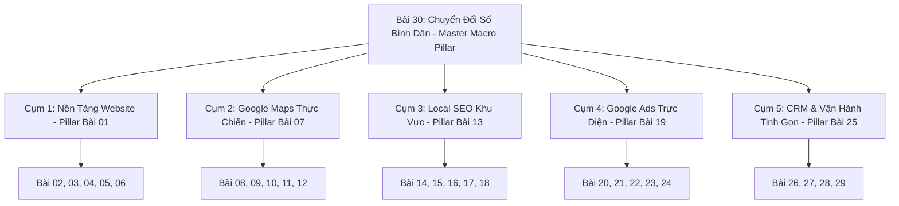

# 🗺️ LOCALMATE CONTENT MASTER PLAN (SSOT v1.0)
> **Tài Liệu Tổng Hợp Quy Hoạch Nội Dung 30 Bài Viết & Chiến Lược Vận Hành Content Engine**  
> **Căn cứ:** Kết quả phối hợp từ 10 Subagents chuyên biệt (Audit, SERP, POV, Practitioner, Evidence, Architecture, Schema, Rewriter, SEO/GEO, Red Team).  
> **Mục tiêu:** Chuyển hóa kho 30 bài viết nháp placeholder thành 30 tài sản nội dung giá trị thực tế cao, có góc nhìn riêng, triệt tiêu AI Slop, tối ưu SEO + GEO (AI Search Engines) và dẫn dắt tự nhiên tới các giải pháp thực thi của LocalMate.

---

## 📑 MỤC LỤC
1. [TỔNG QUAN HIỆN TRẠNG & NGHỊ QUYẾT CHUYỂN ĐỔI](#1-tổng-quan-hiện-trạng--nghị-quyết-chuyển-đổi)
2. [HỆ THỐNG QUAN ĐIỂM BIÊN TẬP (EDITORIAL POV CORE)](#2-hệ-thống-quan-điểm-biên-tập-editorial-pov-core)
3. [KIẾN TRÚC PHÂN CỤM & QUY HOẠCH NỘI BỘ (CONTENT ARCHITECTURE & HUBS)](#3-kiến-trúc-phân-cụm--quy-hoạch-nội-bộ-content-architecture--hubs)
4. [MA TRẬN XỬ LÝ CHỒNG CHÉO TỪ KHÓA (CANNIBALIZATION RESOLUTION)](#4-ma-trận-xử-lý-chồng-chéo-từ-khóa-cannibalization-resolution)
5. [MA TRẬN CHỐT 30 BÀI VIẾT (TOPIC SSOT MATRIX)](#5-ma-trận-chốt-30-bài-viết-topic-ssot-matrix)
6. [HỆ THỐNG ĐO LƯỜNG & CHỨNG CỨ (EVIDENCE & ATTRIBUTION POLICY)](#6-hệ-thống-đo-lường--chứng-cứ-evidence--attribution-policy)
7. [LỘ TRÌNH THỰC THI 6 BATCH REWRITE & BẢO ĐẢM CHẤT LƯỢNG](#7-lộ-trình-thực-thi-6-batch-rewrite--bảo-đảm-chất-lượng)

---

## 1. TỔNG QUAN HIỆN TRẠNG & NGHỊ QUYẾT CHUYỂN ĐỔI

Qua cuộc tổng rà soát của 10 Subagents, hiện trạng 30 bài viết draft được kết luận như sau:
- **100% bài viết là bản nháp placeholder:** Dữ liệu seed chỉ có thẻ heading kèm đoạn giữ chỗ rập khuôn (*"Nội dung chi tiết cho mục... đang được biên tập..."*), số từ khai báo ảo (650 từ trong khi nội dung thật dưới 90 từ).
- **Nguy cơ phạt SEO nghiêm trọng:** Nếu xuất bản ở trạng thái này, website sẽ bị các thuật toán Google Helpful Content và Spam Update đánh tụt thứ hạng toàn trang do lỗi Thin Content / Pure Placeholder.
- **Cannibalization cao ở các cặp bài:** Bài 7 vs 8 (Tạo lập Google Maps), Bài 13 vs 14 vs 15 (SEO địa phương), Bài 1 vs 5 (Chọn loại website), Bài 19 vs 20 (Cơ chế Google Ads), Bài 25 vs 26 (Tính năng CRM).
- **Quyết định chuyển đổi:** Viết lại toàn bộ (Rewrite 100%) theo quy trình 6 batch có kiểm duyệt khắt khe qua Red Team Gate (14 tiêu chí cấm, đạt $\ge 85$ điểm).

---

## 2. HỆ THỐNG QUAN ĐIỂM BIÊN TẬP (EDITORIAL POV CORE)

LocalMate tuyệt đối không viết các bài blog giáo điều, quảng cáo thổi phồng hay sao chép từ điển tiếp thị thành thị. Mọi bài viết phải thấm nhuần 5 nguyên lý hành nghề:
1. **Sở hữu tài sản số chính chủ 100%:** Bác bỏ việc để bên thứ ba nắm giữ tài khoản tên miền, email quản trị hay quyền sở hữu Google Business Profile làm "con tin".
2. **Xem trước 0đ — Làm thực trước khi thanh toán:** Loại bỏ tình trạng hứa hẹn suông trên slide; chỉ ký kết khi khách nhìn thấy sản phẩm mẫu chạy mượt mà trên điện thoại.
3. **Thước đo 4G bình dân:** Website và công cụ số phải tải tức thì dưới 1.5 giây trên mạng 4G chập chờn của điện thoại bình dân, không dùng hiệu ứng nặng làm đơ máy khách.
4. **Bán hàng trước — Tự động hóa sau:** Doanh nghiệp nhỏ dưới 10 người chỉ tự động hóa khi quy trình thủ công đã thông suốt và có dòng tiền ổn định; cấm triển khai phần mềm cồng kềnh gây lãng phí.
5. **Đo bằng cuộc gọi & tin nhắn thật:** Không báo cáo lượt hiển thị (impressions) hay lượt tương tác ảo; chỉ đo bằng cuộc gọi hỏi việc, tin nhắn Zalo và lượt bấm chỉ đường đến tiệm.

---

## 3. KIẾN TRÚC PHÂN CỤM & QUY HOẠCH NỘI BỘ (CONTENT ARCHITECTURE & HUBS)

30 bài viết được cấu trúc thành **5 Cụm Chuyên Đề Cốt Lõi + 1 Cụm Chiến Lược Tối Cao (Cornerstone Hub)**:

### Quy Tắc Liên Kết Đa Chiều (Internal Linking Blueprint):
- **Liên kết dọc (Vertical):** 100% bài supporting bắt buộc phải có ít nhất 01 link ngữ cảnh tự nhiên trỏ về Pillar của cụm mình và 01 link trỏ về Master Pillar (Bài 30). Pillar trỏ link ngược lại đến toàn bộ bài supporting.
- **Liên kết ngang (Horizontal):** Các bài trong cùng cụm dẫn dắt nhau theo tiến trình logic (ví dụ: Tạo Maps Bài 07 $\rightarrow$ Tối ưu Bài 09 $\rightarrow$ Tăng đánh giá Bài 11 $\rightarrow$ Cứu khóa Bài 12).
- **Liên kết thương mại (Contextual Service CTA):** Mỗi bài tích hợp 01 hộp kêu gọi hành động dẫn dắt về đúng 1 trong 5 trang Giải pháp chuyên sâu (`/giai-phap/nen-tang-so`, `/giai-phap/duoc-tim-thay`, `/giai-phap/thu-hut-khach-hang`, `/giai-phap/van-hanh-tu-dong-hoa`, `/giai-phap/dong-hanh-duy-tri`).

---

## 4. MA TRẬN XỬ LÝ CHỒNG CHÉO TỪ KHÓA (CANNIBALIZATION RESOLUTION)

| Cặp Bài Nguy Hiểm | Vấn Đề Trùng Lặp Ban Đầu | Quyết Định Điều Chỉnh Góc Nhìn (Angle Pivot) |
| :--- | :--- | :--- |
| **Bài 01 vs Bài 05** | Cùng nói về bản chất và chọn lựa website | **Bài 01 (Pillar):** Khẳng định Website là tài sản số chính chủ bảo vệ thương hiệu trước sự biến động của mạng xã hội. **Bài 05 (Supporting):** Chuyên sâu bài toán kinh tế: Phân định khi nào cần giỏ hàng online (E-commerce) và khi nào chỉ cần trang tư vấn gọi điện (Lead-Gen). |
| **Bài 07 vs Bài 08** | Cùng hướng dẫn tạo và đưa tiệm lên Maps | **Bài 07 (Pillar):** Cẩm nang nền tảng A-Z, nguyên lý phân phối hiển thị theo tọa độ và chính sách Google. **Bài 08 (Supporting):** Cẩm nang kỹ thuật thực địa: Hướng dẫn chi tiết quay video hiện trường xác minh thực tế 2026 không bị treo. |
| **Bài 13, 14 vs 15** | Đều bàn về làm SEO địa phương | **Bài 13 (Pillar):** Khái niệm, lợi thế cạnh tranh của Local SEO so với SEO toàn quốc. **Bài 14 (Supporting):** So sánh chi phí, tốc độ và ROI giữa SEO Google Maps vs SEO Website truyền thống. **Bài 15 (Supporting):** Kỹ thuật tạo hệ thống Location Pages chuẩn xác theo bán kính quận/huyện. |
| **Bài 16 vs Bài 17** | Khái niệm Entity & Citation trừu tượng | **Bài 16 (Supporting):** Bóc trần và giải ảo dịch vụ "Entity 300 profile mạng xã hội vô nghĩa", tập trung tính nhất quán pháp lý. **Bài 17 (Supporting):** Hướng dẫn chuẩn hóa NAP (Tên - Địa chỉ - Điện thoại) và đăng ký 15 trang danh bạ vàng thực tế tại Việt Nam. |
| **Bài 19 vs Bài 20** | Cùng bàn về chạy quảng cáo Google Ads | **Bài 19 (Pillar):** Bức tranh toàn cảnh chuẩn bị vốn, lựa chọn từ khóa ngách và tâm lý chạy Ads cho chủ tiệm. **Bài 20 (Supporting):** Giải phẫu cơ chế đấu giá, điểm chất lượng (Quality Score) và cách tiệm nhỏ thắng thầu với ngân sách khiêm tốn. |
| **Bài 25 vs Bài 26** | Đều giới thiệu tính năng CRM | **Bài 25 (Pillar):** Giải tỏa nỗi sợ công nghệ: Định nghĩa CRM bình dân là chuyển đổi từ sổ tay, tránh mất số khách hàng cũ. **Bài 26 (Supporting):** Checklist bóc tách 5 tính năng cốt lõi cần có và các tính năng thừa thãi cần gạch bỏ của phần mềm CRM cho tiệm. |

---

## 5. MA TRẬN CHỐT 30 BÀI VIẾT (TOPIC SSOT MATRIX)

| ID | Category | Dạng Bài | Primary Question (Câu hỏi người đọc cần trả lời) | LocalMate Unique Angle & POV | Actionable Element Bắt Buộc | Contextual Solution CTA |
| :---: | :--- | :--- | :--- | :--- | :--- | :--- |
| **01** | Website | Pillar | Doanh nghiệp nhỏ dưới 10 người có thực sự cần làm website không? | Website không phải brochure trang trí, mà là tài sản số chính chủ duy nhất giúp khách xác minh tiệm có thật sau khi thấy trên Facebook/TikTok. | Ma trận 4 tầng hiện diện số (Presence Matrix) | `/giai-phap/nen-tang-so` |
| **02** | Website | Checklist | Cần chuẩn bị những gì trước khi thuê làm website để không bị đội giá? | Đừng giao khoán cho thợ; chủ tiệm tự nắm tên miền, tự chụp ảnh đồ nghề/cơ sở thật và bảng giá minh bạch. | Bảng Checklist 12 đầu mục chuẩn bị tư liệu | `/giai-phap/nen-tang-so` |
| **03** | Website | Cost Guide | Chi phí làm và duy trì website năm 2026 gồm những khoản nào? | Bóc tách chi phí cố định (Domain + Cloud Hosting) vs chi phí thiết kế; vạch trần bẫy web 500k ép gia hạn năm 2. | Bảng đối soát chi phí 3 năm (Năm 1 vs Năm 2 & 3) | `/giai-phap/nen-tang-so` |
| **04** | Website | Structure | Website giới thiệu công ty dịch vụ địa phương cần có những trang nào? | Tinh gọn 4 trang cốt lõi phục vụ cuộc gọi; dẹp bỏ các trang triết lý, sứ mệnh dài dòng không ai đọc. | Sơ đồ cấu trúc trang tinh gọn 4 block | `/giai-phap/nen-tang-so` |
| **05** | Website | Comparison | Tiệm dịch vụ nên làm web giỏ hàng (E-com) hay web tư vấn gọi điện? | 90% dịch vụ địa phương cần cuộc gọi hoặc tin Zalo chốt lịch; làm giỏ hàng phức tạp chỉ gây rào cản mua hàng. | Cây quyết định Yes/No: Giỏ hàng hay Nút gọi | `/giai-phap/nen-tang-so` |
| **06** | Website | Troubleshooting | Tại sao website có người vào xem nhưng không có ai gọi điện hoặc nhắn tin? | Không phải do website xấu, mà do thiếu số hotline cố định, giấu bảng giá và tải chậm trên sóng 4G. | Bảng chẩn đoán 6 điểm nghẽn chuyển đổi trên di động | `/giai-phap/nen-tang-so` |
| **07** | Google Maps | Pillar | Google Business Profile giúp tiệm địa phương có khách như thế nào? | Google Maps là "mặt tiền số" quan trọng hơn cả website đối với tiệm phục vụ bán kính dưới 15km. | Quy trình 5 bước xây dựng mặt tiền Google Maps chuẩn chỉ | `/giai-phap/duoc-tim-thay` |
| **08** | Google Maps | Guide | Cách tạo vị trí tiệm trên Google Maps và xác minh thành công 2026? | Google siết chặt xác minh video thực địa; cần quay biển hiệu cố định, giấy phép và thao tác mở cửa thật. | Kịch bản 100 giây quay video xác minh thực địa | `/giai-phap/duoc-tim-thay` |
| **09** | Google Maps | Optimization | Cần tối ưu những mục nào để tiệm xuất hiện khi khách tìm quanh đây? | Không nhồi nhét tên tiệm; tối ưu danh mục chính xác, giờ mở cửa thật và cập nhật ảnh hoạt động hàng tuần. | Checklist 8 hạng mục tối ưu hồ sơ Maps chuẩn SEO | `/giai-phap/duoc-tim-thay` |
| **10** | Google Maps | Troubleshooting | Vì sao tiệm đã tạo nhưng tìm kiếm quanh khu vực không thấy xuất hiện? | Hiểu đúng về bán kính hiển thị, bộ lọc vị trí của Google và thuật toán chống địa chỉ ma. | Lưu đồ kiểm tra 4 nguyên nhân ẩn hồ sơ | `/giai-phap/duoc-tim-thay` |
| **11** | Google Maps | Strategy | Làm sao để tăng đánh giá 5 sao từ khách thật mà không bị Google quét xóa? | Cấm tuyệt đối mua review ảo; xin review tại thời điểm khách hài lòng nhất bằng mã QR để bàn. | Kịch bản 3 câu mở lời xin đánh giá tự nhiên tại quầy | `/giai-phap/duoc-tim-thay` |
| **12** | Google Maps | Troubleshooting | Phải làm gì khi hồ sơ Google Maps đột ngột bị tạm ngưng (suspended)? | Bình tĩnh rà soát lỗi sửa thông tin liên tục; chuẩn bị giấy tờ pháp lý và gửi kháng nghị có bằng chứng. | Quy trình 4 bước kháng nghị tài khoản Maps | `/giai-phap/dong-hanh-duy-tri` |
| **13** | Local SEO | Pillar | Local SEO là gì và khác gì so với SEO từ khóa toàn quốc? | Local SEO là tối ưu để khách ở cự ly gần nhất tìm thấy bạn khi họ phát sinh nhu cầu khẩn cấp. | Bảng so sánh kinh tế: Local SEO vs SEO Toàn quốc | `/giai-phap/duoc-tim-thay` |
| **14** | Local SEO | Comparison | Nên tập trung làm SEO Google Maps hay làm SEO Website trước? | Tùy vào loại hình dịch vụ: Khẩn cấp (sửa khóa, cứu hộ) làm Maps trước; Dịch vụ giá trị cao làm cả hai kết hợp. | Bảng ma trận so sánh theo độ khẩn cấp của ngành hàng | `/giai-phap/duoc-tim-thay` |
| **15** | Local SEO | Guide | Cách viết trang dịch vụ địa phương (Location Pages) lên top tìm kiếm? | Mỗi quận một trang nội dung thực tế, có ảnh thợ đang làm tại địa bàn đó, cấm copy-paste thay mỗi tên quận. | Khung sườn cấu trúc trang dịch vụ quận/huyện | `/giai-phap/duoc-tim-thay` |
| **16** | Local SEO | Reality Check | Doanh nghiệp nhỏ có cần bỏ tiền mua các gói Entity SEO hàng triệu đồng? | Không mua các gói tạo 300 tài khoản mạng xã hội rác; tập trung vào pháp lý chuẩn và hiện diện nhất quán. | Tiêu chí phân biệt Entity thật vs Entity rác | `/giai-phap/duoc-tim-thay` |
| **17** | Local SEO | Guide | Citation (trích dẫn danh bạ) là gì và làm thế nào cho đúng chuẩn? | Chuẩn hóa bộ ba NAP (Name - Address - Phone) trên các cổng thông tin và danh bạ có lượng truy cập thật. | Danh bạ 15 trang danh bạ uy tín nhất tại Việt Nam | `/giai-phap/duoc-tim-thay` |
| **18** | Local SEO | Checklist | Những việc tự làm được để cải thiện thứ hạng tìm kiếm địa phương năm 2026? | Danh sách các việc chủ tiệm tự làm trong 30 phút mỗi tuần mà không cần thuê chuyên gia phức tạp. | Bảng kiểm toán Local SEO 20 tiêu chí | `/giai-phap/duoc-tim-thay` |
| **19** | Google Ads | Pillar | Doanh nghiệp nhỏ ít vốn có nên chạy quảng cáo Google Ads không? | Chỉ chạy Google Search Ads khi sản phẩm có nhu cầu tìm kiếm chủ động và website đã tối ưu nút gọi. | Khung kiểm tra 4 điều kiện sẵn sàng trước khi nạp tiền Ads | `/giai-phap/thu-hut-khach-hang` |
| **20** | Google Ads | Technical | Google Search Ads tính tiền như thế nào và làm sao để giảm giá click? | Giá thầu phụ thuộc vào Điểm chất lượng (Quality Score); trang đích tải nhanh và đúng từ khóa sẽ tiết kiệm 40% chi phí. | Công thức tính Ad Rank và 3 cách kéo điểm chất lượng | `/giai-phap/thu-hut-khach-hang` |
| **21** | Google Ads | Budget | Ngân sách chạy quảng cáo Google Ads bao nhiêu một ngày là hiệu quả? | Bắt đầu từ 50.000đ - 100.000đ/ngày ở cụm từ khóa chính xác nhất, tuyệt đối không bật đối sánh rộng phung phí tiền. | Bảng tính ngân sách tối thiểu theo biên lợi nhuận đơn hàng | `/giai-phap/thu-hut-khach-hang` |
| **22** | Google Ads | Troubleshooting | Tại sao chạy quảng cáo tốn tiền click mà không có ai gọi điện tư vấn? | Kiểm tra đối sánh từ khóa bị tràn tìm kiếm rác, trang đích giấu số điện thoại hoặc form liên hệ bị lỗi. | Checklist 7 bước rà soát loại trừ từ khóa phủ định | `/giai-phap/thu-hut-khach-hang` |
| **23** | Google Ads | Landing Page | Landing page chạy quảng cáo cho tiệm địa phương cần có những gì? | Tiêu đề khớp từ khóa, hình ảnh xưởng thật, bảng giá rõ ràng và nút Zalo nổi bật trên màn hình di động. | Wireframe mẫu 5 tầng của một Landing Page chuyển đổi | `/giai-phap/thu-hut-khach-hang` |
| **24** | Google Ads | Comparison | Nên chạy Google Ads hay Facebook Ads cho ngành dịch vụ địa phương? | Google đánh vào khách có nhu cầu mua ngay; Facebook đánh vào khách tò mò lướt mạng. Chọn kênh theo hành vi. | Ma trận lựa chọn kênh quảng cáo theo 10 nhóm ngành nghề | `/giai-phap/thu-hut-khach-hang` |
| **25** | CRM & Auto | Pillar | CRM là gì và tiệm nhỏ có cần mua phần mềm quản lý khách hàng không? | Đừng mua phần mềm hàng chục triệu; CRM cho tiệm nhỏ bắt đầu bằng một bảng tính Google Sheet lưu đủ lịch sử bảo hành. | Bảng so sánh: Sổ tay vs Google Sheet vs Phần mềm CRM | `/giai-phap/van-hanh-tu-dong-hoa` |
| **26** | CRM & Auto | Features | Một hệ thống quản lý khách hàng cho cơ sở dịch vụ chỉ cần tính năng gì? | Quản lý lịch hẹn, lưu số điện thoại, nhắc lịch bảo dưỡng tự động; lược bỏ báo cáo tài chính phức tạp. | Bảng lọc tính năng: Bắt buộc có vs Tính năng thừa | `/giai-phap/van-hanh-tu-dong-hoa` |
| **27** | CRM & Auto | Guide | 7 công việc thủ công lặp lại mà chủ tiệm nên cài đặt tự động hóa ngay? | Tự động báo tin Zalo khi có khách đặt lịch, tự động lưu thông tin vào bảng tính, tự động nhắc khách bảo dưỡng sau 6 tháng. | Sơ đồ quy trình tự động hóa 7 bước với chi phí 0đ | `/giai-phap/van-hanh-tu-dong-hoa` |
| **28** | CRM & Auto | Multi-channel | Làm sao để gom tin nhắn từ Facebook, Zalo và Website về một nơi để không sót khách? | Thiết lập webhook hoặc ứng dụng trung chuyển thông báo về Telegram/Zalo của chủ tiệm tức thì. | Bản thiết kế luồng gom thông báo khách về điện thoại | `/giai-phap/van-hanh-tu-dong-hoa` |
| **29** | Content | Pillar | Tiệm địa phương nên làm nội dung gì để khách tin tưởng mà không cần viết văn hoa? | Chụp ảnh sản phẩm hoàn thiện mỗi ngày, quay video cận cảnh thao tác sửa chữa thật và giải đáp đúng thắc mắc về giá. | Lịch nội dung 4 tuần thực chiến cho chủ cơ sở | `/giai-phap/duoc-tim-thay` |
| **30** | Master | Macro Pillar | Lộ trình chuyển đổi số bình dân từng bước cho hộ kinh doanh từ 0 đến có khách? | Bước 1: Mặt tiền Maps $\rightarrow$ Bước 2: Web tư vấn chính chủ $\rightarrow$ Bước 3: Đánh giá thật $\rightarrow$ Bước 4: Chạy Ads ngách $\rightarrow$ Bước 5: Chăm sóc khách cũ. | Bản đồ lộ trình 5 giai đoạn chuyển đổi số bền vững | `/giai-phap/nen-tang-so` |

---

## 6. HỆ THỐNG ĐO LƯỜNG & CHỨNG CỨ (EVIDENCE & ATTRIBUTION POLICY)

Mọi bài viết xuất bản phải tuân thủ nghiêm ngặt **3 Tầng Chứng Cứ**:
1. **Tier 1 — Dẫn nguồn quy chuẩn nền tảng (Mandatory Citations):**
   - Google Search Central Documentation (chuẩn SEO, tốc độ, mobile-friendly).
   - Google Business Profile Help Center (chính sách xác minh, đánh giá, tạm ngưng Maps).
   - Google Ads Help & Policies (cơ chế tính giá thầu Ad Rank, điểm chất lượng Quality Score).
   - Cơ quan Nhà nước: Nghị định 52/2013/NĐ-CP & 85/2021/NĐ-CP của Bộ Công Thương về thông báo website thương mại điện tử; Trung tâm Internet Việt Nam (VNNIC) về quyền sở hữu tên miền `.vn`.
2. **Tier 2 — Quan sát thực tiễn tại hiện trường (Field Observations):**
   - Phải ghi rõ ngữ cảnh quan sát theo công thức `[Bối cảnh địa phương + Ngành nghề + Thử nghiệm thực tế + Kết quả thực tế]`.
   - Ví dụ chuẩn: *"Theo kinh nghiệm hỗ trợ hơn 30 cơ sở sửa chữa tại TP.HCM và Hà Nội của LocalMate, việc quay video xác minh liên tục trong 1 khung hình từ biển hiệu đến bên trong xưởng giúp tỷ lệ duyệt hồ sơ đạt trên 90% ngay lần đầu."*
3. **Tuyệt đối cấm:** Bịa đặt số liệu phần trăm vô căn cứ (*"tăng 300% doanh số"*, *"chiếm 80% thị phần"*), dùng testimonial ảo, bịa đặt giải thưởng danh hiệu không có thật.

---

## 7. LỘ TRÌNH THỰC THI 6 BATCH REWRITE & BẢO ĐẢM CHẤT LƯỢNG

```mermaid
flowchart LR
  B1[Batch 1: Bài 01-05] --> Q1[Red Team Gate 1]
  Q1 --> B2[Batch 2: Bài 06-10] --> Q2[Red Team Gate 2]
  Q2 --> B3[Batch 3: Bài 11-15] --> Q3[Red Team Gate 3]
  Q3 --> B4[Batch 4: Bài 16-20] --> Q4[Red Team Gate 4]
  Q4 --> B5[Batch 5: Bài 21-25] --> Q5[Red Team Gate 5]
  Q5 --> B6[Batch 6: Bài 26-30] --> Q6[Red Team Gate 6]
  Q6 --> PUB[Hoàn tất & Đồng bộ CMS]
```

- **Mỗi Batch gồm 5 bài:** Được biên tập kỹ lưỡng theo đúng cấu trúc 10 điểm, độ dài từ 1.200 - 2.500 từ tùy theo intent.
- **Tiêu chí nghiệm thu tại cổng Quality Gate:**
  - 100% 0 lỗi đỏ (Không Generic, Không Filler, Không Bịa số liệu, Không Văn mẫu AI, Không Khoe thuật ngữ, Không Bêu xấu đối thủ).
  - Điểm thẩm định chuyên môn đạt $\ge 85/100$ điểm theo Rubric 5 Trụ cột.
  - Sau khi Batch đạt chuẩn, tiến hành nạp trực tiếp vào data source hạt nhân (`content/seeds/drafts_30_articles.json`) và chuyển tiếp sang batch tiếp theo.
