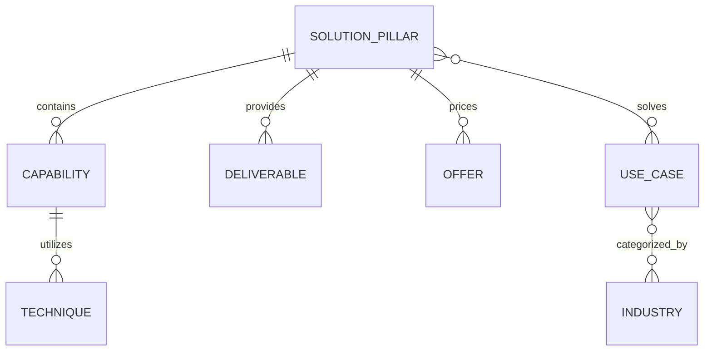

# Kiến Trúc Thông Tin Hệ Thống Dịch Vụ Localmate (Information Architecture SSOT)

> **Trạng thái:** Active SSOT  
> **Phiên bản:** 2.0.0  
> **Ngày phê duyệt:** 13/09/2026  
> **Tác giả:** Docs SSOT Architect  
> **Phạm vi áp dụng:** Toàn bộ hệ thống Navigation, Services Hub, Solution Pages, URL Routing và Data Schema của Localmate.

---

## 1. Triết Lý Kiến Trúc Thông Tin (Architecture Philosophy)

Localmate **không phải một SEO Agency thuần túy**, cũng không phải một chợ dịch vụ vụn vặt với hàng chục món kỹ thuật rời rạc.

> **Định vị cốt lõi:**  
> *"Localmate là người đồng hành số giúp doanh nghiệp địa phương đưa công việc lên môi trường số, tìm kiếm khách hàng, tự động hóa vận hành và duy trì hệ thống ổn định lâu dài — mà không cần tự xây dựng một phòng ban công nghệ cồng kềnh."*

### Nguyên tắc 5 giây của khách hàng SME:
Khách hàng doanh nghiệp nhỏ và vừa (SME, hộ kinh doanh, chủ phòng khám, gara, cửa hàng) **không bao giờ thức dậy vào buổi sáng và nghĩ**:
- *"Hôm nay mình cần mua gói Schema JSON-LD."*
- *"Mình cần thuê dịch vụ AEO hay GEO."*
- *"Cửa hàng mình cần Semantic Entity SEO."*

Họ nghĩ bằng những bài toán kinh doanh cụ thể:
- *"Tôi cần nhiều khách gọi và ghé tiệm hơn."*
- *"Khách tìm trên Google không thấy cơ sở của tôi."*
- *"Website cũ quá, khách bấm vào rồi thoát ngay."*
- *"Nhân viên ghi chép tay lộn xộn, hay sót lịch hẹn của khách."*
- *"Tôi muốn chạy quảng cáo nhưng sợ bị lừa hoặc tốn tiền vô ích."*
- *"Tôi muốn có người am hiểu công nghệ phụ trách kỹ thuật cho tôi."*

**Website phải nói ngôn ngữ của khách hàng trước, kỹ thuật chỉ xuất hiện ở tầng giải thích phương pháp (How).**

---

## 2. Phân Tầng Thông Tin 5 Cấp (5-Tier IA Framework)

Hệ thống dịch vụ Localmate được chuẩn hóa theo chuỗi giá trị từ ngoài vào trong:

```
[TIER 1] NHU CẦU & BÀI TOÁN KINH DOANH (Jobs to be Done / Customer Problems)
   │
   ▼
[TIER 2] KẾT QUẢ HƯỚNG TỚI (Business Outcomes)
   │
   ▼
[TIER 3] TRỤ CỘT GIẢI PHÁP (5 Solution Pillars)
   │
   ▼
[TIER 4] NĂNG LỰC & KỸ THUẬT TRIỂN KHAI (Capabilities & Techniques)
   │
   ▼
[TIER 5] HẠNG MỤC BÀN GIAO THỰC TẾ (Deliverables & Ownership Assets)
```

### Chi tiết từng tầng:

| Tầng IA | Khái niệm | Ví dụ thực tế | Tâm lý người dùng |
| :--- | :--- | :--- | :--- |
| **Tier 1: Pain Point / Need** | Nỗi đau hoặc nhu cầu chưa được giải quyết của chủ doanh nghiệp | "Khách ở gần tìm dịch vụ sửa chữa nhưng chỉ thấy đối thủ" | Đồng cảm, nhận diện đúng vấn đề |
| **Tier 2: Outcome** | Kết quả kinh doanh cụ thể mà khách hàng kỳ vọng đạt được | Hiện diện rõ ràng trên Google Maps và tìm kiếm cục bộ, tăng cuộc gọi | Thấy được giá trị ROI thực |
| **Tier 3: Solution Pillar** | Nhóm giải pháp đóng gói toàn diện của Localmate | **02. Được tìm thấy (Google & AI Search)** | Hiểu gói giải pháp cần chọn |
| **Tier 4: Capability & Tech** | Công nghệ và phương pháp kỹ thuật Localmate dùng để giải quyết | Local SEO, Google Business Profile, Schema LocalBusiness, GEO/AEO | Yên tâm về năng lực chuyên môn |
| **Tier 5: Deliverable** | Hiện vật, tài sản số, tài khoản và báo cáo bàn giao cho khách | Hồ sơ Maps xác minh 100% quyền sở hữu, Website chuẩn di động, Bảng theo dõi cuộc gọi | Rõ ràng về quyền lợi sở hữu |

---

## 3. Sơ Đồ Đối Chiếu: Kiến Trúc Cũ vs Kiến Trúc Mới

```
══════════════════════════════════════════════════════════════════════════════════════════
KIẾN TRÚC CŨ (Catalog 15-40 Dịch Vụ Rời Rạc / Flat Directory)
══════════════════════════════════════════════════════════════════════════════════════════

[Trang chủ]
   │
   ├── Navigation trải dài hàng chục mục kỹ thuật:
   │   ├── Dịch vụ GEO (AI Search)
   │   ├── Dịch vụ AEO (Answer AI)
   │   ├── SEO AI Overviews
   │   ├── SEO ChatGPT
   │   ├── SEO Google Maps
   │   ├── SEO Entity Semantic
   │   ├── Thiết kế Web 490k / Web 3-5 trang
   │   ├── Tối ưu PageSpeed
   │   ├── Sửa lỗi web 99k
   │   ├── Quảng cáo Google Ads
   │   ├── Quảng cáo Meta Ads
   │   └── Chăm sóc bảo trì web
   │
   └── VẤN ĐỀ:
       • Khách hàng bị "ngợp thuật ngữ" (Jargon Overload).
       • Nhầm lẫn giữa Công nghệ (GEO, AEO, Schema) với Giải pháp kinh doanh.
       • Các trang con hoạt động như những ốc đảo tách biệt, duplicate intent.
       • Thiếu tính liên kết chiến lược dài hạn giữa các dịch vụ.

══════════════════════════════════════════════════════════════════════════════════════════
KIẾN TRÚC MỚI (5 Trụ Cột Giải Pháp Tập Trung vào Kết Quả)
══════════════════════════════════════════════════════════════════════════════════════════

[Trang Chủ / Hub Giải Pháp]  ───▶  "Bạn cần giải quyết việc gì hôm nay?"
   │
   ├── PILLAR 1: XÂY NỀN TẢNG SỐ (/giai-phap/nen-tang-so)
   │     ├─ Nhu cầu: Doanh nghiệp chưa có kênh số chính thức, cần địa chỉ số uy tín.
   │     ├─ Capabilities: Website doanh nghiệp, Landing page, Domain/DNS, Form gọi Zalo.
   │     └─ Deliverables: Bộ mã nguồn sở hữu 100%, trang chuẩn di động, Google Analytics.
   │
   ├── PILLAR 2: ĐƯỢC TÌM THẤY (/giai-phap/duoc-tim-thay)
   │     ├─ Nhu cầu: Đã có web nhưng không có ai tìm thấy, mất khách vào tay đối thủ.
   │     ├─ Capabilities: Google Search SEO, Google Maps Local SEO, AI Search (GEO, AEO).
   │     └─ Deliverables: Maps tối ưu, Content chuẩn cấu trúc, Dữ liệu Schema cho AI trích dẫn.
   │
   ├── PILLAR 3: THU HÚT KHÁCH HÀNG (/giai-phap/thu-hut-khach-hang)
   │     ├─ Nhu cầu: Cần thêm cuộc gọi, khách đặt hẹn và tin nhắn tư vấn ngay lập tức.
   │     ├─ Capabilities: Chiến dịch Google Search Ads, Meta Ads địa phương, Conversion Tracking.
   │     └─ Deliverables: Tài khoản quảng cáo chính chủ, Dashboard theo dõi chi phí & liên hệ.
   │
   ├── PILLAR 4: VẬN HÀNH TỰ ĐỘNG HÓA (/giai-phap/van-hanh-tu-dong-hoa)
   │     ├─ Nhu cầu: Có khách nhưng làm việc thủ công, nhân viên quên lịch, sót đơn.
   │     ├─ Capabilities: Báo đơn tự động về Telegram/Zalo, Booking hẹn, CRM Sheets/Airtable.
   │     └─ Deliverables: Quy trình đồng bộ tức thì, không phát sinh chi phí phần mềm hàng tháng.
   │
   └── PILLAR 5: CHĂM SÓC & ĐỒNG HÀNH (/giai-phap/dong-hanh-duy-tri)
         ├─ Nhu cầu: Cần đội ngũ kỹ thuật tin cậy túc trực duy trì hệ thống dài lâu.
         ├─ Capabilities: Giám sát uptime 24/7, Sao lưu định kỳ, Cập nhật nội dung, Sửa lỗi nhanh.
         └─ Deliverables: Báo cáo vận hành hàng tháng, cam kết hỗ trợ qua nhóm Zalo chuyên trách.
```

---

## 4. Cấu Trúc Điều Hướng Chuẩn (Navigation Specification)

### 4.1. Desktop Header Navigation (5 Mục Cốt Lõi)
1. **Giải pháp** *(Mega Menu mở ra 5 Solution Pillars kèm liên kết xem tất cả)*
2. **Cách Localmate làm** *(Quy trình 5 bước minh bạch, sở hữu mã nguồn, bàn giao rõ ràng)*
3. **Bảng giá** *(Mô hình minh bạch: Phí thiết lập + Phí duy trì + Ngân sách quảng cáo)*
4. **Kiến thức** *(Bài viết chia sẻ thực chiến cho doanh nghiệp địa phương)*
5. **Về Localmate** *(Tôn chỉ, đội ngũ và thông tin liên hệ trực tiếp)*

### 4.2. Cấu Trúc Mega Menu "Giải Pháp"
```
+-----------------------------------------------------------------------------------------+
| GIẢI PHÁP LOCALMATE                                                                     |
+---------------------------+---------------------------+---------------------------------+
| 01. XÂY NỀN TẢNG SỐ       | 02. ĐƯỢC TÌM THẤY         | 03. THU HÚT KHÁCH HÀNG          |
| Trang web & Hồ sơ số      | Google & AI Search        | Quảng cáo & Chuyển đổi          |
| -> Tạo uy tín và điểm chạm| -> Xuất hiện khi khách    | -> Có thêm cuộc gọi và khách    |
|   đầu tiên trên mạng      |   tìm dịch vụ gần đây     |   hàng tiềm năng nhanh chóng    |
+---------------------------+---------------------------+---------------------------------+
| 04. VẬN HÀNH TỰ ĐỘNG HÓA  | 05. CHĂM SÓC ĐỒNG HÀNH    | TRỢ GIÚP CHỌN GIẢI PHÁP         |
| Tiết kiệm công sức        | Kỹ thuật viên riêng       | "Chưa rõ doanh nghiệp cần gì?"  |
| -> Báo đơn Zalo/Telegram, | -> Bảo trì, sao lưu và    | -> Trao đổi 15 phút cùng chuyên |
|   lưu khách tự động       |   cập nhật định kỳ        |   viên kỹ thuật Localmate       |
+---------------------------+---------------------------+---------------------------------+
| [Khám phá toàn bộ 5 giải pháp trụ cột →]                                                |
+-----------------------------------------------------------------------------------------+
```

### 4.3. Breadcrumb Chuẩn (Search Engine & UX Hierarchy)
- **Cấp Pillar:** `Trang chủ` → `Giải pháp` → `Được tìm thấy trên Google & AI`
- **Cấp Capability/Feature:** `Trang chủ` → `Giải pháp` → `Được tìm thấy` → `Tối ưu tìm kiếm AI (GEO & AEO)`
- **Cấp Bài viết Kiến thức:** `Trang chủ` → `Kiến thức` → `Tối ưu Google Maps cho phòng khám`

---

## 5. Quan Hệ Thực Thể Dữ Liệu (Data Schema Relationships)

Kiến trúc mới chuẩn hóa các thực thể thành mô hình hướng đối tượng tường minh, loại bỏ tình trạng code cứng (hard-coded) rải rác:



- **SolutionPillar:** Thực thể gốc đại diện cho 1 trong 5 trụ cột giải pháp.
- **Capability:** Năng lực công nghệ phục vụ trực tiếp cho Solution (ví dụ: Google Maps Optimization).
- **Technique:** Kỹ thuật chuyên sâu cấu thành Capability (ví dụ: Schema LocalBusiness, Geo-tagging, Citation).
- **Deliverable:** Sản phẩm bàn giao cụ thể, có thể nghiệm thu được (ví dụ: Quyền sở hữu profile Google Business).
- **Offer:** Gói chi phí gồm Setup fee, Monthly fee và điều khoản phạm vi.
- **UseCase:** Tình huống áp dụng thực tế theo mô hình kinh doanh cụ thể.

---

## 6. Tiêu Chuẩn Nghiệm Thu Kiến Trúc (IA Acceptance Criteria)

1. **Kiểm tra 5 giây:** Người dùng lần đầu vào website phải hiểu Localmate làm gì trong vòng 5 giây mà không cần đọc thuật ngữ chuyên ngành.
2. **Không phân nhánh Persona sớm:** Tuyệt đối không tạo menu ngang cấp như `Dành cho Gara`, `Dành cho Nha khoa`. Mọi ngành nghề chỉ xuất hiện dưới dạng Use Case minh họa trong từng Solution Page.
3. **Đưa kỹ thuật về đúng vị trí:** Các thuật ngữ GEO, AEO, SEO AI, JSON-LD, Cloudflare Worker chỉ xuất hiện ở Section Capabilities và Deep-dive Landing Pages bổ trợ, không được làm vỡ cấu trúc menu chính.
4. **Quyền sở hữu tài sản minh bạch:** Mọi giải pháp đều khẳng định rõ quyền làm chủ tài sản số (tên miền, mã nguồn, tài khoản quảng cáo) của khách hàng.
5. **Đường dẫn nhất quán:** Cấu trúc URL thể hiện đúng phân cấp cha - con, không có orphan pages (trang mồ côi không có liên kết nội bộ).
