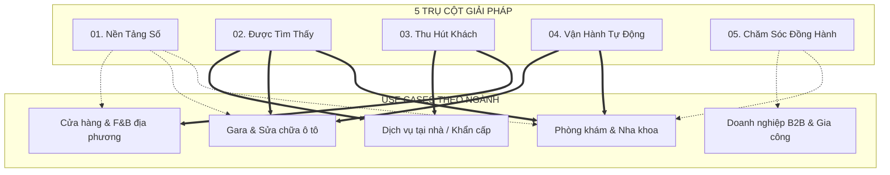

# Hệ Thống Phân Loại Dịch Vụ Localmate (Service Taxonomy SSOT)

> **Trạng thái:** Active SSOT  
> **Phiên bản:** 2.0.0  
> **Ngày phê duyệt:** 13/09/2026  
> **Tác giả:** Docs SSOT Architect  
> **Mục tiêu:** Định nghĩa chi tiết 5 Trụ Cột Giải Pháp (Solution Pillars), Năng lực Kỹ thuật trực thuộc (Capabilities & Techniques), Hạng mục Bàn giao (Deliverables) và Ngân hàng Tình huống thực tế theo Ngành (Cross-Industry Use Cases).

---

## 1. Tổng Quan 5 Trụ Cột Giải Pháp (5 Solution Pillars)

Localmate cấu trúc toàn bộ danh mục dịch vụ thành 5 trụ cột tương ứng với 5 giai đoạn phát triển số của một doanh nghiệp địa phương:

```
┌──────────────────────────────────────────────────────────────────────────────────┐
│                           5 SOLUTION PILLARS LOCALMATE                           │
├───────────────────┬───────────────────┬───────────────────┬──────────────────────┤
│ 01. NỀN TẢNG SỐ   │ 02. ĐƯỢC TÌM THẤY │ 03. THU HÚT KHÁCH │ 04. VẬN HÀNH TỰ ĐỘNG │
│ Website & Hồ Sơ Số│ Google & AI Search│ Quảng Cáo & Lead  │ Quy Trình & Báo Đơn  │
├───────────────────┴───────────────────┴───────────────────┴──────────────────────┤
│                         05. CHĂM SÓC & ĐỒNG HÀNH KỸ THUẬT                        │
│                     Bảo Trì, Giám Sát, Sao Lưu & Cập Nhật Định Kỳ                │
└──────────────────────────────────────────────────────────────────────────────────┘
```

---

## 2. Chi Tiết Từng Trụ Cột Giải Pháp

### PILLAR 01: XÂY DỰNG NỀN TẢNG SỐ (Digital Foundations)
- **Mã định danh:** `pillar-digital-foundations`
- **Slug chính:** `/giai-phap/nen-tang-so`
- **Tên hiển thị:** Xây Nền Tảng Số — Website & Hiện Diện Trực Tuyến
- **Câu hỏi của khách:** *"Doanh nghiệp tôi chưa có kênh số chính thức, hoặc trang cũ nhìn luộm thuộm, thiếu uy tín."*
- **Lời hứa thương hiệu:** Tạo dựng cho doanh nghiệp một ngôi nhà số hoàn chỉnh, tốc độ tải nhanh dưới 1.5 giây trên di động, hiển thị rõ ràng thông tin sản phẩm/dịch vụ và nút liên hệ nhanh. Khách hàng sở hữu 100% tài nguyên, không bị giữ chân bởi hệ thống đóng.

#### Danh mục Capabilities trực thuộc:
1. **Thiết kế Trang Bán Hàng 1 Trang (High-Converting Landing Page):** Tối ưu thông điệp, hình ảnh thực tế, bảng giá rõ ràng, nút gọi hotline và chat Zalo nổi bật.
2. **Thiết Kế Website Giới Thiệu Doanh Nghiệp (Multi-page Web):** 3–5 trang chuẩn mực: Trang chủ, Giới thiệu, Dịch vụ/Sản phẩm, Bảng giá, Liên hệ & Bản đồ.
3. **Thiết Lập Tên Miền & Hạ Tầng Máy Chủ (Domain & Cloud Setup):** Cấu hình DNS Cloudflare bảo mật, chứng chỉ bảo mật SSL miễn phí trọn đời, chống nghẽn mạng.
4. **Chuẩn Hóa Nhận Diện & Hồ Sơ Số (Digital Identity):** Chuẩn hóa logo, bảng mã màu, hình ảnh cơ sở vật chất và nội dung thông tin pháp lý công khai.
5. **Gắn Mã Đo Lường Cơ Bản (Basic Tracking):** Cài đặt Google Tag Manager, Google Analytics 4, Pixel theo dõi sự kiện bấm gọi và gửi form.

#### Hạng mục Bàn giao (Deliverables):
- Mã nguồn đầy đủ, không mã hóa bí mật.
- Tài khoản quản trị tên miền chính chủ (đăng ký bằng CCCD/Email của khách).
- Hướng dẫn chỉnh sửa nội dung văn bản, hình ảnh qua video/tài liệu ngắn gọn.
- Website đạt điểm hiệu năng Google PageSpeed 90+ trên di động.

---

### PILLAR 02: ĐƯỢC KHÁCH HÀNG TÌM THẤY (Presence & Discovery)
- **Mã định danh:** `pillar-presence-discovery`
- **Slug chính:** `/giai-phap/duoc-tim-thay`
- **Tên hiển thị:** Được Khách Hàng Tìm Thấy — Google Maps, SEO & AI Search
- **Câu hỏi của khách:** *"Có website rồi nhưng không ai tìm ra; người ta tìm dịch vụ ở gần mà toàn ra đối thủ."*
- **Lời hứa thương hiệu:** Đưa thông tin cơ sở kinh doanh xuất hiện chuẩn xác và nổi bật tại nơi khách hàng đang tìm kiếm: từ công cụ tìm kiếm truyền thống (Google Tìm kiếm, Google Maps) đến các công cụ đề xuất thế hệ mới (ChatGPT, Perplexity, Gemini).

#### Danh mục Capabilities trực thuộc:
1. **Tối Ưu Vị Trí Google Maps & Local SEO:** Xác minh hồ sơ Google Business Profile, tối ưu danh mục chính/phụ, địa chỉ NAP (Name, Address, Phone) đồng nhất, thiết lập mã QR đánh giá chân thực trên Google.
2. **SEO Từ Khóa Nhu Cầu Địa Phương (Local Intent SEO):** Tối ưu các cụm từ khóa có tỷ lệ chuyển đổi cao theo khu vực (ví dụ: *"phòng khám nha khoa quận 7"*, *"sửa máy giặt tại nhà thủ đức"*).
3. **Cấu Trúc Dữ Liệu Thực Thể & Schema (Entity & Structured Data):** Nhúng Schema `LocalBusiness`, `MedicalClinic`, `AutoRepair`, `OpeningHoursSpecification`, `GeoCoordinates` để bot tìm kiếm hiểu rõ bản chất doanh nghiệp.
4. **Tối Ưu Đề Xuất Tìm Kiếm AI (GEO & AEO):** Chuẩn bị dữ liệu dạng hỏi đáp thực tế, tài liệu `llms.txt`, trích dẫn nguồn uy tín để các mô hình ngôn ngữ lớn (LLM) dễ dàng trích dẫn khi người dùng hỏi trợ lý ảo.
5. **Tối Ưu Trải Nghiệm Tải Trang Kỹ Thuật (Core Web Vitals & Technical SEO):** Đảm bảo trang web không bị giật lag khung hình (CLS = 0), tốc độ phản hồi tức thì (LCP < 2.0s).

#### Hạng mục Bàn giao (Deliverables):
- Toàn quyền sở hữu tài khoản Google Business Profile đã được xác minh.
- Báo cáo thứ hạng hiển thị theo cụm từ khóa mục tiêu tại khu vực địa lý bán kính 3–5km.
- Bộ Schema chuẩn kiểm tra hợp lệ 100% trên công cụ Rich Results Test của Google.
- Dashboard theo dõi cuộc gọi và lượt tìm kiếm đường đi từ Google Maps.

---

### PILLAR 03: THU HÚT KHÁCH HÀNG & CHUYỂN ĐỔI (Customer Acquisition)
- **Mã định danh:** `pillar-customer-acquisition`
- **Slug chính:** `/giai-phap/thu-hut-khach-hang`
- **Tên hiển thị:** Thu Hút Khách Hàng — Quảng Cáo Tìm Kiếm & Chuyển Đổi Thực
- **Câu hỏi của khách:** *"Tôi cần có thêm khách gọi, đặt lịch hoặc nhắn tin ngay trong tuần này."*
- **Lời hứa thương hiệu:** Thiết lập và quản lý chiến dịch quảng cáo đúng trọng tâm khách hàng có nhu cầu bức thiết tại địa phương. Minh bạch 100% chi phí: ngân sách chạy thẳng vào tài khoản của khách, Localmate tính phí công thiết lập và tối ưu.

#### Danh mục Capabilities trực thuộc:
1. **Quảng Cáo Google Tìm Kiếm Địa Phương (Google Search Ads):** Nhắm trúng từ khóa khẩn cấp, phủ định từ khóa rác gây tốn tiền, tối ưu tiện ích mở rộng cuộc gọi và vị trí cửa hàng.
2. **Quảng Cáo Tiếp Cận Khu Vực Meta Ads (Facebook & Instagram Ads):** Tiếp cận cư dân trong bán kính 3–7km xung quanh cơ sở, hướng người xem nhắn tin qua Messenger/Zalo hoặc để lại số điện thoại.
3. **Tối Ưu Tỷ Lệ Chuyển Đổi Trang Đích (CRO - Conversion Rate Optimization):** Rút gọn form đăng ký, làm nổi bật chính sách cam kết, đặt nút bấm nổi (floating action button) thuận tiện cho ngón tay cái trên điện thoại.
4. **Theo Dõi Chuyển Đổi Nâng Cao (Server-side & Event Tracking):** Ghi nhận chính xác nguồn quảng cáo nào đem lại cuộc gọi và đơn hàng thực tế, loại trừ số liệu nhấp chuột ảo.

#### Hạng mục Bàn giao (Deliverables):
- Tài khoản quảng cáo chính chủ đứng tên doanh nghiệp (thẻ visa/mastercard do khách tự thanh toán cho Google/Meta).
- Bộ mẫu quảng cáo, tiêu đề, hình ảnh và danh sách từ khóa phủ định đã được tinh lọc.
- Báo cáo số liệu minh bạch: Số lượt nhấp, Chi phí mỗi cuộc gọi/tin nhắn (Cost Per Lead).

---

### PILLAR 04: QUẢN LÝ & VẬN HÀNH TỰ ĐỘNG HÓA (Operations & Automation)
- **Mã định danh:** `pillar-operations-automation`
- **Slug chính:** `/giai-phap/van-hanh-tu-dong-hoa`
- **Tên hiển thị:** Vận Hành Tự Động Hóa — Giảm Tải Công Việc Thủ Công
- **Câu hỏi của khách:** *"Có khách đăng ký hoặc gọi điện nhưng nhân viên ghi chép lộn xộn, quên chăm sóc, sót khách."*
- **Lời hứa thương hiệu:** Thay thế các thao tác chép tay, gửi file Excel thủ công bằng các quy trình thông báo tức thì về điện thoại của chủ doanh nghiệp qua Zalo hoặc Telegram. Tận dụng công cụ sẵn có, chi phí duy trì 0 đồng.

#### Danh mục Capabilities trực thuộc:
1. **Thông Báo Khách Mới Tức Thì (Instant Lead Alert):** Khách điền form trên web lập tức kích hoạt tin nhắn báo về nhóm Telegram/Zalo của chủ và nhân viên phụ trách chỉ sau 3 giây.
2. **Đồng Bộ Dữ Liệu Tự Động Vào Bảng Tính (Sheets/Airtable CRM):** Tự động phân loại nguồn khách, ngày giờ đăng ký, dịch vụ quan tâm vào bảng quản lý tập trung mà không cần nhập liệu bằng tay.
3. **Hệ Thống Đặt Lịch Hẹn Trực Tuyến (Online Booking Flow):** Cho phép khách chọn ngày giờ rảnh, tự động kiểm tra khung giờ trống và nhắc lịch hẹn trước giờ phục vụ qua tin nhắn.
4. **Trợ Lý Phản Hồi Tự Động 24/7 (AI/Script Auto-responder):** Trả lời các câu hỏi thường gặp về địa chỉ, bảng giá cơ bản, giờ mở cửa kể cả ngoài giờ làm việc.

#### Hạng mục Bàn giao (Deliverables):
- Luồng tự động hóa kết nối trực tiếp (Web → Webhook → Telegram / Google Sheets).
- Bảng quản lý khách hàng tinh gọn, phân quyền rõ ràng cho các nhân viên.
- Video hướng dẫn vận hành và quản lý dành cho chủ doanh nghiệp.

---

### PILLAR 05: CHĂM SÓC & ĐỒNG HÀNH KỸ THUẬT (Care & Digital Partnership)
- **Mã định danh:** `pillar-care-partnership`
- **Slug chính:** `/giai-phap/dong-hanh-duy-tri`
- **Tên hiển thị:** Chăm Sóc & Đồng Hành — Duy Trì Hệ Thống Ổn Định
- **Câu hỏi của khách:** *"Làm xong rồi ai sửa nếu web lỗi? Tên miền hết hạn ai gia hạn? Tôi không rành kỹ thuật."*
- **Lời hứa thương hiệu:** Đóng vai trò như một phòng kỹ thuật số thuê ngoài uy tín, có mặt khi cần, xử lý nhanh các sự cố phát sinh, sao lưu dữ liệu đều đặn để doanh nghiệp yên tâm tập trung kinh doanh.

#### Danh mục Capabilities trực thuộc:
1. **Giám Sát Tình Trạng Hoạt Động (Uptime & Performance Monitoring):** Cảnh báo tự động ngay khi website gặp sự cố kết nối hoặc tải chậm bất thường.
2. **Sao Lưu Dữ Liệu Dự Phòng Định Kỳ (Automated Backups):** Sao lưu toàn bộ mã nguồn và dữ liệu theo tuần/tháng lưu trữ đám mây độc lập.
3. **Hỗ Trợ Sửa Lỗi Kỹ Thuật Nhanh (Fast Technical Fixes):** Đổi banner, cập nhật số điện thoại, sửa lỗi giao diện điện thoại, cấu hình lại email công ty.
4. **Cập Nhật Nội Dung & Bài Viết Định Kỳ (Content & Maps Freshness):** Đăng tải bài viết hướng dẫn mới, cập nhật hình ảnh thực tế lên Google Maps giúp duy trì tín hiệu hoạt động tốt với thuật toán.
5. **Cố Vấn Định Kỳ (Quarterly Digital Review):** Rà soát chi phí công nghệ, đề xuất các điểm cần nâng cấp hoặc cắt giảm các khoản phí không hiệu quả.

#### Hạng mục Bàn giao (Deliverables):
- Báo cáo vận hành định kỳ gửi qua nhóm Zalo chuyên trách.
- Bản sao lưu dữ liệu an toàn có thể khôi phục trong vòng 60 phút khi có sự cố.
- Kênh liên hệ kỹ thuật trực tiếp, tiếp nhận yêu cầu có biên nhận công việc cụ thể.

---

## 3. Ngân Hàng Tình Huống Theo Ngành (Cross-Industry Use Cases)

> **Lưu ý kiến trúc SSOT:**  
> Các ngành nghề dưới đây **KHÔNG PHẢI là nhánh điều hướng chính (Nav branches)**, mà là các ngữ cảnh thực tế (Use Case Scenarios) được tích hợp linh hoạt bên trong từng Solution Page để khách hàng nhận diện chính mình.



### 3.1. Nhóm Ngành: Phòng Khám Y Tế, Nha Khoa, Thẩm Mỹ Viện
- **Đặc thù bài toán:** Khách hàng cần độ tin cậy tuyệt đối, kiểm tra bằng cấp bác sĩ, bảng giá dịch vụ trước khi tới và thường đặt lịch trước.
- **Sự kết hợp giải pháp:**
  - **Pillar 01:** Website giới thiệu đội ngũ chuyên gia, chứng chỉ hành nghề, hình ảnh cơ sở vô trùng, bảng giá niêm yết.
  - **Pillar 02:** Google Maps tối ưu hiển thị đánh giá bệnh nhân, gắn Schema `MedicalClinic`, tối ưu tìm kiếm lân cận trong bán kính 5km.
  - **Pillar 04:** Form đặt lịch hẹn trực tuyến đồng bộ Google Calendar, gửi tin nhắn tự động nhắc bệnh nhân trước 2 tiếng.

### 3.2. Nhóm Ngành: Gara Ô Tô, Trung Tâm Chăm Sóc Xe (Detailing)
- **Đặc thù bài toán:** Khách thường có nhu cầu bảo dưỡng định kỳ hoặc cứu hộ khẩn cấp khi đang di chuyển trên đường.
- **Sự kết hợp giải pháp:**
  - **Pillar 01:** Trang landing page di động có nút "Gọi Cứu Hộ / Đặt Lịch Bảo Dưỡng" to rõ, hiển thị rõ ràng vị trí mặt tiền đường lớn.
  - **Pillar 02:** Tối ưu Google Maps từ khóa cứu hộ, sửa chữa hộp số, sơn gò hàn, dán phim cách nhiệt tại khu vực.
  - **Pillar 03:** Chạy Google Search Ads đúng cụm từ khóa khẩn cấp (ví dụ: *"gara cứu hộ gần đây"*, *"thay ắc quy ô tô tận nơi"*).

### 3.3. Nhóm Ngành: Nhà Hàng, Quán Cà Phê, Chuỗi F&B Địa Phương
- **Đặc thù bài toán:** Khách hàng tìm kiếm thực đơn, không gian quán, chương trình ưu đãi và đường đi nhanh chóng trên điện thoại.
- **Sự kết hợp giải pháp:**
  - **Pillar 01:** Menu điện tử QR code quét xem trực tiếp siêu nhanh, không bắt tải app cồng kềnh.
  - **Pillar 02:** Google Maps chuẩn hóa hình ảnh không gian quán, món ăn đặc trưng, thu hút review thật từ thực khách.
  - **Pillar 03:** Meta Ads nhắm mục tiêu bán kính 3km vào các khung giờ vàng (10h-11h30 và 16h-18h).

### 3.4. Nhóm Ngành: Dịch Vụ Tại Nhà & Khẩn Cấp (Sửa Điện Nước, Khóa, Điện Lạnh)
- **Đặc thù bài toán:** Khách hàng quyết định trong vòng 30 giây, cần người thợ uy tín đến ngay trong khu vực lân cận.
- **Sự kết hợp giải pháp:**
  - **Pillar 01:** Landing page tối giản: Bảng giá công khai + Cam kết có mặt sau 15-30 phút + Nút gọi điện ngay.
  - **Pillar 02:** Tối ưu Local SEO cực mạnh theo từng phường/quận cụ thể.
  - **Pillar 03:** Quảng cáo Google Search từ khóa cứu hộ khẩn cấp với tiện ích mở rộng cuộc gọi trực tiếp.

### 3.5. Nhóm Ngành: Doanh Nghiệp B2B, Xưởng Sản Xuất, Gia Công Cơ Khí
- **Đặc thù bài toán:** Vòng đời bán hàng dài, khách cần hồ sơ năng lực (Profile/Catalog) rõ ràng để trình duyệt ngân sách.
- **Sự kết hợp giải pháp:**
  - **Pillar 01:** Website chuẩn doanh nghiệp: Năng lực nhà xưởng, máy móc, dự án tiêu biểu, tải file PDF profile trực tiếp.
  - **Pillar 02:** SEO từ khóa chuyên ngành gia công, chứng nhận tiêu chuẩn ISO.
  - **Pillar 05:** Gói chăm sóc kỹ thuật định kỳ đảm bảo email doanh nghiệp theo tên miền hoạt động 100% không bị spam.

---

## 4. Bảng Ma Trận Ánh Xạ: Kỹ Thuật (Technique) sang Trụ Cột (Pillar)

Nhằm chấm dứt tình trạng biến các thuật ngữ công nghệ thành trang dịch vụ ngang hàng, bảng sau quy định rõ vị trí của từng kỹ thuật:

| Thuật ngữ Kỹ thuật | Phân cấp thực tế | Trụ cột sở hữu | Cách diễn đạt với khách hàng SME |
| :--- | :--- | :--- | :--- |
| **GEO (Generative Engine Optimization)** | Technique | 02. Được tìm thấy | Chuẩn hóa thông tin để AI (ChatGPT/Gemini) dễ nhận biết và đề xuất doanh nghiệp |
| **AEO (Answer Engine Optimization)** | Technique | 02. Được tìm thấy | Tối ưu câu trả lời ngắn gọn để xuất hiện trong các câu trả lời trực tiếp của trợ lý tìm kiếm |
| **Google Business Profile / Maps** | Capability | 02. Được tìm thấy | Đưa vị trí cửa hàng lên Google Maps và tối ưu để khách ở gần tìm thấy dễ dàng |
| **Schema Markup & JSON-LD** | Technique | 02. Được tìm thấy | Mã hóa dữ liệu giúp Google hiểu chính xác địa chỉ, giờ mở cửa và bảng giá của tiệm |
| **PageSpeed / Core Web Vitals** | Technique | 01. Nền tảng số | Tối ưu website mở tức thì trên điện thoại 4G, không bắt khách chờ đợi |
| **Landing Page 490k** | Offer / Deliverable | 01. Nền tảng số | Trang giới thiệu 1 trang tinh gọn, rõ giá và có nút gọi điện nhanh |
| **Google Search Ads** | Capability | 03. Thu hút khách | Đưa thông tin cơ sở lên đầu trang tìm kiếm khi khách có nhu cầu khẩn cấp |
| **Webhook / Make / Telegram Alert** | Technique | 04. Vận hành tự động | Báo ngay số điện thoại khách vừa đăng ký về máy điện thoại của chủ tiệm |
| **Uptime Monitoring & SSL** | Technique | 05. Chăm sóc đồng hành | Giám sát website chạy liên tục và khóa bảo mật xanh an toàn |
